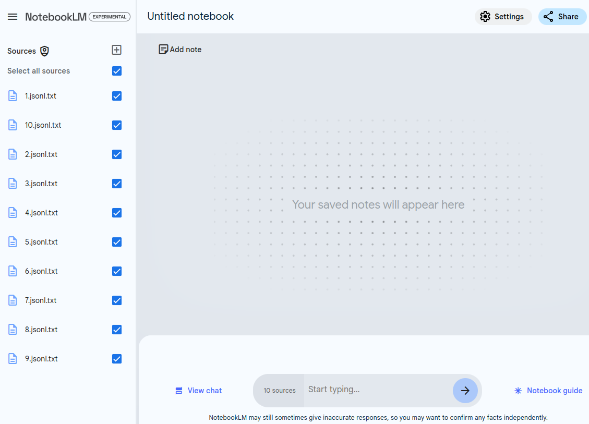
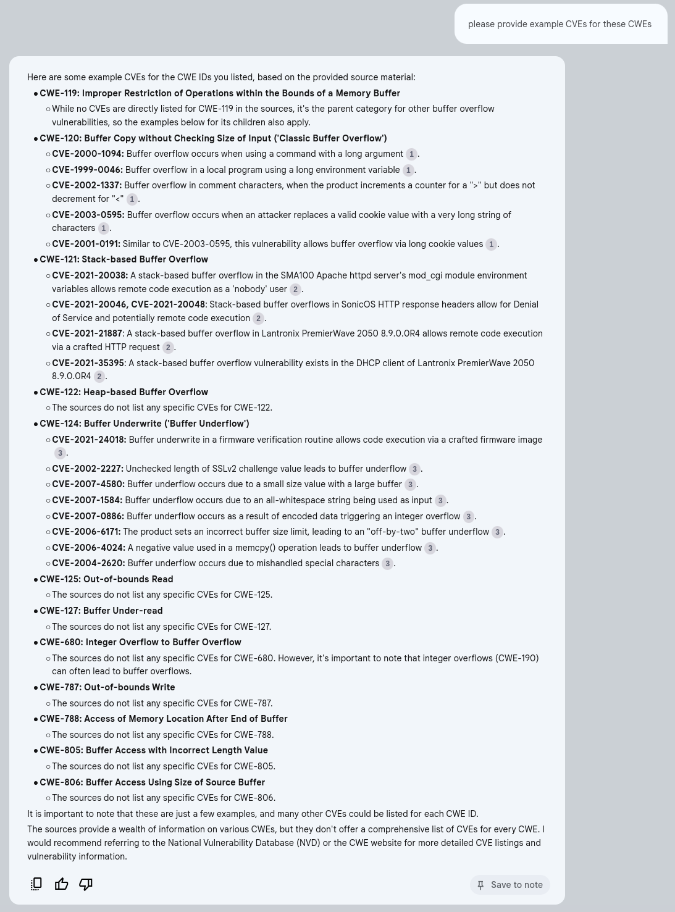

# NotebookLM CWE

!!! abstract "Overview"

    In this chapter, we'll use [NotebookLM](https://notebooklm.google.com/) to ingest the [Common Weakness Enumeration (CWE)](https://cwe.mitre.org/) list. 

    * In the current version (CWE Version 4.14 2024-02-29 as at June 2024), there are over 1400 CWEs, and 2789 pages in the PDF version of the list. 
    * It can be unwieldy to navigate or assimilate this information. 

    Using NotebookLM, we can chat with the CWE document and ask questions, so that **the information comes to us** in the form of an answer. 

    For comparison, we will also ask some of the same questions of ChatGPT4o covering 2 cases:

    1. without uploading any documents to it.
    2. uploading a document to it.
    
!!! success  

    This content and approach was presented to the [CWE Root Cause Mapping Working Group](https://github.com/Root-Cause-Mapping-Working-Group/RCM-WG) mid July.

    The feedback was very positive!
    
    

## Data Sources

## MITRE CWE Specification Preparation

!!!tip
    [cwe_latest.pdf ](https://cwe.mitre.org/data/published/cwe_latest.pdf) from https://cwe.mitre.org/data/downloads.html has 2789 pages (version CWE Version 4.14 2024-02-29).

    * This is too big for NotebookLM to ingest.
    * Use a JSON text version instead of PDF:
        * ensures all the relevant text we want is fed to the model (e.g. text extraction from PDFs can be lossy for tables)
        * allows us to remove content that is not relevant e.g. "ContentHistory" can contain a lot of text that is not relevant to CWE assignment
!!! experiment "Data Sources"

    **The files in https://github.com/CyberSecAI/cwe_top25/tree/main/data_out/output_jsonl are imported into NoteBookLM.**. They are generated as follows: 

    1. Get the MITRE CWE Specification as JSON from https://github.com/CWE-CAPEC/REST-API-wg/blob/main/json_repo/cwe.json
    2. Remove the "ContentHistory" entries as this is not useful to assign CWEs and is a lot of content
        1. use Claude 3.5 to generate the python code to do this
    3. Split it into smaller files
        1. because the single file is too large to import
        2. use Claude 3.5 to generate the python code to do this
    4. The output files are JSONL with a txt extension so NoteBookLM recognizes them: https://github.com/CyberSecAI/cwe_top25/tree/main/data_out/output_jsonl

## Import MITRE CWE Specification to NoteBookLM

1. Download all jsonl.txt files from https://github.com/CyberSecAI/cwe_top25/tree/main/data_out/output_jsonl
2. Open https://notebooklm.google.com/ in a browser
3. Add sources

<figure markdown>

</figure>

## what cwe ids are associated with buffer overflow?

<figure markdown>

</figure>

<figure markdown>

</figure>

!!! note
    https://cwe.mitre.org/data/definitions/121.html contains only 1 Observed Example: 
    
     * CVE-2021-35395. This is listed under CWE-121: Stack-based Buffer Overflow

    The other CVE examples are from the Top25 Mapping Examples included in the JSONL files

      * CVE-2021-20046, CVE-2021-20048: Stack-based buffer overflows in SonicOS HTTP response headers allow for Denial of Service and potentially remote code execution.
      * CVE-2021-21887: A stack-based buffer overflow in Lantronix PremierWave 2050 8.9.0.0R4 allows remote code execution via a crafted HTTP request.
      * CVE-2021-35395: A stack-based buffer overflow vulnerability exists in the DHCP client of Lantronix PremierWave 2050 8.9.0.0R4.
    

## Sharing Notebooks

!!! tip
    The notebook can be shared with other users via email (using the share button top right) to allow them to use the notebook.

    Sharing is via a user's email.

  
## Takeaways
  
!!! success "Takeaways" 

    1. I found it useful, quick, and convenient to be able to ask questions of the CWE list, as a compliment to the traditional search method I've used in the past.
    1. The large CWE document could not be uploaded to NoteBookLM as one PDF document, but had to be split into smaller PDFs.
        1. The same document could be uploaded to ChatGPT4o (without splitting).
    2. Based on the extremely limited test cases here (your experience may vary):
        1. NoteBookLM provides better answers on the provided source documents.
        2. ChatGPT provides richer answers to questions that can be answered outside of the provided source documents.
    3. The [Vulnrichment](../Vulnrichment/Vulnrichment.md) chapter covers a much more detailed use case - and NoteBookLM performed better than other LLMs.