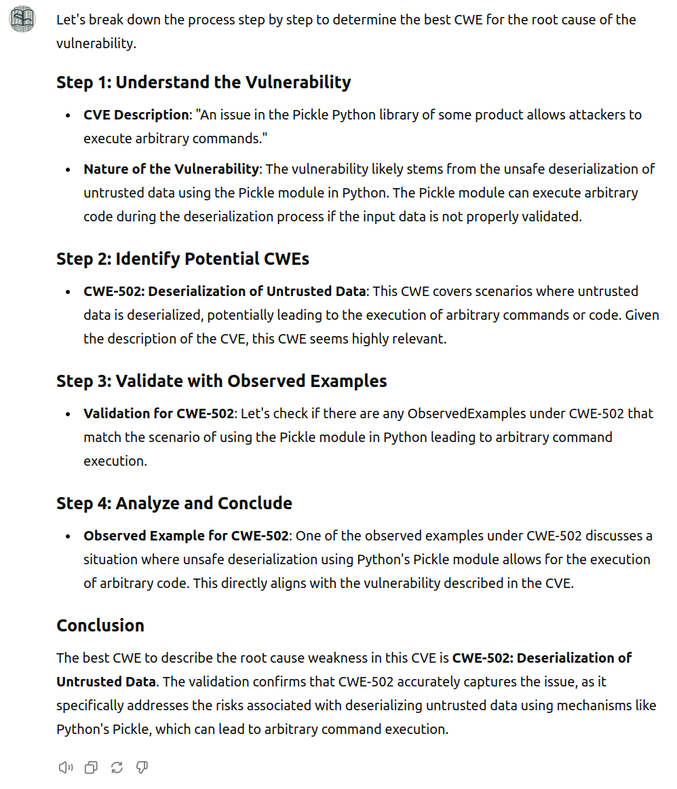
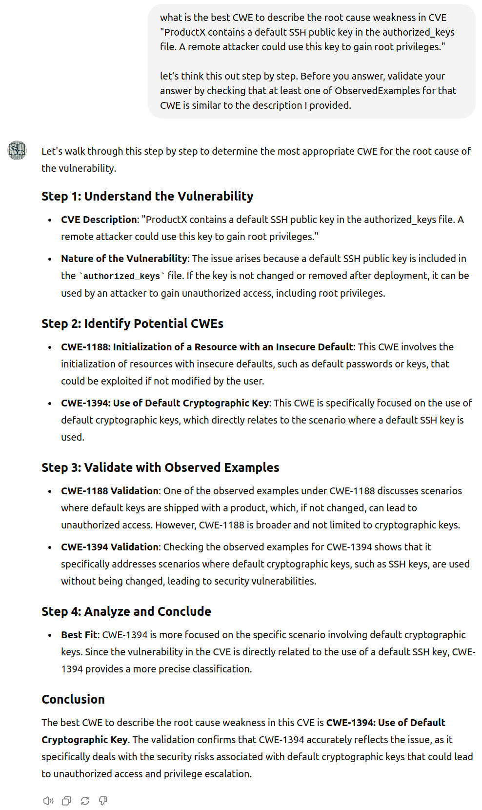
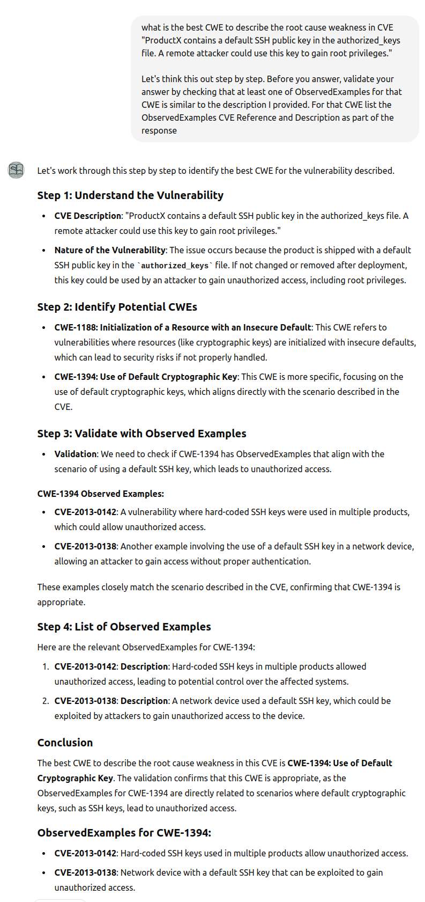

# ChatGPT CWE GPT

!!! abstract "Overview"

    Here we'll use ChatGPT with the MITRE CWE specification to aid mapping CWEs to vulnerability descriptions.

    This is a no-code option.

    We'll attempt to implement a closed grounded system to ensure the accuracy of the data (and mitigate hallucinations)

    2. **Grounded**: content is provided to inform the ansers
    1. **Closed system**: answers come from only the documents you provide

!!! warning "Result"
    The result is a Grounded Open-System i.e. we can ground - but can't create a closed system - and we still get hallucinations in some cases.

## Recipe
1. Use ChatGPT GPTs which are ["custom versions of ChatGPT that combine instructions, extra knowledge, and any combination of skills."](https://chatgpt.com/gpts) 
2. **Grounded**: Provide the MITRE CWE specification as the "extra knowledge" in JSON format (not PDF).
3. **Closed system**: Limit the GPT to that knowledge only i.e. disable web search 
      1. but we see that the GPT still has knowledge from its training data 


## MITRE CWE Specification
1. Use a JSON text version instead of PDF 
    1. ensures all the relevant text we want is fed to the model (e.g. text extraction from PDFs can be lossy for tables)
    2. allows us to remove content that is not relevant e.g. "ContentHistory" can contain a lot of text that is not relevant to CWE assignment
2. Get the MITRE CWE Specification as JSON from https://github.com/CWE-CAPEC/REST-API-wg/blob/main/json_repo/cwe.json
3. Remove the "ContentHistory" entries as this is not useful to assign CWEs and is a lot of content
     2. use Claude 3.5 to generate the python code to do this
4. Split it into smaller files
     1. because the single file is too large to import
     2. use Claude 3.5 to generate the python code to do this
   
## Configure ChatGPT CWE GPT
1. Import the MITRE CWE Specification as split JSON files
2. Disable all capabilities:
     1. Web browsing is disabled so the answers come from the imported MITRE CWE Specification
3. Provide example starter prompts:
     1. what is the best CWE to describe the root cause weakness in CVE "an issue in the Pickle Python library of some product allows attackers to execute arbitrary commands". Provide CVEs with the most similar root cause to support your answer.
     2. what is the best CWE to describe the root cause weakness in CVE "ProductX contains a default SSH public key in the authorized_keys file. A remote attacker could use this key to gain root privileges.". Provide CVEs with the most similar.  root cause to support your answer.
     3. what cwe ids are associated with xss. list them all
     4. what cwe ids are associated with path or directory traversal. list them all
4. Publish it so others can use it: https://chatgpt.com/g/g-d8guurMPs-cwe-map 

<figure markdown>

</figure>

## Check if the System is Closed

!!! quote
   
      What is a dog?


!!! failure

      <figure markdown>
      
      </figure>

!!! Observations
      The system is not closed because the GPT can answer the question even though there is no information about dogs in the MITRE CWE specification.

## Example Usage: CWE-502
 
!!! quote
      what is the best CWE to describe the root cause weakness in CVE "an issue in the Pickle Python library of some product allows attackers to execute arbitrary commands". 

      let's think this out step by step. Before you answer, validate your answer by checking that at least one of ObservedExamples for that CWE is similar to the description I provided.

<figure markdown>

</figure>

CWE-502 includes this as part of the ObservedExamples
````
        {
          "Reference": "CVE-2011-2520",
          "Description": "Python script allows local users to execute code via pickled data.",
          "Link": "https://www.cve.org/CVERecord?id=CVE-2011-2520"
        },
        {
          "Reference": "CVE-2012-4406",
          "Description": "Unsafe deserialization using pickle in a Python script.",
          "Link": "https://www.cve.org/CVERecord?id=CVE-2012-4406"
        },
````


## Example Usage: CWE-1394
!!! quote
      what is the best CWE to describe the root cause weakness in CVE "ProductX contains a default SSH public key in the authorized_keys file. A remote attacker could use this key to gain root privileges."

      let's think this out step by step. Before you answer, validate your answer by checking that at least one of ObservedExamples for that CWE is similar to the description I provided.

<figure markdown>

</figure>

CWE-1394 includes this as part of the ObservedExamples
````
        {
          "Reference": "CVE-2016-1561",
          "Description": "backup storage product has a default SSH public key in the authorized_keys file, allowing root access",
          "Link": "https://www.cve.org/CVERecord?id=CVE-2016-1561"
        },
````


## Example Usage: CWE-1394 with Example CVEs

<figure markdown>

</figure>

!!! failure 
      "CVE-2013-0138: Network device with a default SSH key that can be exploited to gain unauthorized access."
      
      This is not the description for https://nvd.nist.gov/vuln/detail/CVE-2013-0138.

      CVE-2013-0138 is not listed in the MITRE CWE specification.

      Note: https://nvd.nist.gov/vuln/detail/CVE-2013-0137 relates to a known SSH key.
      

!!! observations
      Hallucinations happened for the CVE IDs that the GPT gave as supporting examples whether the "Web Browsing" Capability was enabled or not.


## Takeaways

!!! success "Takeaways" 

    1. Grounding ChatGPT with the MITRE CWE specification helps reduce hallucinations but does not eliminate them.
    2. Hallucinations happened for the CVE IDs that the GPT gave as supporting examples whether the "Web Browsing" Capability was enabled or not.
    3. It is not possible to make ChatGPT GPT a closed system because it has knowledge outside the provided content and will answer from that.
