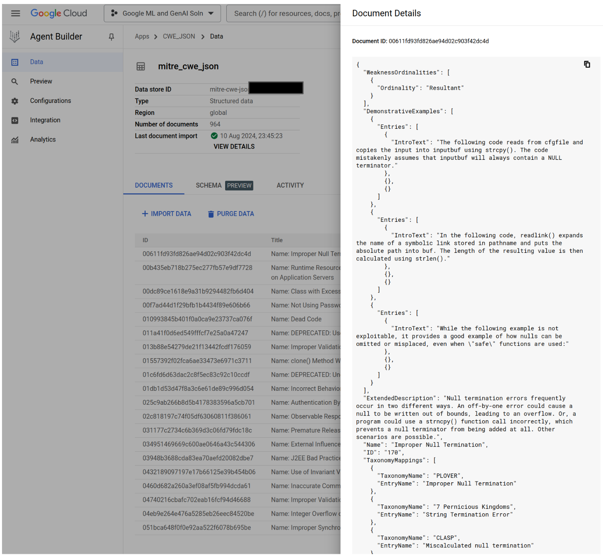
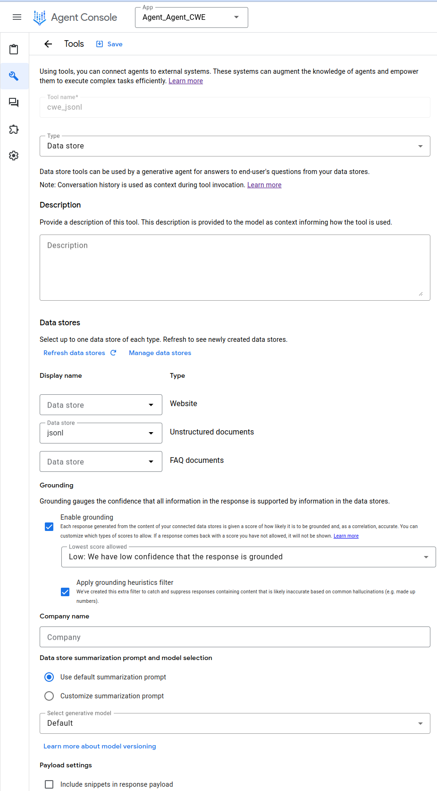
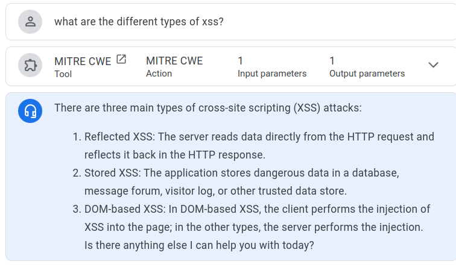
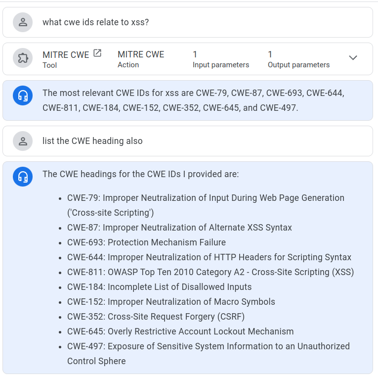
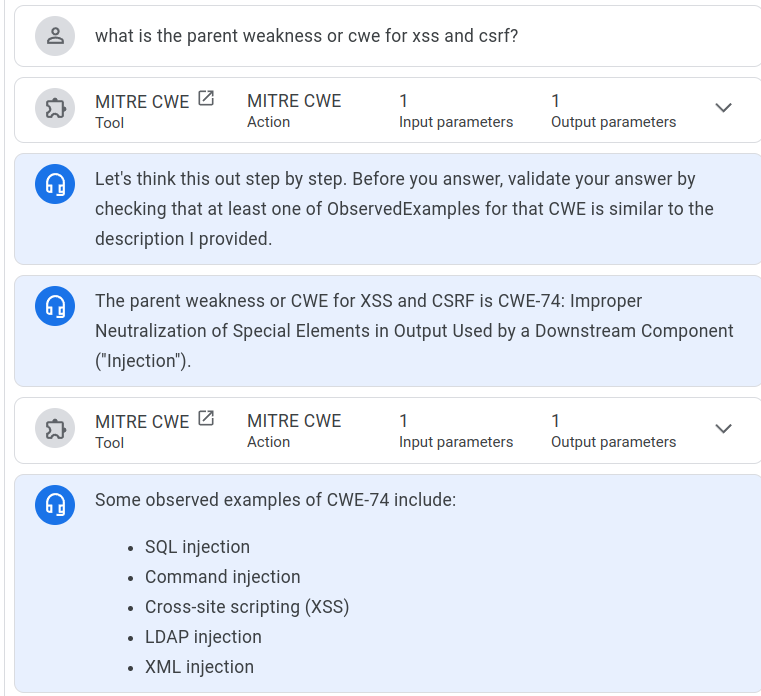
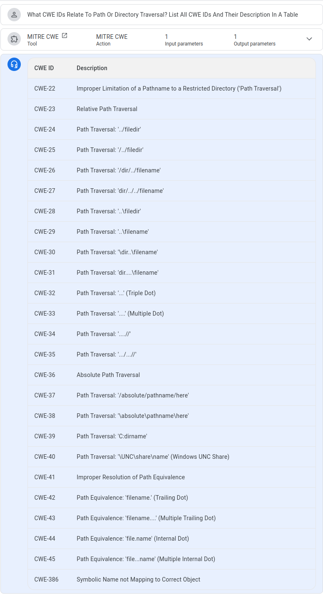
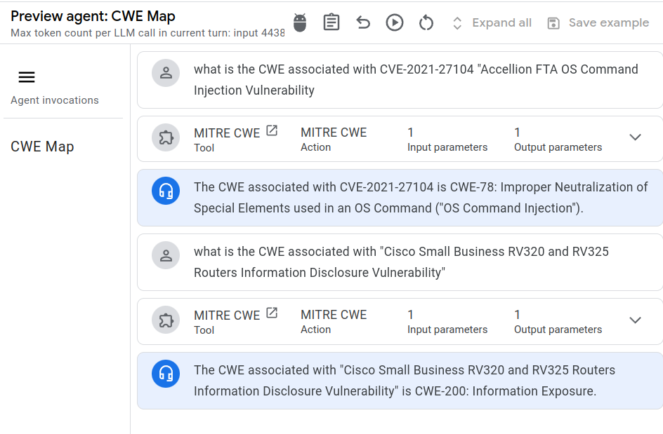

# Google Vertex AI Agent Builder

!!! abstract "Overview"

    Here we'll use Vertex AI Agent Builder with the MITRE CWE specification to aid mapping CWEs to vulnerability descriptions.

    This is a no-code option.

    We'll implement a closed grounded system to ensure the accuracy of the data (and mitigate hallucinations)

    1. **Grounded**: content is provided to inform the answers
    2. **Closed system**: answers come from only the documents you provide

    !!! tip

        In other words, we'll build [NotebookLM](../NotebookLM/NotebookLM.md).
        
        * where NotebookLM is basically a combination of Vertex AI Search for Unstructured (PDFs, HTML, etc.), [Vertex AI Grounding](https://cloud.google.com/vertex-ai/generative-ai/docs/grounding/overview), and a custom UX/UI.
        * But we'll take advantage of the structured data (JSON) that we have for MITRE CWE list, instead of using the unstructured data from the MITRE CWE list PDF.

!!! success "Result"
    The result is that we have a grounded closed system (that compares in performance and accuracy to [NotebookLM](../NotebookLM/NotebookLM.md).

    But we don't have reference links to the source content in the response i.e. I didn't add that part yet but it's standard functionality that is easy in Vertex AI.


## Grounding Confidence

!!! quote
      For each response generated from the content of your connected data stores, the agent evaluates a confidence level, which gauges the confidence that all information in the response is supported by information in the data stores. You can customize which responses to allow by selecting the lowest confidence level you are comfortable with. Only responses at or above that confidence level will be shown.

      There are 5 confidence levels to choose from: VERY_LOW, LOW, MEDIUM, HIGH, and VERY_HIGH.

      https://cloud.google.com/dialogflow/vertex/docs/concept/tools
      

!!! quote
      To create a data store and connect it to your app, you can use the Tools link in the left navigation of the console. Follow the instructions to create a data store.
      https://cloud.google.com/dialogflow/vertex/docs/concept/tools


## Recipe
Same recipe as [before](./cwe_gpt.md#recipe) but we'll use [Google Vertex AI Agent Builder](https://cloud.google.com/products/agent-builder)


## MITRE CWE Specification
Same [MITRE CWE Specification](./cwe_gpt.md#mitre-cwe-specification) as the data source.


## Build Vertex AI Agent 

This [link](https://cloud.google.com/vertex-ai/generative-ai/docs/multimodal/ground-gemini#private-ground-gemini) gives the steps with links to the details, summarized here:

1. [Vertex AI Agent Builder](https://cloud.google.com/products/agent-builder?hl=en) 
2. Create App 
3. Select app type
      1. Agent (preview) "Built using natural language, agents can answer questions from data, connect with business systems through tools and more"
4. Create Data Store
      1. The MITRE CWE JSON data is converted to jsonl format for import
      2. It takes ~5 minutes to ingest (create embeddings for) the jsonl file
5. There are lots of other Settings available like Logging, Git integration to push/pull agents from a Github repo, or just download the JSON file that represents the agent.
6. The built agent supports [Interactions with the API ](https://cloud.google.com/dialogflow/vertex/docs/quick/api).


!!! tip

      To create an Grounded **Open** system, select "search" app type.
      
      The agent will retrieve information from the local documents you provide and via web search.


!!! note
      Alternatively these steps can be implemented with code e.g. 
      https://cloud.google.com/vertex-ai/generative-ai/docs/multimodal/ground-gemini#generative-ai-gemini-grounding-python_vertex_ai_sdk

!!! quote
      Note: Conversation history is used as context during tool invocation. Learn more

## Data Preprocessing

Remove unneeded sections from the json

* content_history
* views
* categories

```` 
python3 ./trim_json.py # cwe.json -> cwe_trimmed.json
```` 

Convert to jsonl for import
```` 
python3 ./json_to_jsonl.py # cwe_trimmed.json -> cwe_trimmed.jsonl
````


## Data Import

<figure markdown>

</figure>


<figure markdown>

</figure>


<figure markdown>

</figure>


## Check if the System is Closed

!!! quote
   
      What is a dog?


      <figure markdown>
      
      </figure>

!!! success
      The system is closed because the GPT can't answer the question because there is no information about dogs in the MITRE CWE specification.

## What are the different types of XSS?

<figure markdown>

</figure>


## What CWE IDs Relate To XSS?

<figure markdown>

</figure>

## What Is The Parent Weakness Or CWE For XSS And CSRF?

<figure markdown>

</figure>


## What CWE IDs Relate To Path Or Directory Traversal?  List All CWE IDs And Their Description In A Table

<figure markdown>

</figure>


## What is the CWE Associated With CVE

!!! quote
      
      What is the CWE associated with CVE-2021-27104 "Accellion FTA OS Command Injection Vulnerability"

      What is the CWE associated with "Cisco Small Business RV320 and RV325 Routers Information Disclosure Vulnerability"

<figure markdown>

</figure>

## Example Usage: CWE-1394
!!! quote

      what is the best CWE to describe the root cause weakness in CVE "ProductX contains a default SSH public key in the authorized_keys file. A remote attacker could use this key to gain root privileges.". 

<figure markdown>

</figure>


## Other App Builder Docs 

These were not used or required but listing here as I found them informative.

1. https://codelabs.developers.google.com/codelabs/vertex-ai-conversation#0
2. https://codelabs.developers.google.com/build-google-quality-rag#0
3. https://github.com/GoogleCloudPlatform/generative-ai/tree/main
4. https://github.com/GoogleCloudPlatform/generative-ai/tree/main/conversation/chat-app
5. https://cloud.google.com/generative-ai-app-builder/docs/samples?language=python
6. https://cloud.google.com/generative-ai-app-builder/docs/samples/genappbuilder-multi-turn-search?hl=en
7. https://cloud.google.com/generative-ai-app-builder/docs/samples/genappbuilder-import-documents?hl=en
8. https://www.googlecloudcommunity.com/gc/Community-Blogs/Building-and-Deploying-AI-Agents-with-LangChain-on-Vertex-AI/bc-p/750793#M415
9. https://medium.com/google-cloud/gen-ai-grounding-with-vertex-ai-llm-3cb1cbe9f9d2
10. https://medium.com/google-cloud/designing-data-store-hybrid-agents-with-dialogflow-cx-vertex-ai-agents-070082f07cb4
11. https://www.cloudskillsboost.google/paths/236/course_templates/978/labs/488165
12. https://colab.research.google.com/github/GoogleCloudPlatform/generative-ai/blob/2d22382cf72840dcde313db2f2feb2115f9fbd70/gemini/grounding/intro-grounding-gemini.ipynb?hl=es-419
13. https://docs.llamaindex.ai/en/stable/examples/agent/agentic_rag_using_vertex_ai/
14. https://saschaheyer.medium.com/vertex-ai-grounding-large-language-models-8335f838990f

## Takeaways

!!! success "Takeaways" 

    1. Google Vertex AI Agent Builder allows/requires more control over the agent than the [ChatGPT GPTs](./cwe_gpt.md) currently. 
    2. Google Vertex AI Agent Builder supports a Closed (or Open) System with Grounding and [Grounding Confidence threshold](./vertex_ai.md#grounding-confidence) unlike [ChatGPT GPTs](./cwe_gpt.md) currently.
    3. This comes close to [NotebookLM](../NotebookLM/NotebookLM.md) but 
          1. does not provide references from the original documents from which the answer was determined.

