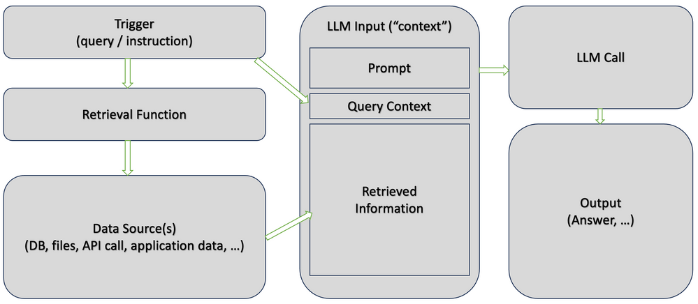
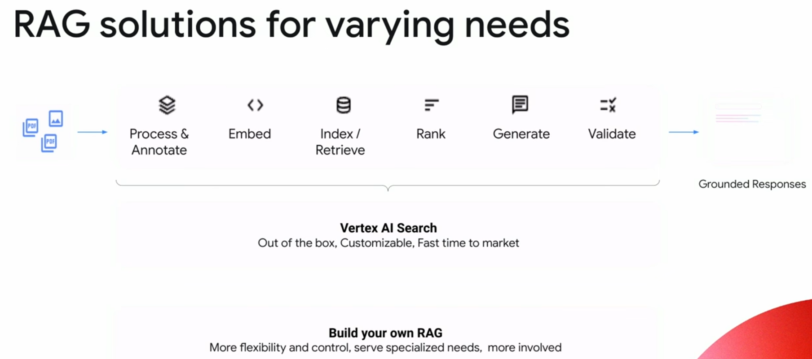

# Grounding

!!! abstract "Overview"

    The accurate answers from [NotebookLM](../NotebookLM/NotebookLM.md) highlight the benefits of a grounded closed system.
    
    NotebookLM also provides links to the content it references in the data sources.

    There are many tools that can be used to build such a system.

## Grounding Overview

!!! quote
    What is Grounding?

    Grounding is the process of using large language models (LLMs) with information that is use-case specific, relevant, and not available as part of the LLM's trained knowledge. It is crucial for ensuring the quality, accuracy, and relevance of the generated output. While LLMs come with a vast amount of knowledge already, this knowledge is limited and not tailored to specific use-cases. To obtain accurate and relevant output, we must provide LLMs with the necessary information. In other words, we need to "ground" the models in the context of our specific use-case.
 

    Motivation for Grounding

    The primary motivation for grounding is that LLMs are not databases, even if they possess a wealth of knowledge. They are designed to be used as general reasoning and text engines. LLMs have been trained on an extensive corpus of information, some of which has been retained, giving them a broad understanding of language, the world, reasoning, and text manipulation. However, we should use them as engines rather than stores of knowledge.

    https://techcommunity.microsoft.com/t5/fasttrack-for-azure/grounding-llms/ba-p/3843857

!!! quote
    In generative AI, grounding is the ability to connect model output to verifiable sources of information. If you provide models with access to specific data sources, then grounding tethers their output to these data and reduces the chances of inventing content. This is particularly important in situations where accuracy and reliability are significant.

    Grounding provides the following benefits:

    * Reduces model hallucinations, which are instances where the model generates content that isn't factual.
    * Anchors model responses to specific information.
    * Enhances the trustworthiness and applicability of the generated content.
    
    https://cloud.google.com/vertex-ai/generative-ai/docs/grounding/overview

### Retrieval Augmented Generation (RAG)
<figure markdown>

https://techcommunity.microsoft.com/t5/fasttrack-for-azure/grounding-llms/ba-p/3843857
</figure>

!!! quote
    Retrieval Augmented Generation (RAG) is the primary technique for grounding and the only one I will discuss in detail. **RAG is a process for retrieving information relevant to a task, providing it to the language model along with a prompt, and relying on the model to use this specific information when responding. While sometimes used interchangeably with grounding, RAG is a distinct technique, albeit with some overlap.** It is a powerful and easy-to-use method, applicable to many use-cases.

    **Fine-tuning**, on the other hand, is an "honourable mention" when it comes to grounding. It involves orchestrating additional training steps to create a new version of the model that builds on the general training and infuses the model with task-relevant information. In the past, when we had less capable models, fine-tuning was more prevalent. However, it has become less relevant as time-consuming, expensive, and not offering a significant advantage in many scenarios.

    The general consensus among experts in the field is that fine-tuning typically results in only a 1-2% improvement in accuracy (depending on how accuracy is defined). While there may be specific scenarios where fine-tuning offers more significant gains, it should be considered a last-resort option for optimisation, rather than the starting go-to technique.

!!! info
    Unlike RAG, fine tuning changes some of the model weights. In some cases, it can lead to reduced performance via catastrophic forgetting. 

## Vertex AI Grounding

<figure markdown>

https://youtu.be/RjuKEMVe_Q4?t=303
</figure>

Google [announced Grounding in April 2024](https://youtu.be/vax4Nl7frAo?t=1648).

!!! quote
    You can ground language models to your own text data using Vertex AI Search as a datastore. With Vertex AI Search you integrate your own data, regardless of format, to refine the model output. Supported data types include:

    * Website data: Directly use content from your website.
    * Unstructured data: Utilize raw, unformatted data.

    When you ground to your specific data the model can perform beyond its training data. By linking to designated data stores within Vertex AI Search, the grounded model can produce more accurate and relevant responses, and responses directly related to your use case.

    https://cloud.google.com/vertex-ai/generative-ai/docs/grounding/overview#ground-private

## Takeaways

!!! success "Takeaways" 

    1. Where a lot of the information needed is captured in documentation e.g. MITRE CWE specification, Grounding is an effective efficient easy option to improve the quality of responses.