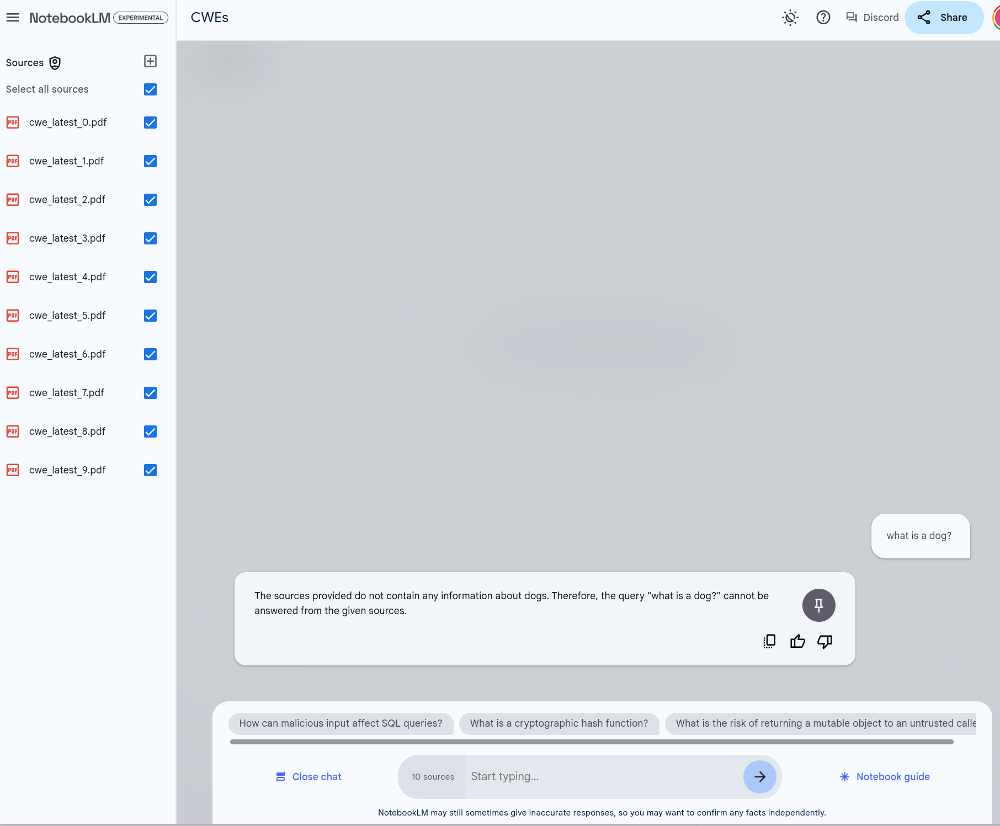

# NotebookLM

!!! abstract "Overview"

    LLMs change the information retrieval paradigm. Instead of searching for information where **we go to the information**, we can chat with our documents and ask questions of them, so that **the information comes to us** in the form of an answer. 

    In this section, we'll use [NotebookLM](https://notebooklm.google.com/), and we just need to import our documents to be able to chat with them. 

    ChatGPT4o is also used for comparison to highlight where one is better applied than the other depending on the context.
    
    * Both tools use LLMs, but NoteBookLM uses a "Closed System" (only the document sources you provide), versus ChatGPT4o which bases it answers on the open internet content at the time it was trained, and additionally the documents you provide.
    

    !!! tip
        Your responses from NotebookLM may be different than the examples shown here. LLMs will give different responses to the same question.

## [NotebookLM](https://notebooklm.google.com/)

!!! tip
    !!! quote
        [NotebookLM](https://notebooklm.google.com/) lets you read, take notes, ask questions, organize your ideas, and much more -- all with the power of Google AI helping you at every step of the way.

    !!! quote
        [Audio Overview](https://blog.google/technology/ai/notebooklm-audio-overviews/), a new way to turn your documents into engaging audio discussions. With one click, two AI hosts start up a lively “deep dive” discussion based on your sources. They summarize your material, make connections between topics, and banter back and forth. You can even download the conversation and take it on the go.
    

    

!!! quote
    It runs on the company’s Gemini 1.5 Pro model ([released Dec 2023](https://en.wikipedia.org/wiki/Gemini_(language_model))), the same AI that powers the Gemini Advanced chatbot. 
    ([ref](https://www.techradar.com/computing/artificial-intelligence/googles-notebooklm-is-now-an-even-smarter-assistant-and-better-fact-checker))

### Key Features and Benefits of Gemini 1.5 Models

Per [Gemini 1.5 Technical Report](https://storage.googleapis.com/deepmind-media/gemini/gemini_v1_5_report.pdf), the Key Features and Benefits of Gemini 1.5 Models are

1. **Highly Compute-Efficient Multimodal Models**
      1. Capable of recalling and reasoning over fine-grained information from millions of tokens of context, including long documents, videos, and audio.
2. **Benchmark Performance**
      1. Outperforms other models such as Claude 3.0 (200k tokens) and GPT-4 Turbo (128k tokens) in next-token prediction and retrieval up to 10M tokens (approximately 7M words).
3. **Unprecedented Context Handling**
      1. Handles extremely long contexts, up to at least 10M tokens (approximately 7M words).
      2. Capable of processing long-form mixed-modality inputs, including entire document collections, multiple hours of video, and almost five days of audio.
      3. Near-perfect recall on long-context retrieval tasks across various modalities.
4. **Realistic Multimodal Long-Context Benchmarks**
      1. Excels in tasks requiring retrieval and reasoning over multiple parts of the context.
      2. Outperforms all competing models across all modalities, even those augmented with external retrieval methods.

These features make Gemini 1.5 models a generational leap over existing models, offering unparalleled performance in processing and understanding extensive and complex multimodal information.

!!! tip
    Such systems map document content to vectors (numeric representations of words or tokens in multi-dimensional space).

    Queries are based on similarity (proximity in vector space).

### Document Loading

Documents are loaded via GoogleDrive, PDFs, Text files, Copied text, Web page URL.

!!! tip 
    Any sources can be used e.g. Books in PDF format, websites, text files.

    Using a file of site content (if available) e.g.a PDF, is generally more reliable than using a URL to that site; it ensures all the content is ingested.

### Closed System

These documents become the corpus where information is retrieved from, with references to the document(s) the information was retrieved from.

!!! quote
    “NotebookLM is a closed system.” This means the AI won’t perform any web searches beyond what you, the user, give it in a prompt. Every response it generates pertains only to the information it has on hand.
    ([ref](https://www.techradar.com/computing/artificial-intelligence/googles-notebooklm-is-now-an-even-smarter-assistant-and-better-fact-checker))

!!! quote 
    
    **“source-grounded AI”**: you define a set of documents that are important to your work—called “sources” in the NotebookLM parlance—and from that point on, you can have an open-ended conversation with the language model where its answers will be “grounded” in the information you’ve selected. It is as if you are giving the AI instant expertise in whatever domain you happen to be working in. ([ref](https://adjacentpossible.substack.com/p/introducing-notebooklm))

#### What is a dog?

This is illustrated with a simple example of asking our [Notebook on CWEs](../CWE_Assignment/cwe_overview.md) "what is a dog?":

!!! quote
    The sources provided do not contain any information about dogs. Therefore, the query "what is a dog?" cannot be answered from the given sources.

<figure markdown>

<figcaption></figcaption>
</figure>

### Sharing
Unlike Google Docs, it is not possible to share a NotebookLM publicly - sharing is done directly via email addresses.

### How To Use NotebookLM

<iframe width="560" height="315" src="https://www.youtube.com/embed/iWPjBwXy_Io?si=0Z0e0u_ni0R4tAM-" title="YouTube video player" frameborder="0" allow="accelerometer; autoplay; clipboard-write; encrypted-media; gyroscope; picture-in-picture; web-share" referrerpolicy="strict-origin-when-cross-origin" allowfullscreen></iframe>

## References

1. [Introducing NotebookLM](https://adjacentpossible.substack.com/p/introducing-notebooklm), Oct 19, 2023, Steven Johnson who contributed to NotebookLM
2. [Getting The Most Out Of Notes In NotebookLM](https://medium.com/@stevenbjohnson/getting-the-most-out-of-notes-in-notebooklm-d9d70316b780), Mar 18, 2024, Steven Johnson
3. [How To Use NotebookLM As A Research Tool](https://stevenberlinjohnson.com/how-to-use-notebooklm-as-a-research-tool-6ad5c3a227cc), Feb 19, 2024, Steven Johnson
4. [Google's NotebookLM is now an even smarter assistant and better fact-checker](https://www.techradar.com/computing/artificial-intelligence/googles-notebooklm-is-now-an-even-smarter-assistant-and-better-fact-checker), June 7, 2024 
5. [Using Google’s NotebookLM for Data Science: A Comprehensive Guide](https://www.kdnuggets.com/using-google-notebooklm-for-data-science-a-comprehensive-guide), Dec 7, 2023 
6. [How to use Google’s genAI-powered note-taking app](https://www.computerworld.com/article/1611774/google-notebooklm-generative-ai-notes-app.html), Feb 15, 2024 

## Takeaways
  
!!! success "Takeaways" 

    1. NotebookLM is a powerful free solution from Google that allows users to quickly and easily build a source-grounded AI (where users define the set of documents) and then have an open-ended conversation with the language model where its answers will be “grounded” in the information users selected.
    2. The support for large contexts means that large documents can be processed - as demonstrated in the following sections.
    3. I found it a useful tool / companion for the research I was doing on vulnerability management to augment my knowledge and capabilities.

  
