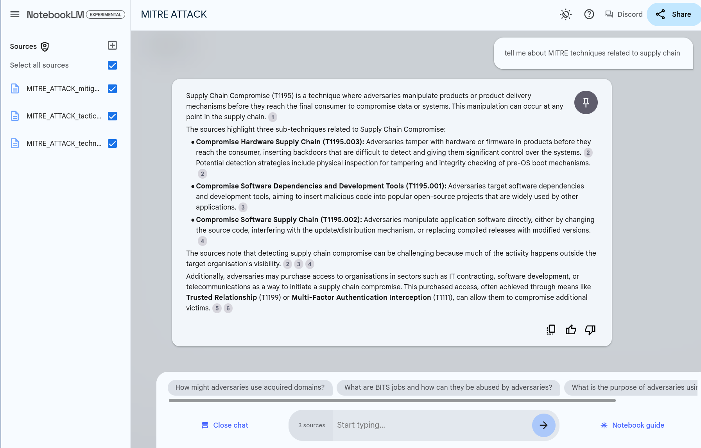
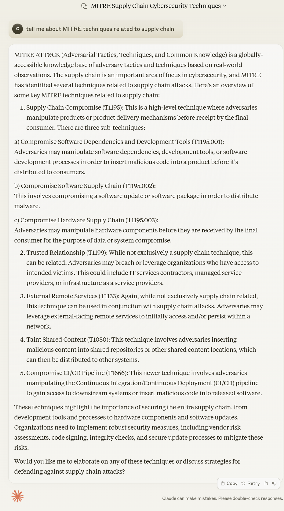

# NotebookLM

!!! abstract "Overview"

    In this chapter, we'll use [NotebookLM](https://notebooklm.google.com/) to ingest the [MITRE ATT&CK Enterprise Tactics](https://attack.mitre.org/tactics/enterprise/). 

    * In the current version, MITRE ATT&CK Matrix for Enterprise consists of 14 tactics, 559 Total Attack Patterns. 
    * It can be unwieldy to navigate or assimilate this information. 

    Using NotebookLM, we can chat with the MITRE ATT&CK Matrix and ask questions, so that **the information comes to us** in the form of an answer. 

    1. without uploading any documents to it.
    2. uploading a document to it.

## Data Sources

The MITRE ATTACK Tactics and Techniques are available online at https://attack.mitre.org/tactics/enterprise/ as 1 webpage for each of the 14 Tactics.

* However, loading these webpages (or the "Version Permalink" pages) into NotebookLM did not work.

MITRE ATTACK is also available as an Excel file from https://attack.mitre.org/resources/attack-data-and-tools/

 * https://attack.mitre.org/docs/enterprise-attack-v15.1/enterprise-attack-v15.1.xlsx
 * Note: The data is also available as [JSON](https://raw.githubusercontent.com/mitre/cti/master/enterprise-attack/enterprise-attack.json). 


So we can convert that to a text file and load those as follows:

1. Open the [Excel file](https://attack.mitre.org/docs/enterprise-attack-v15.1/enterprise-attack-v15.1.xlsx)
2. For the tabs we want (e.g. Tactics, Techniques, Mitigations), delete the columns we don't want 
3. Export each tab as a csv file
4. Transpose the data to a text file
5. Import the text files


### Convert MITRE ATTACK to a Text File for Import

Claude 3.5 Sonnet Prompt:
```
i have a csv file with these columns ID    name description    tactics    detection    "data sources"    "is sub-technique"    "sub-technique of"
I want to extract the content into a document to read. 
Each row should be extracted as follows: the name of the first column, then the ccontent for the first column. Then the second column name and content.
And so on for each column.
And do this for all rows

I want python code to do this
```

The LLM generated generic code that was applied to convert each csv file to a text file.


### Load each text file
So we can just load each one to NoteBookLM as a text file:

* MITRE_ATTACK_mitigations.txt
* MITRE_ATTACK_tactics.txt
* MITRE_ATTACK_techniques.txt


## Tell me about MITRE techniques related to supply chain

### NotebookLM Answer

<figure markdown>

</figure>

### Claude Sonnet 3.5 Answer

<figure markdown>

</figure>

## Takeaways
  
!!! success "Takeaways" 

    1. 