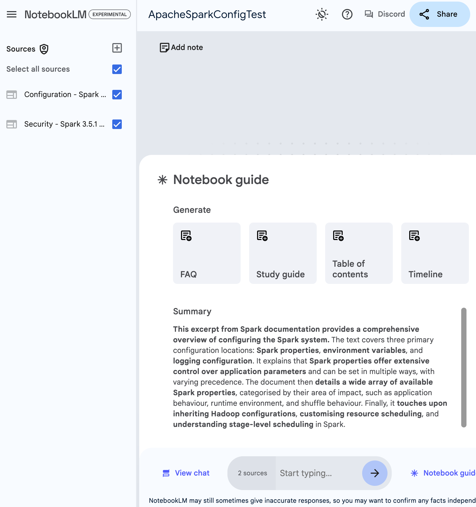

# NotebookLM

!!! abstract "Overview"
    
    I came across this via https://tldrsec.com/p/tldr-sec-237 (an excellent newsletter) in the "AI + Security" section, and it piqued my interest! 

    One area of research is using LLMs for infrastructure configuration as detailed in https://www.coguard.io/post/coguard-uses-openai-cybersecurity-grant-to-automate-infrastructure-security and the associated [repo](https://github.com/coguardio/coguard_openai_rule_auto_generation_research/tree/master?tab=readme-ov-file).

    Here we take on the first task [C1]: Extraction of security and uptime-relevant configuration parameters from manuals; for the example provided in the [repo](https://github.com/coguardio/coguard_openai_rule_auto_generation_research/tree/master?tab=readme-ov-file): Apache Spark


## Details

### Task

!!! quote
    [C1] Extraction of security and uptime-relevant configuration parameters from manuals.
    The goal of this component is simple to describe, but hard to accomplish. Given a manual for a software component, extract the configuration parameters and define the security relevant ones from it.

    Example: For Apache Spark, the manual is provided on the general [configuration page](https://spark.apache.org/docs/latest/configuration.html#spark-ui) online, i.e. in HTML format, and there is also a specific [security page](https://spark.apache.org/docs/latest/security.html). The expectation would be to at least extract the parameters from the security page, as well as some log-related items from the general page. In total, when manually examining the configuration parameters, it totals approximately 80 parameters that are security relevant. You can find these in the [Appendix A](https://github.com/coguardio/coguard_openai_rule_auto_generation_research/tree/master##appendix-a).


### Original Prompt 


The original prompt used is per https://github.com/coguardio/coguard_openai_rule_auto_generation_research/tree/master?tab=readme-ov-file#extraction-of-security-relevant-parameters-in-c1

!!! quote
    You are an assistant that is a cybersecurity expert and knows their configuration files. Your response here should be a JSON list of strings
    Using the documentation of Apache Spark, which configuration parameters are relevant from a security perspective?.

### Expected Answer
The expected answer is per https://github.com/coguardio/coguard_openai_rule_auto_generation_research/tree/master?tab=readme-ov-file#appendix-a. 
!!! quote
    The following parameters were identified by the CoGuard team by hand as relevant from a security point of view.

    ````
    spark.yarn.shuffle.server.recovery.disabled
    spark.authenticate
    spark.authenticate.secret
    spark.authenticate.secret.file
    spark.authenticate.secret.driver.file
    spark.authenticate.secret.executor.file
    spark.network.crypto.enabled
    spark.network.crypto.config.*
    spark.network.crypto.saslFallback
    spark.authenticate.enableSaslEncryption
    spark.network.sasl.serverAlwaysEncrypt
    spark.io.encryption.enabled
    spark.io.encryption.keySizeBits
    spark.io.encryption.keygen.algorithm
    spark.io.encryption.commons.config.*
    spark.ui.allowFramingFrom
    spark.ui.filters
    spark.acls.enable
    spark.admin.acls
    spark.admin.acls.groups
    spark.modify.acls
    spark.modify.acls.groups
    spark.ui.view.acls
    spark.ui.view.acls.groups
    spark.user.groups.mapping
    spark.history.ui.acls.enable
    spark.history.ui.admin.acls
    spark.history.ui.admin.acls.groups
    spark.ssl.enabled
    spark.ssl.port
    spark.ssl.enabledAlgorithms
    spark.ssl.keyPassword
    spark.ssl.keyStore
    spark.ssl.keyStorePassword
    spark.ssl.keyStoreType
    spark.ssl.protocol
    spark.ssl.needClientAuth
    spark.ssl.trustStore
    spark.ssl.trustStorePassword
    spark.ssl.trustStoreType
    spark.ssl.ui.enabled
    spark.ssl.ui.port
    spark.ssl.ui.enabledAlgorithms
    spark.ssl.ui.keyPassword
    spark.ssl.ui.keyStore
    spark.ssl.ui.keyStorePassword
    spark.ssl.ui.keyStoreType
    spark.ssl.ui.protocol
    spark.ssl.ui.needClientAuth
    spark.ssl.ui.trustStore
    spark.ssl.ui.trustStorePassword
    spark.ssl.ui.trustStoreType
    spark.ssl.standalone.enabled
    spark.ssl.standalone.port
    spark.ssl.standalone.enabledAlgorithms
    spark.ssl.standalone.keyPassword
    spark.ssl.standalone.keyStore
    spark.ssl.standalone.keyStorePassword
    spark.ssl.standalone.keyStoreType
    spark.ssl.standalone.protocol
    spark.ssl.standalone.needClientAuth
    spark.ssl.standalone.trustStore
    spark.ssl.standalone.trustStorePassword
    spark.ssl.standalone.trustStoreType
    spark.ssl.historyServer.enabled
    spark.ssl.historyServer.port
    spark.ssl.historyServer.enabledAlgorithms
    spark.ssl.historyServer.keyPassword
    spark.ssl.historyServer.keyStore
    spark.ssl.historyServer.keyStorePassword
    spark.ssl.historyServer.keyStoreType
    spark.ssl.historyServer.protocol
    spark.ssl.historyServer.needClientAuth
    spark.ssl.historyServer.trustStore
    spark.ssl.historyServer.trustStorePassword
    spark.ssl.historyServer.trustStoreType
    spark.ui.xXssProtection
    spark.ui.xContentTypeOptions.enabled
    spark.ui.strictTransportSecurity
    ````

## Data Sources
The data sources are per above:

1. https://spark.apache.org/docs/latest/configuration.html
2. https://spark.apache.org/docs/latest/security.html


!!! experiment "Data Sources"
    Copies of the html files are available in
    https://github.com/CyberSecAI/CyberSecAI.github.io/tree/main/data/Notebook_Attack

## Setup

### Prepare Validation File
1. CopyNPaste the Expected answer to a text file ./data/NotebookLM_Config/security_parameters_manual.txt.
2. Sort alphabetically to allow diff comparison with answer from NotebookLM.

````
    cat ./data/NotebookLM_Config/security_parameters_manual.txt | sort > ./data/NotebookLM_Config/security_parameters_manual_sorted.txt
````


## Attempt 1: Use the Provided Prompt

### Create A New Notebooklm With The 2 Data Sources Only
New NotebookLM.
Sources - Upload from - Web page URL for the 2 Data Sources listed above.

<figure markdown>

</figure>

### Submit the prompt
<figure markdown>

</figure>

!!! quote
    You are an assistant that is a cybersecurity expert and knows their configuration files. Your response here should be a JSON list of strings
    Using the documentation of Apache Spark, which configuration parameters are relevant from a security perspective?.

### Save The Result
1. Click the Copy button.
2. Create a new file security_parameters.json and save the result, then remove the ```` part at the beginning and end of the file so the file contains JSON only.
3. Sort the answer

````
jq -r '.[]' ./data/NotebookLM_Config/security_parameters.json | sort > ./data/NotebookLM_Config/security_parameters.txt
````

### Compare The Answer With The Expected Answer


1. 60 parameters were retrieved
2. We can see that the main difference relates to "spark.ssl." parameters.
3. Searching manually in the 2 Data Sources above reveals that these config strings are not actually listed in the documentation e.g. "spark.ssl.ui.needClientAuth" directly - but using placeholders.
4. The LLM didn't understand that - so we'll let it know - then ask it again.
5. diff data/NotebookLM_Config/security_parameters_manual.txt data/NotebookLM_Config/security_parameters.txt   

````
diff data/NotebookLM_Config/security_parameters_manual.txt data/NotebookLM_Config/security_parameters.txt                 
1c1,4
< spark.yarn.shuffle.server.recovery.disabled
---
> hadoop.security.credential.provider.path
> spark.acls.enable
> spark.admin.acls
> spark.admin.acls.groups
2a6
> spark.authenticate.enableSaslEncryption
4d7
< spark.authenticate.secret.file
7,11c10,14
< spark.network.crypto.enabled
< spark.network.crypto.config.*
< spark.network.crypto.saslFallback
< spark.authenticate.enableSaslEncryption
< spark.network.sasl.serverAlwaysEncrypt
---
> spark.authenticate.secret.file
> spark.history.ui.acls.enable
> spark.history.ui.admin.acls
> spark.history.ui.admin.acls.groups
> spark.io.encryption.commons.config.*
15,20c18,29
< spark.io.encryption.commons.config.*
< spark.ui.allowFramingFrom
< spark.ui.filters
< spark.acls.enable
< spark.admin.acls
< spark.admin.acls.groups
---
> spark.kerberos.access.hadoopFileSystems
> spark.kerberos.keytab
> spark.kerberos.principal
> spark.kubernetes.hadoop.configMapName
> spark.kubernetes.kerberos.krb5.configMapName
> spark.kubernetes.kerberos.krb5.path
> spark.kubernetes.kerberos.tokenSecret.itemKey
> spark.kubernetes.kerberos.tokenSecret.name
> spark.mesos.driver.secret.envkeys
> spark.mesos.driver.secret.filenames
> spark.mesos.driver.secret.names
> spark.mesos.driver.secret.values
23,28c32,39
< spark.ui.view.acls
< spark.ui.view.acls.groups
< spark.user.groups.mapping
< spark.history.ui.acls.enable
< spark.history.ui.admin.acls
< spark.history.ui.admin.acls.groups
---
> spark.network.crypto.config.*
> spark.network.crypto.enabled
> spark.network.crypto.saslFallback
> spark.network.sasl.serverAlwaysEncrypt
> spark.redaction.regex
> spark.redaction.string.regex
> spark.security.credentials.${service}.enabled
> spark.sql.redaction.options.regex
30d40
< spark.ssl.port
36d45
< spark.ssl.protocol
37a47,48
> spark.ssl.port
> spark.ssl.protocol
41,77c52,57
< spark.ssl.ui.enabled
< spark.ssl.ui.port
< spark.ssl.ui.enabledAlgorithms
< spark.ssl.ui.keyPassword
< spark.ssl.ui.keyStore
< spark.ssl.ui.keyStorePassword
< spark.ssl.ui.keyStoreType
< spark.ssl.ui.protocol
< spark.ssl.ui.needClientAuth
< spark.ssl.ui.trustStore
< spark.ssl.ui.trustStorePassword
< spark.ssl.ui.trustStoreType
< spark.ssl.standalone.enabled
< spark.ssl.standalone.port
< spark.ssl.standalone.enabledAlgorithms
< spark.ssl.standalone.keyPassword
< spark.ssl.standalone.keyStore
< spark.ssl.standalone.keyStorePassword
< spark.ssl.standalone.keyStoreType
< spark.ssl.standalone.protocol
< spark.ssl.standalone.needClientAuth
< spark.ssl.standalone.trustStore
< spark.ssl.standalone.trustStorePassword
< spark.ssl.standalone.trustStoreType
< spark.ssl.historyServer.enabled
< spark.ssl.historyServer.port
< spark.ssl.historyServer.enabledAlgorithms
< spark.ssl.historyServer.keyPassword
< spark.ssl.historyServer.keyStore
< spark.ssl.historyServer.keyStorePassword
< spark.ssl.historyServer.keyStoreType
< spark.ssl.historyServer.protocol
< spark.ssl.historyServer.needClientAuth
< spark.ssl.historyServer.trustStore
< spark.ssl.historyServer.trustStorePassword
< spark.ssl.historyServer.trustStoreType
< spark.ui.xXssProtection
---
> spark.ssl.useNodeLocalConf
> spark.ui.allowFramingFrom
> spark.ui.filters
> spark.ui.strictTransportSecurity
> spark.ui.view.acls
> spark.ui.view.acls.groups
79c59,60
< spark.ui.strictTransportSecurity
\ No newline at end of file
---
> spark.ui.xXssProtection
> spark.user.groups.mapping
````

!!! note
    In the next section, we'll use an LLM to do the comparison.
    
    Here we used traditional methods i.e. diff.

## Attempt 2: Explain about Config Namespace Placeholders

The LLM did not understand from the documents about Config Namespace placeholders:

<figure markdown>

</figure>

So this time, we explain as part of the prompt about Config Namespace placeholders.


### Submit The Prompt

<figure markdown>

</figure>


!!! quote
    Note that Config Namespace placeholders are used for some security configurations. These are placeholders "${ns}" that can take values listed under Config Namespace. For these security configurations placeholders list all possible security configurations for each Config Namespace e.g. For Property Name: "${ns}.enabled", "spark.ssl.enabled" and "spark.ssl.historyServer" would be some possible configurations now that you understand namespace placeholders, list all the configuration parameters that are relevant from a security perspective replacing all placeholders with possible config namespace values. Your response here should be a JSON list of strings only. list the configuration parameters that are relevant from a security perspective replacing all placeholders with possible config namespace values and repeated patterns

!!! note
    Note the duplication in the prompt to emphasize what we want
    
    !!! quote
        "list the configuration parameters that are relevant from a security perspective replacing all placeholders with possible config namespace values and repeated patterns" in the prompt.

security_parameters_ns.json is the resulting file that has 96 config parameters - more than the expected answer config parameters as generated by humans.


### Save The Result
1. Click the Copy button.
2. Create a new file security_parameters_ns.json and save the result, then remove the ```` part at the beginning and end of the file so the file contains JSON only.
3. Sort the answer and ensure there's no duplicates.

````
jq -r '.[]' ./data/NotebookLM_Config/security_parameters_ns.json | sort | uniq > ./data/NotebookLM_Config/security_parameters_ns.txt
````

### Compare The Answer With The Expected Answer

In this case, we use ChatGPT4o to do the diff, copy and pasting the values from each file:

* ./data/NotebookLM_Config/security_parameters_manual.txt: the expected answers
* ./data/NotebookLM_Config/security_parameters_ns.txt: the actual answers

#### Prompt

```
List the values that are in ===manual===  but not in ===notebooklm===
List the values that are in ===notebooklm===  but not in ===manual===

===manual=== 
spark.yarn.shuffle.server.recovery.disabled
spark.authenticate
spark.authenticate.secret
spark.authenticate.secret.file
spark.authenticate.secret.driver.file
spark.authenticate.secret.executor.file
spark.network.crypto.enabled
spark.network.crypto.config.*
spark.network.crypto.saslFallback
spark.authenticate.enableSaslEncryption
spark.network.sasl.serverAlwaysEncrypt
spark.io.encryption.enabled
spark.io.encryption.keySizeBits
spark.io.encryption.keygen.algorithm
spark.io.encryption.commons.config.*
spark.ui.allowFramingFrom
spark.ui.filters
spark.acls.enable
spark.admin.acls
spark.admin.acls.groups
spark.modify.acls
spark.modify.acls.groups
spark.ui.view.acls
spark.ui.view.acls.groups
spark.user.groups.mapping
spark.history.ui.acls.enable
spark.history.ui.admin.acls
spark.history.ui.admin.acls.groups
spark.ssl.enabled
spark.ssl.port
spark.ssl.enabledAlgorithms
spark.ssl.keyPassword
spark.ssl.keyStore
spark.ssl.keyStorePassword
spark.ssl.keyStoreType
spark.ssl.protocol
spark.ssl.needClientAuth
spark.ssl.trustStore
spark.ssl.trustStorePassword
spark.ssl.trustStoreType
spark.ssl.ui.enabled
spark.ssl.ui.port
spark.ssl.ui.enabledAlgorithms
spark.ssl.ui.keyPassword
spark.ssl.ui.keyStore
spark.ssl.ui.keyStorePassword
spark.ssl.ui.keyStoreType
spark.ssl.ui.protocol
spark.ssl.ui.needClientAuth
spark.ssl.ui.trustStore
spark.ssl.ui.trustStorePassword
spark.ssl.ui.trustStoreType
spark.ssl.standalone.enabled
spark.ssl.standalone.port
spark.ssl.standalone.enabledAlgorithms
spark.ssl.standalone.keyPassword
spark.ssl.standalone.keyStore
spark.ssl.standalone.keyStorePassword
spark.ssl.standalone.keyStoreType
spark.ssl.standalone.protocol
spark.ssl.standalone.needClientAuth
spark.ssl.standalone.trustStore
spark.ssl.standalone.trustStorePassword
spark.ssl.standalone.trustStoreType
spark.ssl.historyServer.enabled
spark.ssl.historyServer.port
spark.ssl.historyServer.enabledAlgorithms
spark.ssl.historyServer.keyPassword
spark.ssl.historyServer.keyStore
spark.ssl.historyServer.keyStorePassword
spark.ssl.historyServer.keyStoreType
spark.ssl.historyServer.protocol
spark.ssl.historyServer.needClientAuth
spark.ssl.historyServer.trustStore
spark.ssl.historyServer.trustStorePassword
spark.ssl.historyServer.trustStoreType
spark.ui.xXssProtection
spark.ui.xContentTypeOptions.enabled
spark.ui.strictTransportSecurity


===notebooklm===
hadoop.security.credential.provider.path
spark.acls.enable
spark.admin.acls
spark.admin.acls.groups
spark.authenticate
spark.authenticate.enableSaslEncryption
spark.authenticate.secret
spark.authenticate.secret.driver.file
spark.authenticate.secret.executor.file
spark.authenticate.secret.file
spark.history.ui.acls.enable
spark.history.ui.admin.acls
spark.history.ui.admin.acls.groups
spark.io.encryption.commons.config.*
spark.io.encryption.enabled
spark.io.encryption.keySizeBits
spark.io.encryption.keygen.algorithm
spark.kerberos.access.hadoopFileSystems
spark.kerberos.keytab
spark.kerberos.principal
spark.kubernetes.hadoop.configMapName
spark.kubernetes.kerberos.krb5.configMapName
spark.kubernetes.kerberos.krb5.path
spark.kubernetes.kerberos.tokenSecret.itemKey
spark.kubernetes.kerberos.tokenSecret.name
spark.mesos.driver.secret.envkeys
spark.mesos.driver.secret.filenames
spark.mesos.driver.secret.names
spark.mesos.driver.secret.values
spark.modify.acls
spark.modify.acls.groups
spark.network.crypto.config.*
spark.network.crypto.enabled
spark.network.crypto.saslFallback
spark.network.sasl.serverAlwaysEncrypt
spark.redaction.regex
spark.redaction.string.regex
spark.security.credentials.${service}.enabled
spark.sql.redaction.options.regex
spark.ssl.enabled
spark.ssl.enabledAlgorithms
spark.ssl.historyServer.enabled
spark.ssl.historyServer.enabledAlgorithms
spark.ssl.historyServer.keyPassword
spark.ssl.historyServer.keyStore
spark.ssl.historyServer.keyStorePassword
spark.ssl.historyServer.keyStoreType
spark.ssl.historyServer.needClientAuth
spark.ssl.historyServer.port
spark.ssl.historyServer.protocol
spark.ssl.historyServer.trustStore
spark.ssl.historyServer.trustStorePassword
spark.ssl.historyServer.trustStoreType
spark.ssl.keyPassword
spark.ssl.keyStore
spark.ssl.keyStorePassword
spark.ssl.keyStoreType
spark.ssl.needClientAuth
spark.ssl.port
spark.ssl.protocol
spark.ssl.standalone.enabled
spark.ssl.standalone.enabledAlgorithms
spark.ssl.standalone.keyPassword
spark.ssl.standalone.keyStore
spark.ssl.standalone.keyStorePassword
spark.ssl.standalone.keyStoreType
spark.ssl.standalone.needClientAuth
spark.ssl.standalone.port
spark.ssl.standalone.protocol
spark.ssl.standalone.trustStore
spark.ssl.standalone.trustStorePassword
spark.ssl.standalone.trustStoreType
spark.ssl.trustStore
spark.ssl.trustStorePassword
spark.ssl.trustStoreType
spark.ssl.ui.enabled
spark.ssl.ui.enabledAlgorithms
spark.ssl.ui.keyPassword
spark.ssl.ui.keyStore
spark.ssl.ui.keyStorePassword
spark.ssl.ui.keyStoreType
spark.ssl.ui.needClientAuth
spark.ssl.ui.port
spark.ssl.ui.protocol
spark.ssl.ui.trustStore
spark.ssl.ui.trustStorePassword
spark.ssl.ui.trustStoreType
spark.ssl.useNodeLocalConf
spark.ui.allowFramingFrom
spark.ui.filters
spark.ui.strictTransportSecurity
spark.ui.view.acls
spark.ui.view.acls.groups
spark.ui.xContentTypeOptions.enabled
spark.ui.xXssProtection
spark.user.groups.mapping
```
#### Response


<figure markdown>

</figure>


```
Values in ===manual=== but not in ===notebooklm===
spark.yarn.shuffle.server.recovery.disabled
Values in ===notebooklm=== but not in ===manual===
hadoop.security.credential.provider.path
spark.kerberos.access.hadoopFileSystems
spark.kerberos.keytab
spark.kerberos.principal
spark.kubernetes.hadoop.configMapName
spark.kubernetes.kerberos.krb5.configMapName
spark.kubernetes.kerberos.krb5.path
spark.kubernetes.kerberos.tokenSecret.itemKey
spark.kubernetes.kerberos.tokenSecret.name
spark.mesos.driver.secret.envkeys
spark.mesos.driver.secret.filenames
spark.mesos.driver.secret.names
spark.mesos.driver.secret.values
spark.redaction.regex
spark.redaction.string.regex
spark.security.credentials.${service}.enabled
spark.sql.redaction.options.regex
spark.ssl.useNodeLocalConf
```

!!! observation

    1. NotebookLM did not understand the concept of placeholder config parameters from the source documents. Since there are several config parameters per placeholder, it missed many config parameters (Attempt 1).
    2. **When the prompt explained about placeholder config parameters, NotebookLM found all but 1 of the 79 configuration parameters related to security (Attempt 2).**
          1. **NotebookLM found 18 config parameters related to security that were not found by humans as part of the expected answers** and these appear to be valid configuration parameters related to security based on my review.
    3. 1 config parameter was not found by NotebookLM, and it's not obvious why: `spark.yarn.shuffle.server.recovery.disabled`
        <figure markdown>
        
        </figure>

## ChatGPT4o

### Original Prompt
````
You are an assistant that is a cybersecurity expert and knows their configuration files. Your response here should be a JSON list of strings
Using only the documentation of Apache Spark from the URLs below (and no other source), which configuration parameters are relevant from a security perspective?

The data sources are :
1. https://spark.apache.org/docs/latest/configuration.html
2. https://spark.apache.org/docs/latest/security.html
````

````
[
    "spark.authenticate",
    "spark.authenticate.secret",
    "spark.authenticate.secret.file",
    "spark.authenticate.secret.driver.file",
    "spark.authenticate.secret.executor.file",
    "spark.network.crypto.enabled",
    "spark.network.crypto.config.*",
    "spark.network.crypto.saslFallback",
    "spark.authenticate.enableSaslEncryption",
    "spark.network.sasl.serverAlwaysEncrypt",
    "spark.io.encryption.enabled",
    "spark.io.encryption.keySizeBits",
    "spark.io.encryption.keygen.algorithm",
    "spark.io.encryption.commons.config.*",
    "spark.ui.allowFramingFrom",
    "spark.ui.filters",
    "spark.acls.enable",
    "spark.admin.acls",
    "spark.admin.acls.groups",
    "spark.modify.acls",
    "spark.modify.acls.groups",
    "spark.ui.view.acls",
    "spark.ui.view.acls.groups",
    "spark.user.groups.mapping",
    "spark.history.ui.acls.enable",
    "spark.history.ui.admin.acls",
    "spark.history.ui.admin.acls.groups",
    "spark.ssl.enabled",
    "spark.ssl.port",
    "spark.ssl.enabledAlgorithms",
    "spark.ssl.keyPassword",
    "spark.ssl.keyStore",
    "spark.ssl.keyStorePassword",
    "spark.ssl.keyStoreType",
    "spark.ssl.protocol",
    "spark.ssl.needClientAuth",
    "spark.ssl.trustStore",
    "spark.ssl.trustStorePassword",
    "spark.ssl.trustStoreType",
    "spark.ui.xXssProtection",
    "spark.ui.xContentTypeOptions.enabled",
    "spark.ui.strictTransportSecurity",
    "spark.kerberos.access.hadoopFileSystems",
    "spark.security.credentials.${service}.enabled"
]

````

### Prompt Explaining Config Namespace placeholders
````
Note that Config Namespace placeholders are used for some security configurations. These are placeholders "${ns}" that can take values listed under Config Namespace. For these security configurations placeholders list all possible security configurations for each Config Namespace e.g. For Property Name: "${ns}.enabled", "spark.ssl.enabled" and "spark.ssl.historyServer" would be some possible configurations now that you understand namespace placeholders, list all the configuration parameters that are relevant from a security perspective replacing all placeholders with possible config namespace values. Your response here should be a JSON list of strings only. list the configuration parameters that are relevant from a security perspective replacing all placeholders with possible config namespace values and repeated patterns
````

````
[
    "spark.ssl.enabled",
    "spark.ssl.historyServer.enabled",
    "spark.security.credentials.enabled",
    "spark.ssl.port",
    "spark.ssl.historyServer.port",
    "spark.security.credentials.port",
    "spark.ssl.enabledAlgorithms",
    "spark.ssl.historyServer.enabledAlgorithms",
    "spark.security.credentials.enabledAlgorithms",
    "spark.ssl.keyPassword",
    "spark.ssl.historyServer.keyPassword",
    "spark.security.credentials.keyPassword",
    "spark.ssl.keyStore",
    "spark.ssl.historyServer.keyStore",
    "spark.security.credentials.keyStore",
    "spark.ssl.keyStorePassword",
    "spark.ssl.historyServer.keyStorePassword",
    "spark.security.credentials.keyStorePassword",
    "spark.ssl.keyStoreType",
    "spark.ssl.historyServer.keyStoreType",
    "spark.security.credentials.keyStoreType",
    "spark.ssl.protocol",
    "spark.ssl.historyServer.protocol",
    "spark.security.credentials.protocol",
    "spark.ssl.needClientAuth",
    "spark.ssl.historyServer.needClientAuth",
    "spark.security.credentials.needClientAuth",
    "spark.ssl.trustStore",
    "spark.ssl.historyServer.trustStore",
    "spark.security.credentials.trustStore",
    "spark.ssl.trustStorePassword",
    "spark.ssl.historyServer.trustStorePassword",
    "spark.security.credentials.trustStorePassword",
    "spark.ssl.trustStoreType",
    "spark.ssl.historyServer.trustStoreType",
    "spark.security.credentials.trustStoreType",
    "spark.ssl.historyServer",
    "spark.ssl.historyServer.historyServer",
    "spark.security.credentials.historyServer",
    "spark.authenticate",
    "spark.authenticate.secret",
    "spark.authenticate.secret.file",
    "spark.authenticate.secret.driver.file",
    "spark.authenticate.secret.executor.file",
    "spark.network.crypto.enabled",
    "spark.network.crypto.config.*",
    "spark.network.crypto.saslFallback",
    "spark.authenticate.enableSaslEncryption",
    "spark.network.sasl.serverAlwaysEncrypt",
    "spark.io.encryption.enabled",
    "spark.io.encryption.keySizeBits",
    "spark.io.encryption.keygen.algorithm",
    "spark.io.encryption.commons.config.*",
    "spark.ui.allowFramingFrom",
    "spark.ui.filters",
    "spark.acls.enable",
    "spark.admin.acls",
    "spark.admin.acls.groups",
    "spark.modify.acls",
    "spark.modify.acls.groups",
    "spark.ui.view.acls",
    "spark.ui.view.acls.groups",
    "spark.user.groups.mapping",
    "spark.history.ui.acls.enable",
    "spark.history.ui.admin.acls",
    "spark.history.ui.admin.acls.groups",
    "spark.ui.xXssProtection",
    "spark.ui.xContentTypeOptions.enabled",
    "spark.ui.strictTransportSecurity",
    "spark.kerberos.access.hadoopFileSystems",
    "spark.security.credentials.${service}.enabled"
]
``` &#8203;:citation[oaicite:0]{index=0}&#8203;

````

### Compare The Answer With The Expected Answer

1. ChatGPT4o missed these 2 config placeholders (these were not provided in the example in the prompt - only the first and last one were provided)
      1. spark.ssl.ui
      2. spark.ssl.standalone	
2. ChatGPT4o wrongly interpreted spark.security.credentials.${service}.enabled as being the same as ${ns} placeholder, and appended the parameters for ${ns} placeholder to spark.security.credentials.

````
{
    "manual_not_in_chatgpt4o": [
        "spark.yarn.shuffle.server.recovery.disabled",
        "spark.ssl.ui.enabled",
        "spark.ssl.ui.port",
        "spark.ssl.ui.enabledAlgorithms",
        "spark.ssl.ui.keyPassword",
        "spark.ssl.ui.keyStore",
        "spark.ssl.ui.keyStorePassword",
        "spark.ssl.ui.keyStoreType",
        "spark.ssl.ui.protocol",
        "spark.ssl.ui.needClientAuth",
        "spark.ssl.ui.trustStore",
        "spark.ssl.ui.trustStorePassword",
        "spark.ssl.ui.trustStoreType",
        "spark.ssl.standalone.enabled",
        "spark.ssl.standalone.port",
        "spark.ssl.standalone.enabledAlgorithms",
        "spark.ssl.standalone.keyPassword",
        "spark.ssl.standalone.keyStore",
        "spark.ssl.standalone.keyStorePassword",
        "spark.ssl.standalone.keyStoreType",
        "spark.ssl.standalone.protocol",
        "spark.ssl.standalone.needClientAuth",
        "spark.ssl.standalone.trustStore",
        "spark.ssl.standalone.trustStorePassword",
        "spark.ssl.standalone.trustStoreType"
    ],
    "chatgpt4o_not_in_manual": [
        "spark.security.credentials.enabled",
        "spark.security.credentials.port",
        "spark.security.credentials.enabledAlgorithms",
        "spark.security.credentials.keyPassword",
        "spark.security.credentials.keyStore",
        "spark.security.credentials.keyStorePassword",
        "spark.security.credentials.keyStoreType",
        "spark.security.credentials.protocol",
        "spark.security.credentials.needClientAuth",
        "spark.security.credentials.trustStore",
        "spark.security.credentials.trustStorePassword",
        "spark.security.credentials.trustStoreType",
        "spark.security.credentials.historyServer",
        "spark.security.credentials.${service}.enabled"
    ]
}
````

!!! observation

    1. `spark.yarn.shuffle.server.recovery.disabled` was not found by ChatGPT4o (or NotebookLM).     
    2. ChatGPT4o found 44 parameters in the first prompt.
    3. When the concept of placeholder config parameters was explained in the second prompt, ChatGPT made 2 mistakes and thereby got many config parameters wrong
          1. it did not extend the example to all the placeholder config parameters
          2. it appended the {ns} placeholder parameters to a different placeholder {service}


## Claude Sonnet 3.5

!!! note
    Claude Sonnet 3.5 Pro was used as both documents were too large for the free version.
### Original Prompt
````
You are an assistant that is a cybersecurity expert and knows their configuration files. Your response here should be a JSON list of strings
Using only the documentation of Apache Spark from the URLs below (and no other source), which configuration parameters are relevant from a security perspective?

The data sources are :
1. https://spark.apache.org/docs/latest/configuration.html
2. https://spark.apache.org/docs/latest/security.html
````

````
Based on my analysis of the Apache Spark documentation, here is a JSON list of configuration parameters that are relevant from a security perspective:
[
"spark.authenticate",
"spark.authenticate.secret",
"spark.network.crypto.enabled",
"spark.network.crypto.saslFallback",
"spark.authenticate.enableSaslEncryption",
"spark.network.sasl.serverAlwaysEncrypt",
"spark.io.encryption.enabled",
"spark.io.encryption.keySizeBits",
"spark.io.encryption.keygen.algorithm",
"spark.ssl.enabled",
"spark.ssl.keyStore",
"spark.ssl.keyStorePassword",
"spark.ssl.keyPassword",
"spark.ssl.trustStore",
"spark.ssl.trustStorePassword",
"spark.ssl.protocol",
"spark.ssl.enabledAlgorithms",
"spark.ui.filters",
"spark.acls.enable",
"spark.admin.acls",
"spark.admin.acls.groups",
"spark.modify.acls",
"spark.modify.acls.groups",
"spark.ui.view.acls",
"spark.ui.view.acls.groups",
"spark.eventLog.enabled",
"spark.eventLog.dir",
"spark.history.kerberos.enabled",
"spark.history.kerberos.principal",
"spark.history.kerberos.keytab",
"spark.kerberos.principal",
"spark.kerberos.keytab",
"spark.hadoop.security.authentication",
"spark.yarn.security.tokens.hbase.enabled",
"spark.yarn.security.tokens.hive.enabled",
"spark.yarn.security.credentials.hadoop.enabled",
"spark.redaction.regex",
"spark.ui.proxyRedirectUri",
"spark.driver.log.dfsDir"
]
````

### Prompt Explaining Config Namespace placeholders
````
Note that Config Namespace placeholders are used for some security configurations. These are placeholders "${ns}" that can take values listed under Config Namespace. For these security configurations placeholders list all possible security configurations for each Config Namespace e.g. For Property Name: "${ns}.enabled", "spark.ssl.enabled" and "spark.ssl.historyServer" would be some possible configurations now that you understand namespace placeholders, list all the configuration parameters that are relevant from a security perspective replacing all placeholders with possible config namespace values. Your response here should be a JSON list of strings only. list the configuration parameters that are relevant from a security perspective replacing all placeholders with possible config namespace values and repeated patterns
````

````
I understand. Here's a revised JSON list of configuration parameters relevant from a security perspective, with namespace placeholders expanded and repeated patterns included:
[
"spark.authenticate",
"spark.authenticate.secret",
"spark.network.crypto.enabled",
"spark.network.crypto.saslFallback",
"spark.authenticate.enableSaslEncryption",
"spark.network.sasl.serverAlwaysEncrypt",
"spark.io.encryption.enabled",
"spark.io.encryption.keySizeBits",
"spark.io.encryption.keygen.algorithm",
"spark.ssl.enabled",
"spark.ssl.ui.enabled",
"spark.ssl.standalone.enabled",
"spark.ssl.historyServer.enabled",
"spark.ssl.keyStore",
"spark.ssl.ui.keyStore",
"spark.ssl.standalone.keyStore",
"spark.ssl.historyServer.keyStore",
"spark.ssl.keyStorePassword",
"spark.ssl.ui.keyStorePassword",
"spark.ssl.standalone.keyStorePassword",
"spark.ssl.historyServer.keyStorePassword",
"spark.ssl.keyPassword",
"spark.ssl.ui.keyPassword",
"spark.ssl.standalone.keyPassword",
"spark.ssl.historyServer.keyPassword",
"spark.ssl.trustStore",
"spark.ssl.ui.trustStore",
"spark.ssl.standalone.trustStore",
"spark.ssl.historyServer.trustStore",
"spark.ssl.trustStorePassword",
"spark.ssl.ui.trustStorePassword",
"spark.ssl.standalone.trustStorePassword",
"spark.ssl.historyServer.trustStorePassword",
"spark.ssl.protocol",
"spark.ssl.ui.protocol",
"spark.ssl.standalone.protocol",
"spark.ssl.historyServer.protocol",
"spark.ssl.enabledAlgorithms",
"spark.ssl.ui.enabledAlgorithms",
"spark.ssl.standalone.enabledAlgorithms",
"spark.ssl.historyServer.enabledAlgorithms",
"spark.ui.filters",
"spark.acls.enable",
"spark.admin.acls",
"spark.admin.acls.groups",
"spark.modify.acls",
"spark.modify.acls.groups",
"spark.ui.view.acls",
"spark.ui.view.acls.groups",
"spark.eventLog.enabled",
"spark.eventLog.dir",
"spark.history.kerberos.enabled",
"spark.history.kerberos.principal",
"spark.history.kerberos.keytab",
"spark.kerberos.principal",
"spark.kerberos.keytab",
"spark.hadoop.security.authentication",
"spark.yarn.security.tokens.hbase.enabled",
"spark.yarn.security.tokens.hive.enabled",
"spark.yarn.security.credentials.hadoop.enabled",
"spark.redaction.regex",
"spark.ui.proxyRedirectUri",
"spark.driver.log.dfsDir",
"spark.ssl.keyStoreType",
"spark.ssl.ui.keyStoreType",
"spark.ssl.standalone.keyStoreType",
"spark.ssl.historyServer.keyStoreType",
"spark.ssl.trustStoreType",
"spark.ssl.ui.trustStoreType",
"spark.ssl.standalone.trustStoreType",
"spark.ssl.historyServer.trustStoreType",
"spark.ssl.needClientAuth",
"spark.ssl.ui.needClientAuth",
"spark.ssl.standalone.needClientAuth",
"spark.ssl.historyServer.needClientAuth",
"spark.ui.allowFramingFrom",
"spark.ui.xXssProtection",
"spark.ui.xContentTypeOptions.enabled",
"spark.ui.strictTransportSecurity"
]

````

### Compare The Answer With The Expected Answer
````
Values in ===manual=== but not in ===claude35===:

spark.yarn.shuffle.server.recovery.disabled
spark.authenticate.secret.file
spark.authenticate.secret.driver.file
spark.authenticate.secret.executor.file
spark.network.crypto.config.*
spark.io.encryption.commons.config.*
spark.user.groups.mapping
spark.history.ui.acls.enable
spark.history.ui.admin.acls
spark.history.ui.admin.acls.groups
spark.ssl.port
spark.ssl.ui.port
spark.ssl.standalone.port
spark.ssl.historyServer.port

Values in ===claude35=== but not in ===manual===:

spark.eventLog.enabled
spark.eventLog.dir
spark.history.kerberos.enabled
spark.history.kerberos.principal
spark.history.kerberos.keytab
spark.kerberos.principal
spark.kerberos.keytab
spark.hadoop.security.authentication
spark.yarn.security.tokens.hbase.enabled
spark.yarn.security.tokens.hive.enabled
spark.yarn.security.credentials.hadoop.enabled
spark.redaction.regex
spark.ui.proxyRedirectUri
spark.driver.log.dfsDir
````

!!! observation

    1. `spark.yarn.shuffle.server.recovery.disabled` was not found by Claude3.5 (or ChatGPT4o or NotebookLM).     
    2. Claude3.5 found 39 parameters in the first prompt.
    3. When the concept of placeholder config parameters was explained in the second prompt, Claude3.5 understood it.
    4. Claude3.5 found 14 parameters more than the human-generated answer, including several parameters that the other LLMs did not find.


## Takeaways
  
!!! success "Takeaways" 

    1. NotebookLM, ChatGPT4o and Claude3.5 Pro did reasonably well at extracting the config parameters related to security
       1. NotebookLM performed best, missing just 1, and finding 18 more than the human-generated answer.
       2. Claude3.5 found 79 parameters, missed 14, and found 14 more than the human-generated answer.
       3. ChatGPT 4o found 71 parameters.
    2. Overall, with everything-as-code (infrastructure, policy, LLM answers, ....), and LLMs being able to process code, there's a lot of benefit and promise in applying LLMs.
    3. The feedback to CoGuard is via https://github.com/coguardio/coguard_openai_rule_auto_generation_research/issues/2 


  
