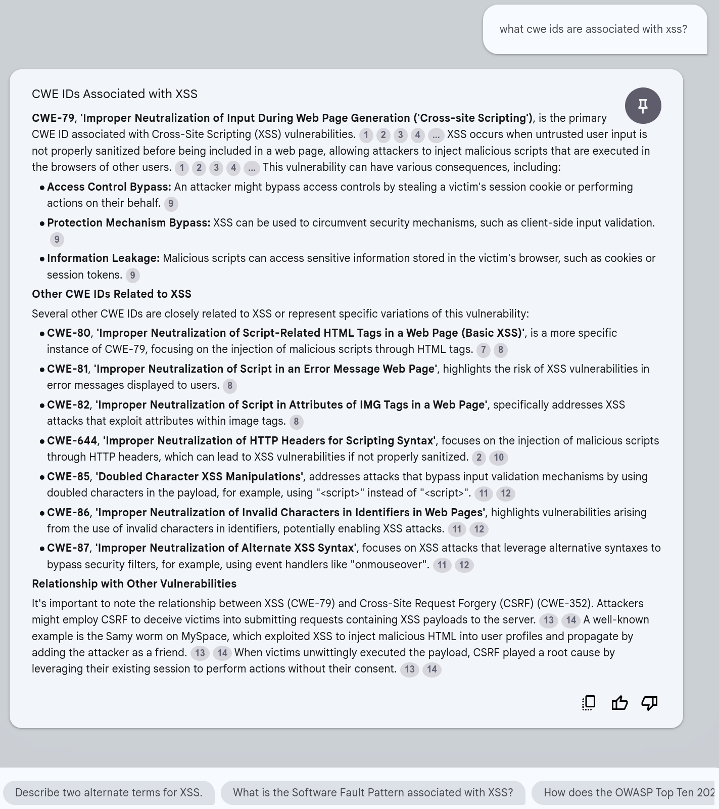

# NotebookLM CWE

!!! abstract "Overview"

    In this chapter, we'll use [NotebookLM](https://notebooklm.google.com/) to ingest the [Common Weakness Enumeration (CWE)](https://cwe.mitre.org/) list. 

    * In the current version (CWE Version 4.14 2024-02-29 as at June 2024), there are over 1400 CWEs, and 2789 pages in the PDF version of the list. 
    * It can be unwieldy to navigate or assimilate this information. 

    Using NotebookLM, we can chat with the CWE document and ask questions, so that **the information comes to us** in the form of an answer. 

    For comparison, we will also ask some of the same questions of ChatGPT4o covering 2 cases:

    1. without uploading any documents to it.
    2. uploading a document to it.
    


## Data Sources
[cwe_latest.pdf ](https://cwe.mitre.org/data/published/cwe_latest.pdf) from https://cwe.mitre.org/data/downloads.html has 2789 pages (version CWE Version 4.14 2024-02-29).

* This is too big for NotebookLM to ingest.
* So the PDF is split into 10 smaller PDFs of 280 pages each using this script.
* These 10 smaller PDFs are then ingested into [NotebookLM](https://notebooklm.google.com/).

````
pagesper=280 file=./data/NotebookLM_CweCapec/cwe_latest.pdf ./pdfsplit.sh  
````

!!! experiment "Data Sources"
    A copy of the original cwe_latest.pdf, and the 10 smaller PDFs it is split into, are available in
    https://github.com/CyberSecAI/CyberSecAI.github.io/tree/main/data/NotebookLM_Cwe/


<figure markdown>

</figure>

## CWE assigned to CVE-2024-0042 
I was reading a [post on LinkedIn](https://www.linkedin.com/feed/update/urn:li:activity:7214295735440187393?commentUrn=urn%3Ali%3Acomment%3A%28activity%3A7214295735440187393%2C7214365350828613632%29&dashCommentUrn=urn%3Ali%3Afsd_comment%3A%287214365350828613632%2Curn%3Ali%3Aactivity%3A7214295735440187393%29) and the CWE assigned by CISA ADP looked wrong.

So I used my NotebookLM CWE notebook, and other GPTs, to determine the appropriate CWE.

I then raised an issue: https://github.com/cisagov/vulnrichment/issues/84.


## what cwe ids are associated with buffer overflow?

<figure markdown>

</figure>

### ChatGPT4o Answer
ChatGPT4o did not provide all the CWEs that NotebookLM did.

<figure markdown>

</figure>


### ChatGPT4o Answer with uploaded CWE document
ChatGPT4o required some additional prompting to provide a comparable list of CWEs to what NotebookLM gave.


<figure markdown>

</figure>

## what cwe ids are associated with xss?

<figure markdown>

<figcaption>The Sources sidebar is no longer shown in this and the following examples</figcaption>
</figure>

## what is the parent weakness or cwe for xss and csrf?

<figure markdown>

</figure>

## what are the different types of xss?

<figure markdown>

</figure>

### ChatGPT4o Answer
ChatGPT4o provided the same types - but gave a much richer answer than NotebookLM did because it has access to a lot more documents on XSS.


<figure markdown>

</figure>

## what is the CWE associated with CVE-2021-27104 "Accellion FTA OS Command Injection Vulnerability"

<figure markdown>

</figure>

## what is the CWE associated with CVE-2019-1653 "Cisco Small Business RV320 and RV325 Routers Information Disclosure Vulnerability"

<figure markdown>

</figure>

### ChatGPT4o Answer
ChatGPT4o provided one CWE ID.

<figure markdown>

</figure>


  
## Takeaways
  
!!! success "Takeaways" 

    1. I found it useful, quick, and convenient to be able to ask questions of the CWE list, as a compliment to the traditional search method I've used in the past.
    1. The large CWE document could not be uploaded to NoteBookLM as one PDF document, but had to be split into smaller PDFs.
        1. The same document could be uploaded to ChatGPT4o (without splitting).
    2. Based on the extremely limited test cases here (your experience may vary):
        1. NoteBookLM provides better answers on the provided source documents.
        2. ChatGPT provides richer answers to questions that can be answered outside of the provided source documents.
    3. The [Vulnrichment](../Vulnrichment/Vulnrichment.md) chapter covers a much more detailed use case - and NoteBookLM performed better than other LLMs.