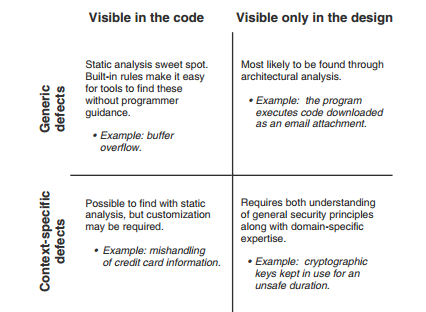
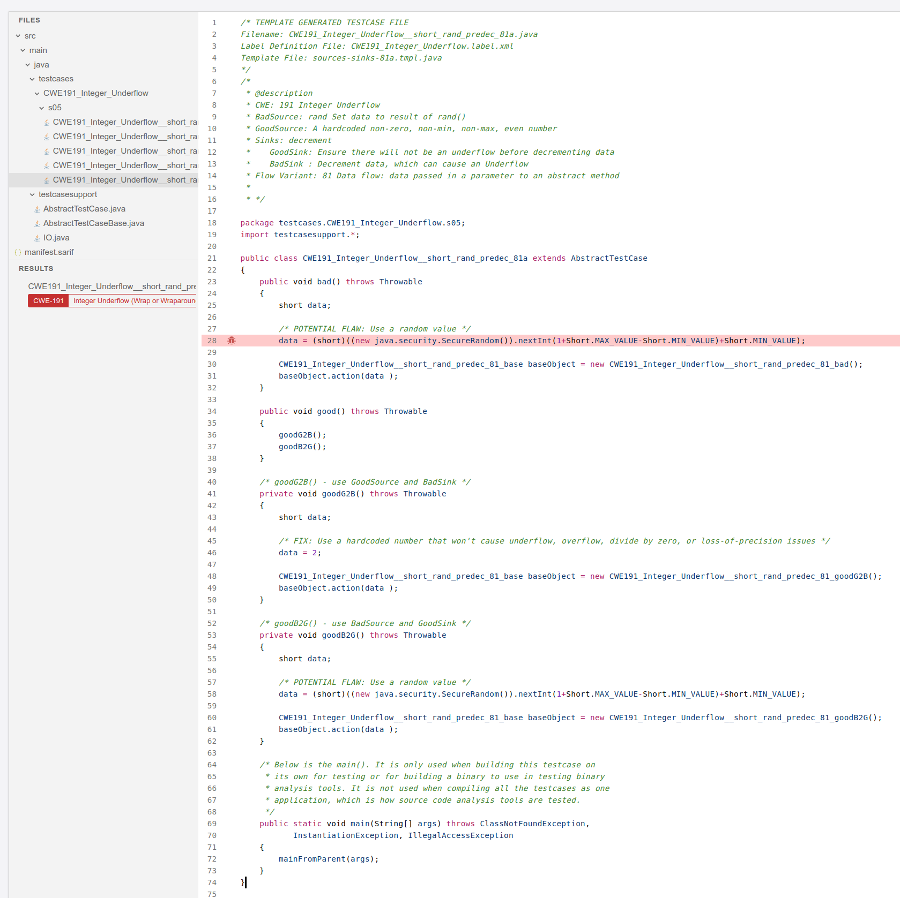
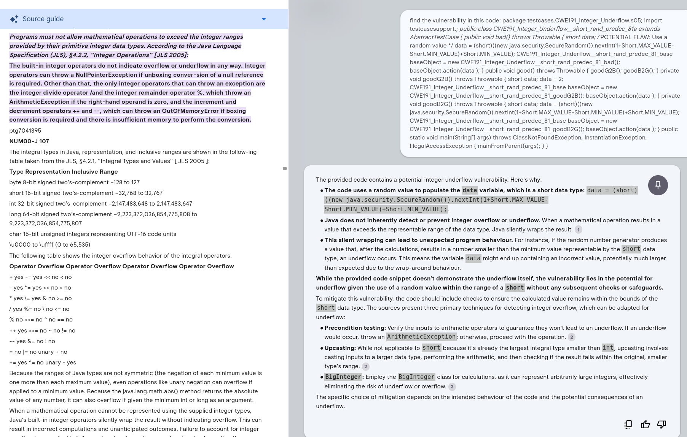
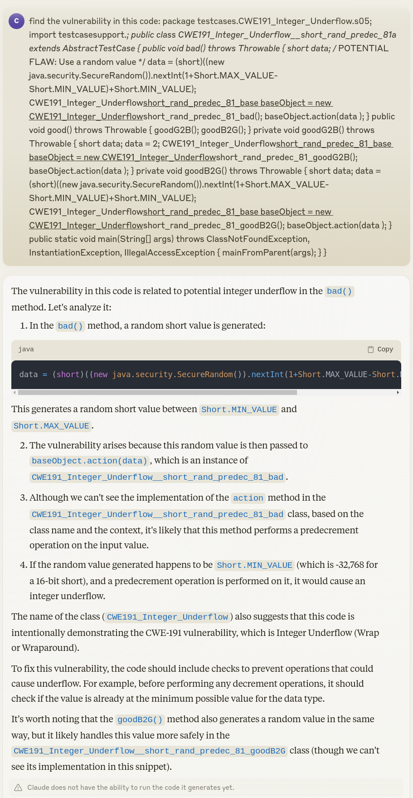
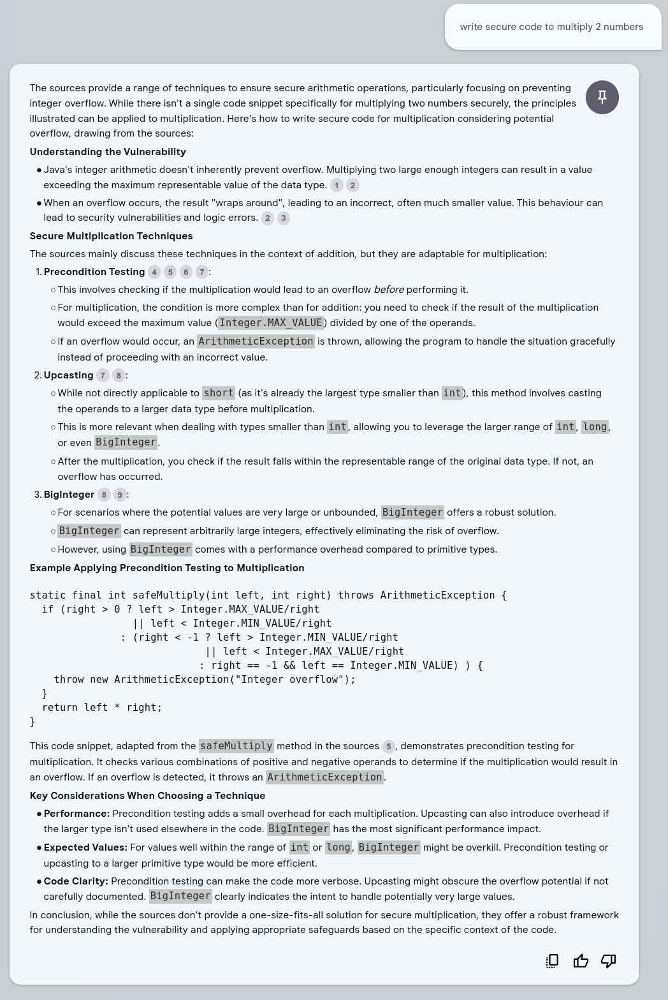
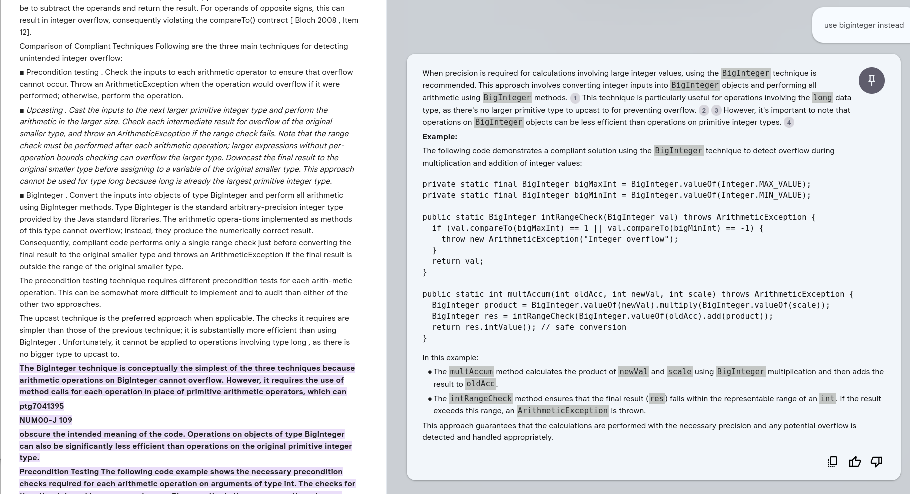
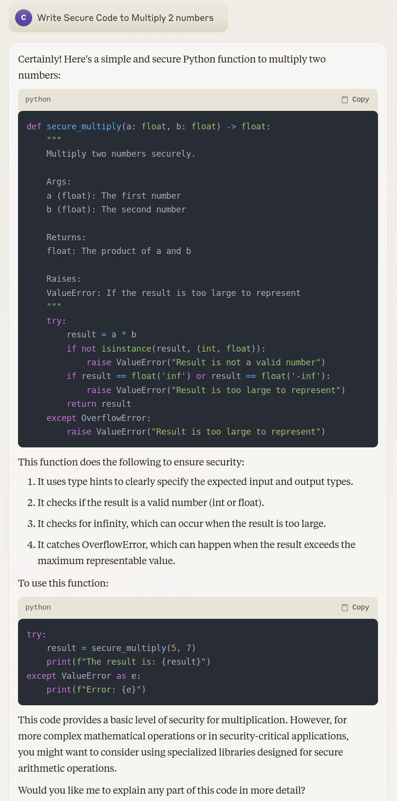
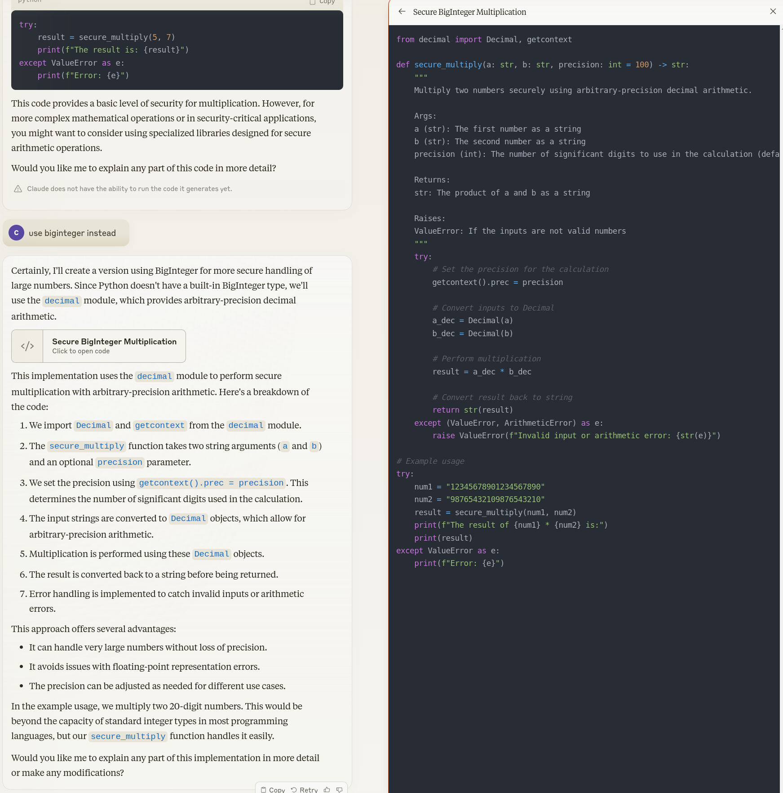

# NotebookLM Secure Code

!!! abstract "Overview"

    In two separate conversations recently, the topic of using LLMs for secure coding came up.
    One of the concerns that is often raised is that GenAI Code is not secure because GenAI is trained on arbitrary code on the internet.

    I was curious how NotebookLM would work for generating or reviewing secure code i.e. A closed system that has been provide a lot of guidance on secure code (and not arbitrary examples).

    Claude Sonnet 3.5 was also used for comparison.

## Vulnerability Types

[Secure Programming with Static Analysis](http://www.amazon.com/Secure-Programming-Static-Analysis-Brian/dp/0321424778/ref=sr_1_1?s=books&ie=UTF8&qid=1345459967&sr=1-1&keywords=Secure+Programming+with+Static+Analysis), classifies vulnerability types as follows:

<figure markdown>

</figure>

LLMs go beyond understanding syntax to understanding semantics and may be effective in the 3 quadrants that traditional static analysis isn't.

But in this simple test case below, the focus is on Generic defects visible in the code, as an initial proof of concept.

## Data Sources

Two books I had on Java were loaded to NotebookLM:

1. [The CERT Oracle Secure Coding Standard for Java](https://www.informit.com/store/cert-oracle-secure-coding-standard-for-java-9780321803955)
    1. The same material is available on https://wiki.sei.cmu.edu/confluence/display/java/SEI+CERT+Oracle+Coding+Standard+for+Java
1. [Java Coding Guidelines: 75 Recommendations for Reliable and Secure Programs](https://www.informit.com/store/java-coding-guidelines-75-recommendations-for-reliable-9780133439519)

### Test Data

NIST [Software Assurance Reference Dataset (SARD)](https://samate.nist.gov/SARD/) was used as the test dataset.

!!! quote
    The [Software Assurance Reference Dataset (SARD)](https://samate.nist.gov/SARD/) is a growing collection of test programs with documented weaknesses. Test cases vary from small synthetic programs to large applications. The programs are in C, C++, Java, PHP, and C#, and cover over 150 classes of weaknesses.

e.g. CWE: 191 Integer Underflow https://samate.nist.gov/SARD/test-cases/252126/versions/1.0.0#4

## Setup
1. Import both PDFs into a new NotebookLM.

## Test

### Test Code CWE: 191 Integer Underflow 

<figure markdown>

https://samate.nist.gov/SARD/test-cases/252126/versions/1.0.0#4
</figure>

### Review Test Code

Comments are removed from https://samate.nist.gov/SARD/test-cases/252126/versions/1.0.0#4 so the code fits in the prompt window.

<figure markdown>

</figure>

#### Claude 3.5 
<figure markdown>

</figure>

### Generate Code: Write Secure Code to Multiply 2 numbers 

<figure markdown>

</figure>

#### Use BigInteger Instead

<figure markdown>

</figure>

#### Claude 3.5 

<figure markdown>

</figure>
<figure markdown>

</figure>

## Llama 3.1 405B Code Training

Llama 3.1 405B was released July 2024.

The training process to generate good code is described in https://www.deeplearning.ai/the-batch/issue-260/.

!!! quote

    The pretrained model was fine-tuned to perform seven tasks, including **coding** and reasoning, via supervised learning and direct preference optimization (DPO). **Most of the fine-tuning data was generated by the model itself and curated using a variety of methods including agentic workflows**. For instance,

    To **generate good code to learn from**, the team: 

    1. Generated programming problems from random code snippets. 
    2. Generated a solution to each problem, prompting the model to follow good programming practices and explain its thought process in comments. 
    3. Ran the generated code through a parser and linter to check for issues like syntax errors, style issues, and uninitialized variables. 
    4. Generated unit tests. 
    5. Tested the code on the unit tests. 
    6. If there were any issues, regenerated the code, giving the model the original question, code, and feedback. 
    7. If the code passed all tests, added it to the dataset. 
    8. Fine-tuned the model. 
    9. Repeated this process several times.

    https://www.deeplearning.ai/the-batch/issue-260/

## Takeaways
  
!!! success "Takeaways" 

    1. NotebookLM with 2 Secure Code Java references performed well in these simple test cases.
    2. LLMs in conjunction with traditional code assurance tools can be used to "generate good code".