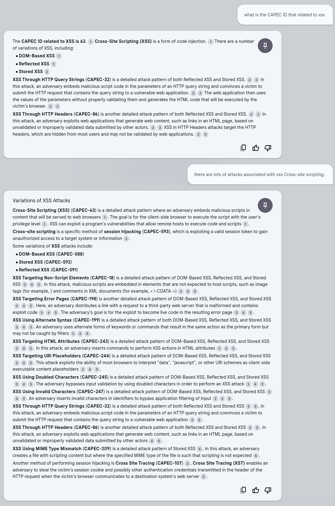
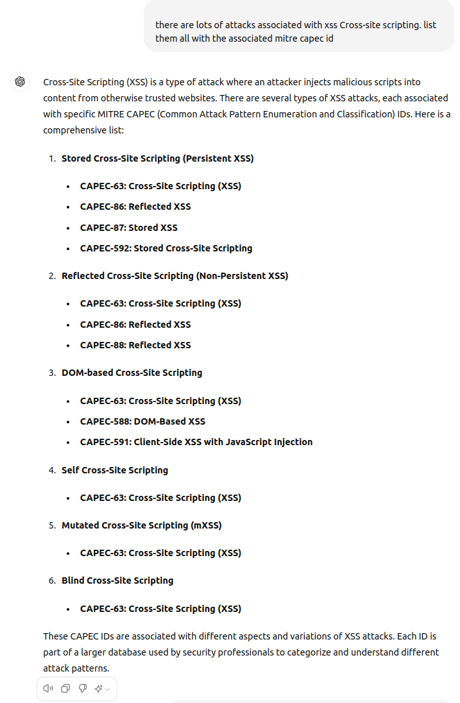
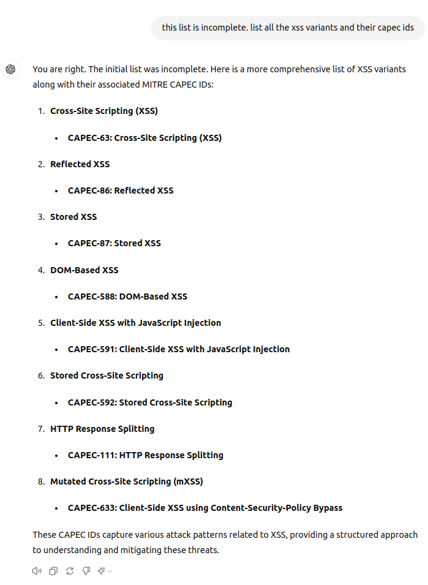
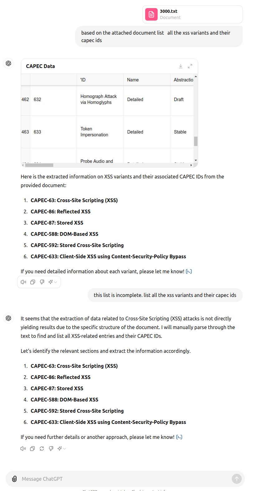
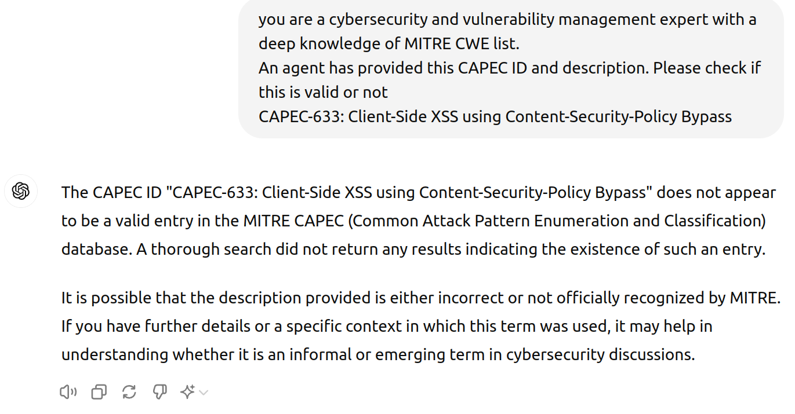
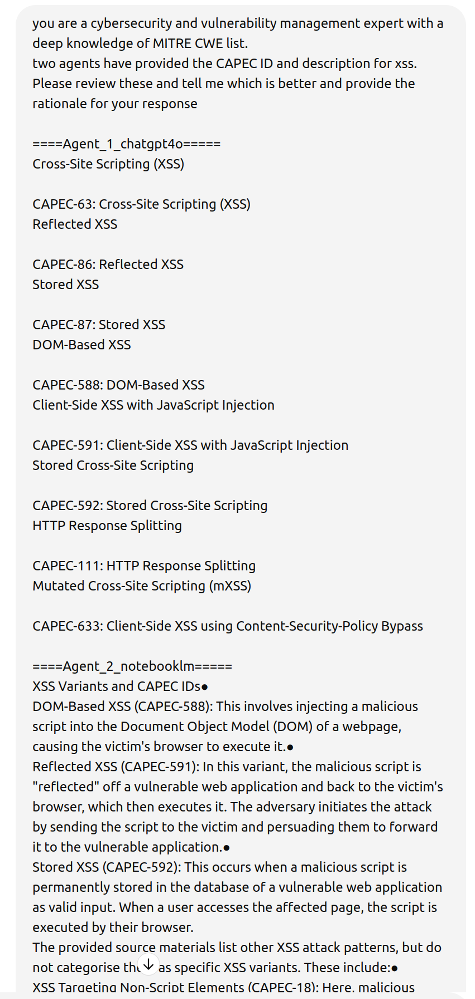
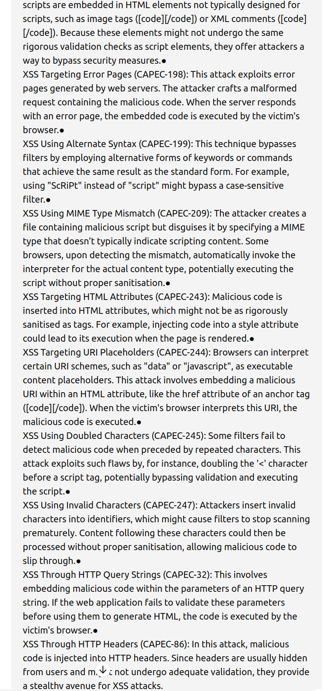

# NotebookML

!!! abstract "Overview"

    In this chapter, we'll use [NotebookLM](https://notebooklm.google.com/) to ingest the [Common Attack Pattern Enumeration and Classification (CAPEC) list](https://capec.mitre.org/). 

    * In the current version (CAPEC List Version 3.9 as at June 2024), there are 559 Total Attack Patterns. 
    * It can be unwieldy to navigate or assimilate this information. 

    Using NotebookML, we can chat with the CAPEC document and ask questions, so that **the information comes to us** in the form of an answer. 

    For comparison, we will also ask some of the same questions of ChatGPT4o covering 2 cases:

    1. without uploading any documents to it.
    2. uploading a document to it.

    **Note that CAPEC appears a lot less than CWE on the internet so an LLM will have a lot less context for CAPEC.**

## Data Sources

https://capec.mitre.org/data/downloads.html offers various formats (XML, CSV, HTML), and views:

* Mechanisms of Attack: https://capec.mitre.org/data/slices/1000.html
* Domains of Attack: https://capec.mitre.org/data/slices/3000.html
    * We'll use this one.

NotebookML - Upload from - Web page URL - Paste website link - https://capec.mitre.org/data/slices/3000.html

## what is the CAPEC ID that related to xss

<figure markdown>

</figure>

### ChatGPT4o Answer
ChatGPT4o did not provide all the CWEs that NotebookLM did.

<figure markdown>

</figure>

### ChatGPT4o Answer with Hallucination

<figure markdown>

</figure>
!!! failure 
    
    **Hallucination**

    "CAPEC-633: Client-Side XSS using Content-Security-Policy Bypass" is not valid
    https://capec.mitre.org/data/definitions/633.html

### ChatGPT4o Answer with Hallucination with Uploaded CAPEC File
ChatGPT4o UI did not process the CAPEC HTML file, and the UI does not accept URLs, so the CSV file was uploaded instead.

<figure markdown>

</figure>

### ChatGPT4o Validate the Hallucination
In a different ChatGPT4o session (new context to avoid the hallucination), we ask ChatGPT4o to validate the CAPEC. 

<figure markdown>

</figure>

### ChatGPT4o Review and Rate the Responses from NotebookLM and ChatGPT4o
ChatGPT4o was used to review and rate both responses (copied directly from the NoteBookLM and ChatGPT4o responses)

<figure markdown>

</figure>

<figure markdown>

</figure>

<figure markdown>

</figure>

## Takeaways
  
!!! success "Takeaways" 

    1. For less common or referenced text like CAPEC, ChatGPT4o can hallucinate even when the CAPEC list is uploaded to it.
       1. NotebookLM did not hallucinate (a benefit of the "Closed System" approach).