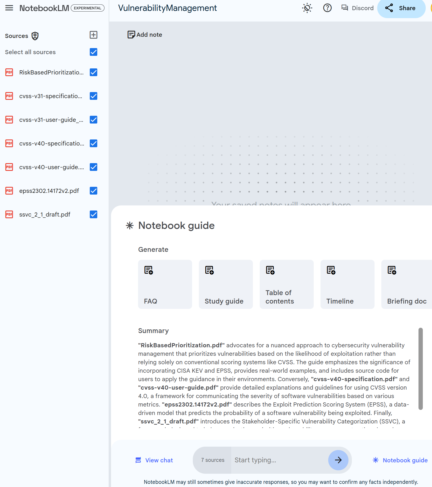

# NotebookML

!!! abstract "Overview"
    
    https://www.coguard.io/post/coguard-uses-openai-cybersecurity-grant-to-automate-infrastructure-security
    https://github.com/coguardio/coguard_openai_rule_auto_generation_research/tree/master?tab=readme-ov-file


## Details

### Task

    !!! quote
        [C1] Extraction of security and uptime-relevant configuration parameters from manuals
        The goal of this component is simple to describe, but hard to accomplish. Given a manual for a software component, extract the configuration parameters and define the security relevant ones from it.

        Example: For Apache Spark, the manual is provided on the general [confiugration page](https://spark.apache.org/docs/latest/configuration.html#spark-ui) online, i.e. in HTML format, and there is also a specific [security page](https://spark.apache.org/docs/latest/security.html). The expectation would be to at least extract the parameters from the security page, as well as some log-related items from the general page. In total, when manually examining the configuration parameters, it totals approximately 80 parameters that are security relevant. You can find these in the [Appendix A](https://github.com/coguardio/coguard_openai_rule_auto_generation_research/tree/master##appendix-a).


### original prompt 
    The original prompt used is per https://github.com/coguardio/coguard_openai_rule_auto_generation_research/tree/master?tab=readme-ov-file#extraction-of-security-relevant-parameters-in-c1"
    !!! quote
        You are an assistant that is a cybersecurity expert and knows their configuration files. Your response here should be a JSON list of strings
        Using the documentation of Apache Spark, which configuration parameters are relevant from a security perspective?.

### expected answer
    The expected answer is per https://github.com/coguardio/coguard_openai_rule_auto_generation_research/tree/master?tab=readme-ov-file#appendix-a. 
    !!! quote
        The following parameters were identified by the CoGuard team by hand as relevant from a security point of view.

        * spark.yarn.shuffle.server.recovery.disabled
        * spark.authenticate
        * spark.authenticate.secret
        * spark.authenticate.secret.file
        * spark.authenticate.secret.driver.file
        * spark.authenticate.secret.executor.file
        * THIS LIST IS TRUNCATED...


## Data Sources
The data sources are per above:
1. https://spark.apache.org/docs/latest/configuration.html
2. https://spark.apache.org/docs/latest/security.html


## Setup

### Prepare validation file
1. CopyNPaste the Expected answer to a text file ./data/NotebookML_Config/security_parameters_manual.txt.
2. Sort alphabetically to allow diff comparison with answer from NotebookLM.

````
    cat ./data/NotebookML_Config/security_parameters_manual.txt | sort > ./data/NotebookML_Config/security_parameters_manual_sorted.txt
````


## Attempt 1

### Create a new NotebookLM with the 2 Data Sources only
New NotebookLM.
Sources - Upload from - Web page URL for the 2 Data Sources listed above.

### Submit the prompt

    !!! quote
        You are an assistant that is a cybersecurity expert and knows their configuration files. Your response here should be a JSON list of strings
        Using the documentation of Apache Spark, which configuration parameters are relevant from a security perspective?.

### Save the result
1. Click the Copy button.
2. Create a new file security_parameters.json and save the result, then remove the ```` part at the beginning and end of the file so the file contains JSON only.
3. Sort the answer

````
jq -r '.[]' ./data/NotebookML_Config/security_parameters.json | sort > ./data/NotebookML_Config/security_parameters.txt
````

### Compare the answer with the expected answer


1. 60 parameters were retrieved
2. We can see that the main difference relates to "spark.ssl." parameters.
3. Searching manually in the 2 Data Sources above reveals that these config strings are not actually listed in the documentation e.g. "spark.ssl.ui.needClientAuth" directly - but using placeholders.
4. The LLM didn't understand that - so we'll let it know - then ask it again.
5. diff data/NotebookML_Config/security_parameters_manual.txt data/NotebookML_Config/security_parameters.txt   

````
diff data/NotebookML_Config/security_parameters_manual.txt data/NotebookML_Config/security_parameters.txt                 
1c1,4
< spark.yarn.shuffle.server.recovery.disabled
---
> hadoop.security.credential.provider.path
> spark.acls.enable
> spark.admin.acls
> spark.admin.acls.groups
2a6
> spark.authenticate.enableSaslEncryption
4d7
< spark.authenticate.secret.file
7,11c10,14
< spark.network.crypto.enabled
< spark.network.crypto.config.*
< spark.network.crypto.saslFallback
< spark.authenticate.enableSaslEncryption
< spark.network.sasl.serverAlwaysEncrypt
---
> spark.authenticate.secret.file
> spark.history.ui.acls.enable
> spark.history.ui.admin.acls
> spark.history.ui.admin.acls.groups
> spark.io.encryption.commons.config.*
15,20c18,29
< spark.io.encryption.commons.config.*
< spark.ui.allowFramingFrom
< spark.ui.filters
< spark.acls.enable
< spark.admin.acls
< spark.admin.acls.groups
---
> spark.kerberos.access.hadoopFileSystems
> spark.kerberos.keytab
> spark.kerberos.principal
> spark.kubernetes.hadoop.configMapName
> spark.kubernetes.kerberos.krb5.configMapName
> spark.kubernetes.kerberos.krb5.path
> spark.kubernetes.kerberos.tokenSecret.itemKey
> spark.kubernetes.kerberos.tokenSecret.name
> spark.mesos.driver.secret.envkeys
> spark.mesos.driver.secret.filenames
> spark.mesos.driver.secret.names
> spark.mesos.driver.secret.values
23,28c32,39
< spark.ui.view.acls
< spark.ui.view.acls.groups
< spark.user.groups.mapping
< spark.history.ui.acls.enable
< spark.history.ui.admin.acls
< spark.history.ui.admin.acls.groups
---
> spark.network.crypto.config.*
> spark.network.crypto.enabled
> spark.network.crypto.saslFallback
> spark.network.sasl.serverAlwaysEncrypt
> spark.redaction.regex
> spark.redaction.string.regex
> spark.security.credentials.${service}.enabled
> spark.sql.redaction.options.regex
30d40
< spark.ssl.port
36d45
< spark.ssl.protocol
37a47,48
> spark.ssl.port
> spark.ssl.protocol
41,77c52,57
< spark.ssl.ui.enabled
< spark.ssl.ui.port
< spark.ssl.ui.enabledAlgorithms
< spark.ssl.ui.keyPassword
< spark.ssl.ui.keyStore
< spark.ssl.ui.keyStorePassword
< spark.ssl.ui.keyStoreType
< spark.ssl.ui.protocol
< spark.ssl.ui.needClientAuth
< spark.ssl.ui.trustStore
< spark.ssl.ui.trustStorePassword
< spark.ssl.ui.trustStoreType
< spark.ssl.standalone.enabled
< spark.ssl.standalone.port
< spark.ssl.standalone.enabledAlgorithms
< spark.ssl.standalone.keyPassword
< spark.ssl.standalone.keyStore
< spark.ssl.standalone.keyStorePassword
< spark.ssl.standalone.keyStoreType
< spark.ssl.standalone.protocol
< spark.ssl.standalone.needClientAuth
< spark.ssl.standalone.trustStore
< spark.ssl.standalone.trustStorePassword
< spark.ssl.standalone.trustStoreType
< spark.ssl.historyServer.enabled
< spark.ssl.historyServer.port
< spark.ssl.historyServer.enabledAlgorithms
< spark.ssl.historyServer.keyPassword
< spark.ssl.historyServer.keyStore
< spark.ssl.historyServer.keyStorePassword
< spark.ssl.historyServer.keyStoreType
< spark.ssl.historyServer.protocol
< spark.ssl.historyServer.needClientAuth
< spark.ssl.historyServer.trustStore
< spark.ssl.historyServer.trustStorePassword
< spark.ssl.historyServer.trustStoreType
< spark.ui.xXssProtection
---
> spark.ssl.useNodeLocalConf
> spark.ui.allowFramingFrom
> spark.ui.filters
> spark.ui.strictTransportSecurity
> spark.ui.view.acls
> spark.ui.view.acls.groups
79c59,60
< spark.ui.strictTransportSecurity
\ No newline at end of file
---
> spark.ui.xXssProtection
> spark.user.groups.mapping
````


<figure markdown>

<figcaption>The initial screen after the documents are loaded.<br>CISA KEV was then loaded as a text file.</figcaption>
</figure>

````
diff data/NotebookML_Config/security_parameters_manual_sorted.txt data/NotebookML_Config/security_parameters_ns.txt               
10,12d9
< spark.history.ui.acls.enable
< spark.history.ui.admin.acls
< spark.history.ui.admin.acls.groups
16a14
> spark.kerberos.access.hadoopFileSystems
22a21
> spark.security.credentials.${service}.enabled
79d77
< spark.yarn.shuffle.server.recovery.disabled
````


## Takeaways
  
!!! success "Takeaways" 

    1. NotebookLM 


  

  
