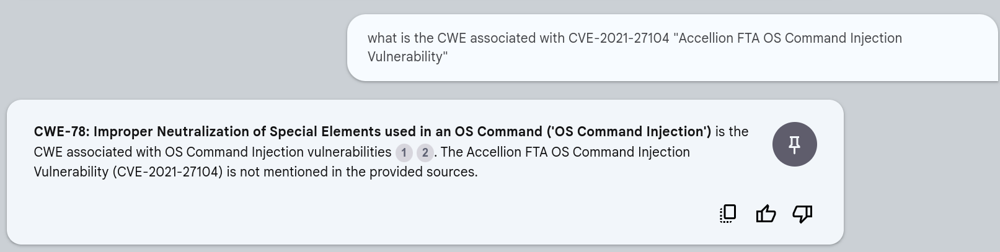

# NotebookML

!!! abstract "Overview"

    In this chapter, we'll use [NotebookLM](https://notebooklm.google.com/) to ingest the [Common Weakness Enumeration (CWE)](https://cwe.mitre.org/) list. 

    * In the current version (CWE Version 4.14 2024-02-29 as at June 2024), there are over 1400 CWEs, and 2789 pages in the PDF version of the list. 
    * It can be unwieldy to navigate or assimilate this information. 

    Using NotebookML, we can chat with the CWE document and ask questions, so that **the information comes to us** in the form of an answer. 
    


## Data Sources
[cwe_latest.pdf ](https://cwe.mitre.org/data/published/cwe_latest.pdf) from https://cwe.mitre.org/data/downloads.html has 2789 pages (version CWE Version 4.14 2024-02-29).

* This is too big for NotebookML to ingest.
* So the PDF is split into 10 smaller PDFs of 280 pages each using this script.
* These 10 smaller PDFs are then ingested into [NotebookLM](https://notebooklm.google.com/).

````
pagesper=280 file=./data/NotebookML_CweCapec/cwe_latest.pdf ./pdfsplit.sh  
````


## [NotebookLM](https://notebooklm.google.com/)

<figure markdown>

<figcaption>T</figcaption>
</figure>

<figure markdown>

</figure>

<figure markdown>

<figcaption>The Sources sidebar is no longer shown in this and the following examples</figcaption>
</figure>

<figure markdown>

</figure>

<figure markdown>

</figure>

<figure markdown>

</figure>

<figure markdown>

</figure>

<figure markdown>

</figure>


  

  

  
