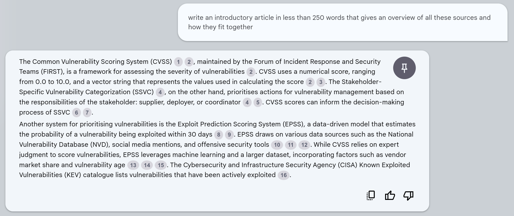
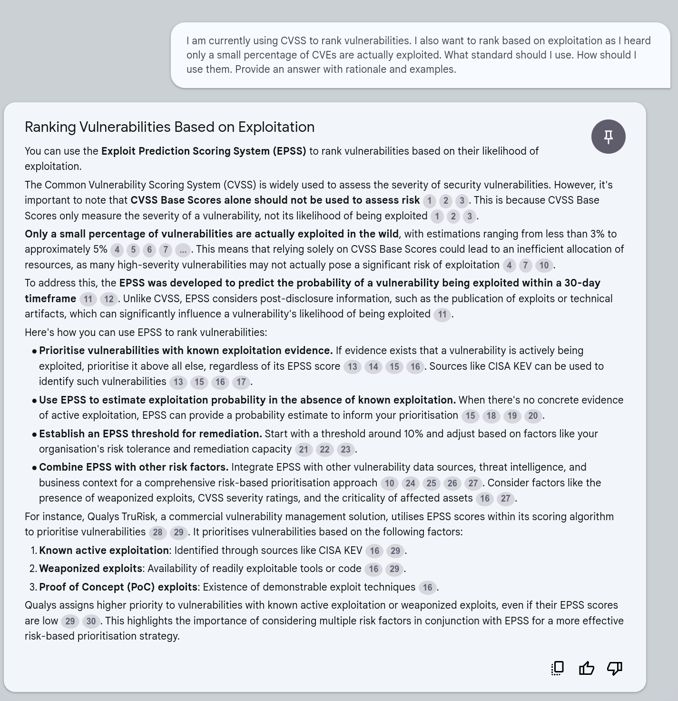
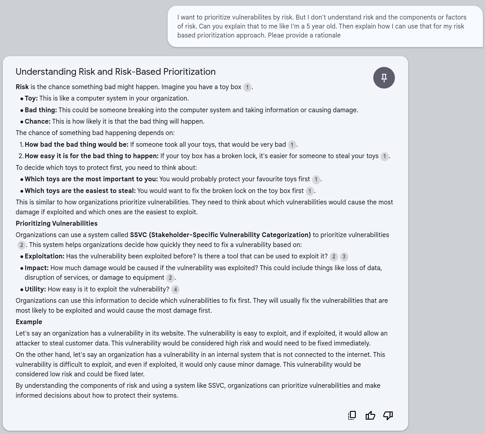
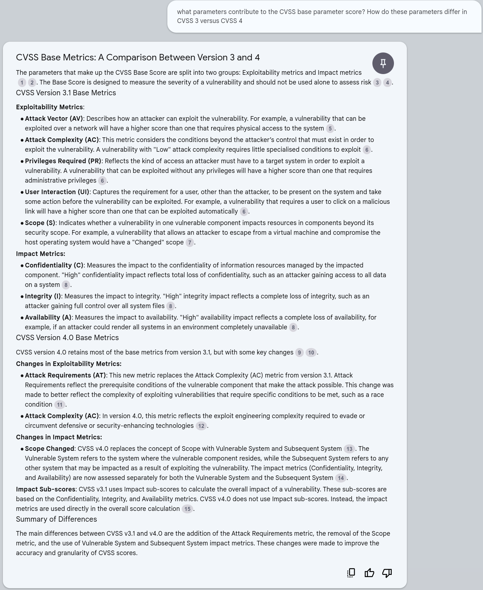
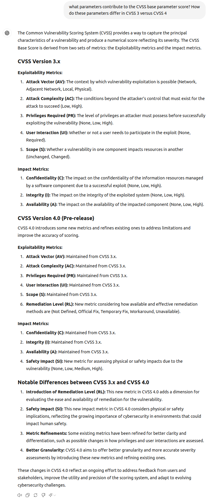
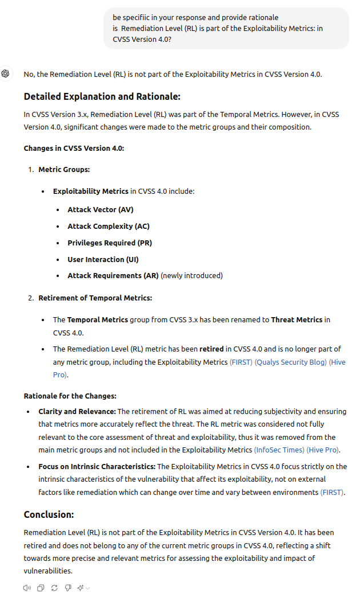

# NotebookML

!!! abstract "Overview"

    In this chapter, we'll feed the main vulnerability standards to [NotebookLM](https://notebooklm.google.com/).

## Data Sources

These files are available in docs/NotebookML/InputDocs for convenience.

| **Content**                                                                     | **Page with link to content**                          | **Direct Link**                                                                                     |
|---------------------------------------------------------------------------------|--------------------------------------------------------|-----------------------------------------------------------------------------------------------------|
| Risk Based Prioritization Guide                                                 | https://riskbasedprioritization.github.io/print_page/  | Print - Save to PDF                                                                                 |
| CVSS 3.1 User Guide                                                             | https://www.first.org/cvss/v3.1/user-guide             | https://www.first.org/cvss/v3-1/cvss-v31-user-guide_r1.pdf                                          |
| CVSS 3.1 Specification                                                          | https://www.first.org/cvss/v3.1/specification-document | https://www.first.org/cvss/v3-1/cvss-v31-specification_r1.pdf                                       |
| CVSS 4.0 User Guide                                                             | https://www.first.org/cvss/v4.0/user-guide             | https://www.first.org/cvss/v4-0/cvss-v40-user-guide.pdf                                             |
| CVSS 4.0 Specification Document                                                 | https://www.first.org/cvss/v4.0/specification-document | https://www.first.org/cvss/v4-0/cvss-v40-specification.pdf                                          |
| Exploit Prediction Scoring System (EPSS) FAQ                                    | https://www.first.org/epss/faq                         | https://www.first.org/epss/faq                                                                      |
| Exploit Prediction Scoring System (EPSS) latest published paper                 | https://www.first.org/epss/model                       | https://arxiv.org/pdf/2302.14172                                                                    |
| Stakeholder-Specific Vulnerability Categorization (SSVC) latest published paper | https://github.com/CERTCC/SSVC/tree/main/pdfs          | https://github.com/CERTCC/SSVC/blob/main/pdfs/ssvc_2_1_draft.pdf                                    |
| CISA KEV                                                                        | https://www.cisa.gov/known-exploited-vulnerabilities   | copy and paste text to a file cisakev.txt because NotebookML cannot pull content directly from the page |

<figure markdown>

<figcaption>The initial screen after the documents are loaded. CISA KEV was then loaded as a text file.</figcaption>
</figure>

!!! quote
    write an introductory article in less than 250 words that gives an overview of all these sources and how they fit together

<figure markdown>

<figcaption></figcaption>
</figure>

Each circled-number is a clickable link to the reference text in the original sources.

## I want to rank vulnerabilities by Exploitation

!!! quote
    
    I am currently using CVSS to rank vulnerabilities. I also want to rank based on exploitation as I heard only a small percentage of CVEs are actually exploited. What standard should I use. How should I use them. Provide an answer with rationale and examples.

<figure markdown>

<figcaption></figcaption>
</figure>

## Explain risk like I'm a 5 year old

!!! quote
    
    I want to prioritize vulnerabilities by risk. But I don't understand risk and the components or factors of risk. Can you explain that to me like I'm a 5 year old. Then explain how I can use that for my risk based prioritization approach. Please provide a rationale

<figure markdown>

<figcaption></figcaption>
</figure>

## CVSS Base Parameters for CVSS v3 and v4

!!! quote
    
    what parameters contribute to the CVSS base parameter score? How do these parameters differ in CVSS 3 versus CVSS 4

<figure markdown>

<figcaption></figcaption>
</figure>

### ChatGPT4o Response

<figure markdown>

<figcaption></figcaption>
</figure>

!!! failure 
    
    **Hallucination**
    Remediation Level (RL) is NOT part of the Exploitability Metrics
    
    !!! quote
    
        Remediation Level (RL): New metric considering how available and effective remediation methods are (Not Defined, Official Fix, Temporary Fix, Workaround, Unavailable).

### ChatGPT4o Check Response
<figure markdown>

<figcaption></figcaption>
</figure>

  
## Takeaways
  
!!! success "Takeaways" 

    1. NotebookLM does a good job assimilating these verbose standards and was competently able to answer specific factual questions, and broader opinionated questions.
    2. Lots of references to the source material were provided in the answers which help understand and validate the answers.

  

  
