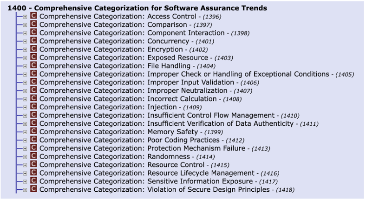
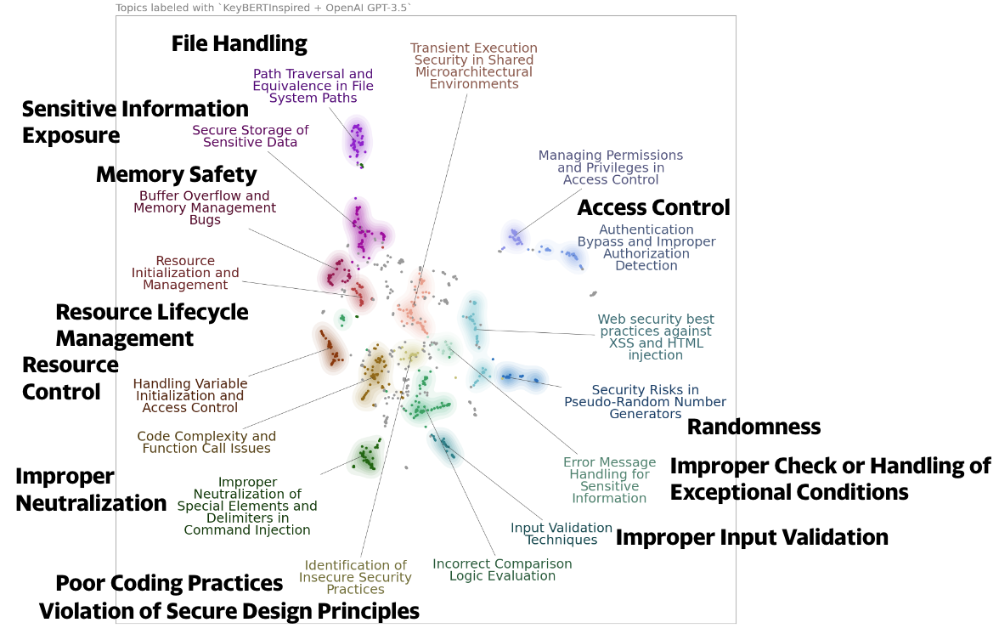

# BERTopic

!!! abstract "Overview"

    Topic modeling can be used to discover the underlying themes and patterns in a collection of documents (e.g. CVE Descriptions, or CWE Descriptions,...).

    It is an unsupervised machine learning technique that’s capable of scanning a set of documents, detecting word and phrase patterns within them, and automatically clustering word groups and similar expressions that best characterize the set of documents.

    The output is collections of documents that the algorithm has grouped together, as well as clusters of words and expressions that it used to infer these relations.

## BERTopic
BERTopic is a topic modeling technique that leverages 🤗 transformers and c-TF-IDF. In general, it outperforms other methods (statistical vs Language Model based) e.g. LSA, LDA. 

!!! quote
    Before diving into a classification task, text clustering allows for getting an intuitive understanding of the task but also of its complexity.

    BERTopic is a topic modeling technique that assumes that clusters of semantically similar documents are a powerful way of generating and describing clusters. The documents in each cluster are expected to describe a major theme and combined they might represent a topic.

    Extracts from book co-authored by BertTopic creator: https://www.oreilly.com/library/view/hands-on-large-language/9781098150952/

## Topic Model CWEs

I've used BERTopic to Topic Model lots of datasets to quickly get an intuition for the data.

In this example, we'll look at CWEs. 

* Specifically, generate a Topic Model of the ~1400 CWEs in [1400 View](https://cwe.mitre.org/data/definitions/1400.html), so we can better understand the underlying patterns and themes.

I did this initially as part of a [Linked Thread](https://www.linkedin.com/feed/update/urn:li:activity:7186373368344920064?commentUrn=urn%3Ali%3Acomment%3A%28activity%3A7186373368344920064%2C7186485198996353024%29&dashCommentUrn=urn%3Ali%3Afsd_comment%3A%287186485198996353024%2Curn%3Ali%3Aactivity%3A7186373368344920064%29), to illustrate Topic Modeling as a solution, but also the ease and speed at which it could be done.

## Code

!!! example "Source Code"
    The starting point code is deliberately chosen as unrelated to CyberSecurity: https://github.com/splevine/harnessing-nlp-cx-demo Mar 2024 (where this repo gives an excellent overview of NLP and BERTopic and SetFit).

    The main changes I made were:

    1. Don't use wandb (Weights and Balances) service as it was not needed for the demo
    2. Use the 1400 CWE view [1400.csv](https://cwe.mitre.org/data/csv/1400.csv.zip) as the input Data
    3. Use SentenceTransformer("basel/ATTACK-BERT") as the embedding_model so that CyberSecurity embeddings are used.

    The code and visualizations are available here: https://colab.research.google.com/drive/168i3oHekL4Cva2s2w01KMq6mnffDgxIS?usp=sharing
    No effort was made to optimize the topic modeling i.e. it was completely unsupervised.

## Topic Model of the ~1400 CWEs in 1400 View

<figure markdown>

The top level categorizations of CVE 1400 per https://cwe.mitre.org/data/definitions/1400.html.
</figure>

<figure markdown>

The Topic Model of 1400 CWE view [1400.csv](https://cwe.mitre.org/data/csv/1400.csv.zip) with the top level categorizations overlayed in bold to allow comparison of the top level groupings assigned by MITRE and the Topic Modeling.
</figure>

Other visualizations are available in the [Colab Notebook](https://colab.research.google.com/drive/168i3oHekL4Cva2s2w01KMq6mnffDgxIS?usp=sharing).

## Takeaways
  
!!! success "Takeaways" 

    1. Topic Modeling with BERTopic is a powerful unsupervised learning approach to quickly and easily get an intuition for a set of documents.