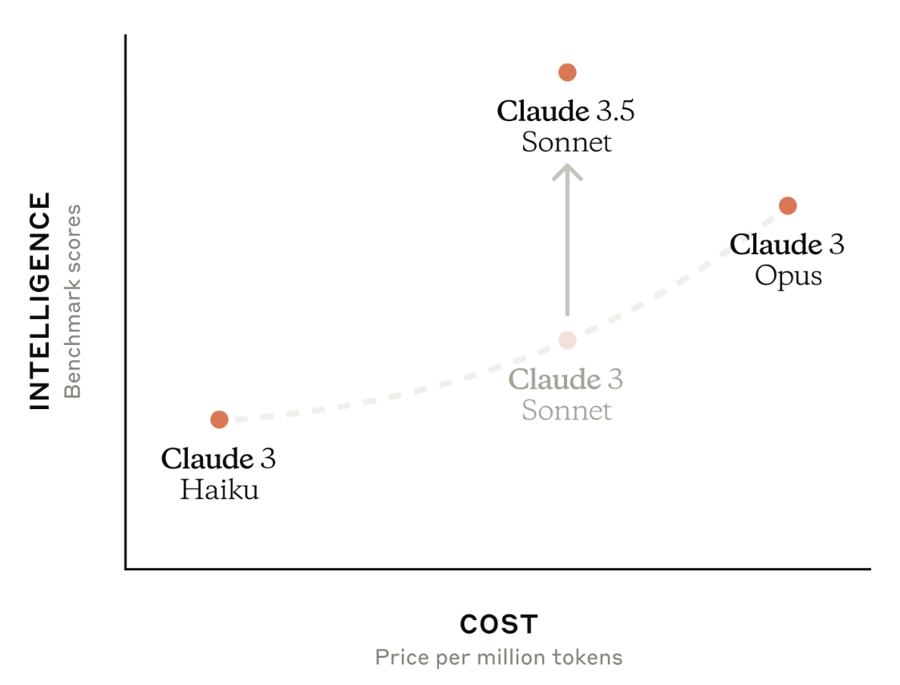
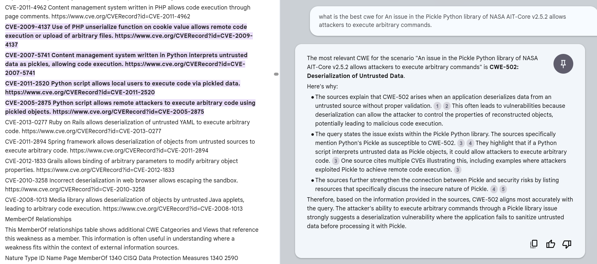
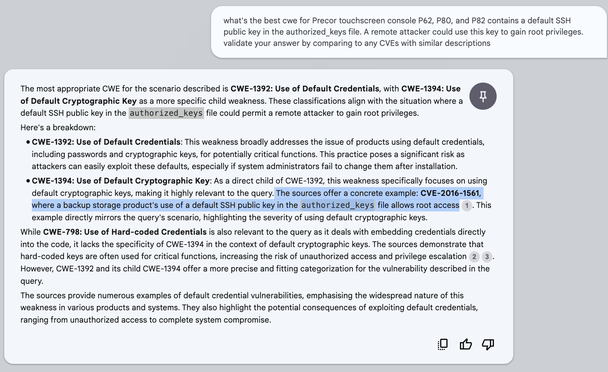

# CISA Vulnrichment

!!! abstract "Overview"

    **An incorrect CWE assignment caught my eye while reading a post**

    I was reading a [post on LinkedIn](https://www.linkedin.com/feed/update/urn:li:activity:7214295735440187393?commentUrn=urn%3Ali%3Acomment%3A%28activity%3A7214295735440187393%2C7214365350828613632%29&dashCommentUrn=urn%3Ali%3Afsd_comment%3A%287214365350828613632%2Curn%3Ali%3Aactivity%3A7214295735440187393%29) and the CWE assigned by CISA ADP looked wrong so...

    * I used my [NotebookLM CWE notebook](../NotebookLM/NotebookLM.md), and other LLMs, to determine the appropriate CWE.
    * I then raised an issue: https://github.com/cisagov/vulnrichment/issues/84.
    * I then decided to dig a bit more into this... specifically the CWEs assigned by CISA ADP.

    **Using LLMs to find incorrect CWE assignments at scale**


    I used [langchain](https://www.langchain.com/) to create a consensus of LLMs to review all CWEs assigned by CISA ADP to find issues:


    * These issues were found automatically by a consensus of 3 LLMs: (current state-of-the-art) ChatGPT4o, Gemini 1.5 Pro, Claude 3.5 Sonnet who were asked to review CWEs assigned to CVEs by CISA ADP.
    * The consensus output was then reviewed by a human (me).
  
    * I created [3 Vulnrichment Github Issues initially](https://github.com/cisagov/vulnrichment/issues?q=is%3Aissue+author%3ACrashedmind+is%3Aclosed) and these were accepted by CISA Vulnrichment and resolved promptly!
    
    * I then provided a report to CISA Vulnrichment for all CWEs that were incorrect based on the consensus.

    **Using LLMs to assign correct CWEs**

    Finally, I showed how NotebookLM can be used for CWE assignment

    * It avoids the problem of
        * training language models on bad data (existing CVE CWE assignments)
        * training humans on the detailed CWE standard (though a basic understanding is still required)
    * **NotebookLM did well in recommending a CWE given a CVE Description.... and providing a supporting CVE from the CWE Observed Examples in the CWE standard**.
        *  NotebookLM has a large context window which allows it to digest the large CWE standard, and it is source-grounded as described in the [NotebookLM chapter](../NotebookLM/NotebookLM.md).
        *  [NotebookLM_Cwe](../NotebookLM/NotebookLM_Cwe.md) describes how to create this NotebookLM for CWEs

    The different approaches used (and the subscription plan used):

    2. code: 
        1. ChatGPT4o [OpenAI Batch API](https://platform.openai.com/docs/guides/batch/overview) (Plus Plan)
        2. langchain calling 2 LLMs via APIs: Gemini 1.5 Pro, Claude 3.5 Sonnet (ChatGPT4 or ChatGPT4o is also supported in the code (but commented out) if your plan supports that)
    1. no-code using the browser chat interface is not shown here but it is useful for initial evaluation
        1. Gemini 1.5 Pro (subscription)
        2. Claude 3.5 Sonnet (prepay)


!!! success  

    The approach described here resulted in successfully identifying incorrectly assigned CWEs, and identifying the correct CWEs, and a report to CISA Vulnrichment.

    

## Consensus of 3 LLMs


!!! example "Source Code"
    https://github.com/CyberSecAI/CWEMap


## CISA Vulnrichment

!!! quote
    The CISA Vulnrichment project is the public repository of CISA's enrichment of public CVE records through CISA's ADP (Authorized Data Publisher) container. In this phase of the project, CISA is assessing new and recent CVEs and adding key SSVC decision points. Once scored, some higher-risk CVEs will also receive enrichment of CWE, CVSS, and CPE data points, where possible.

    https://github.com/cisagov/vulnrichment

I have great admiration for CISA and their pragmatic initiatives like [CISA KEV](https://riskbasedprioritization.github.io/cisa_kev/cisa_kev/) and [SSVC](https://riskbasedprioritization.github.io/ssvc/SSVC/) and have [spoken about them](https://riskbasedprioritization.github.io/talks/talks/) and applied them in production.

!!! Tip
    One of the many benefits of this Vulnrichment project is that feedback can be provided as GitHub issues and **the team is VERY responsive** ✅ :clap: 🙌
    
    * The 'Bug' label was assigned the same day to the 3 issues I submitted: https://github.com/cisagov/vulnrichment/issues?q=is%3Aissue+author%3ACrashedmind+is%3Aclosed.
    * The changes were accepted and applied the next working day and a comment was added to the ticket which was then closed.

    My overall goal here was to 

    * Show that LLMs could augment human analysts where vulnerability enrichment today is largely done manually.
    * Show how to use them for this purpose.
    * Get people to use LLMs to improve the quality of the CVE data in general, and in this specific example case, the CWE data.
    * Maximize the value of the CISA ADP data and enrichment by improving CWE-assignment quality.

## Get CVEs Enriched by CISA ADP


## Approach to using Language Models


* All CVE Descriptions and assigned CWEs were sent to all 3 LLMs.


### Don't Train A Model On Bad Data!

It is possible to train a Language Model as a Classifier to assign CWEs to a CVE - and there are several research papers that took that approach e.g.

* [V2W-BERT: A Framework for Effective Hierarchical Multiclass Classification of Software Vulnerabilities](https://arxiv.org/pdf/2102.11498v1.pdf) 
* [Automated Mapping of CVE Vulnerability Records to MITRE CWE Weaknesses](https://arxiv.org/pdf/2304.11130.pdf)

The problems with this approach:

1. It's delusional based on my research and experience of incorrect assigned CWEs in general - Garbage In Garbage Out
    1. Per [Steve Christey Coley, CWE tech lead](https://www.linkedin.com/feed/update/urn:li:activity:7186373368344920064?commentUrn=urn%3Ali%3Acomment%3A%28activity%3A7186373368344920064%2C7186417379470385153%29&dashCommentUrn=urn%3Ali%3Afsd_comment%3A%287186417379470385153%2Curn%3Ali%3Aactivity%3A7186373368344920064%29): 

    !!! quote 
        There has been significant interest in using AI/ML in various applications to use and/or map to CWE, but in my opinion there are a number of significant hurdles, e.g. you can't train on "bad mappings" to learn how to do good mappings.

2. It removes a lot of the context that could be available to an LM by reducing the reference target down to a set of values or classes (for the given input CVE Descriptions)


### Train on Good Data and the Full Standard

We can "train" on "good mappings".

1. The CWE standard includes known "good mappings" e.g. [CWE-917 Observed Examples](https://riskbasedprioritization.github.io/risk/Log4Shell/#mitre-cwe-917) includes CVE-2021-44228 and its Description.
    1. The count of these CVE Observed Examples varies significantly per CWE. 
    2. There's ~3000 CVE Observed Examples in the CWE standard.
2. We can use the full CWE standard and associated known good CVE assignments in the standard (CVE Observed Examples for a given CWE) as the target, allowing an LLM to compare the CVE Description (and other data) to this.
    1. And moreover, prompt the LLM to provide similar CVEs to support its rationale for the CWE assignment

!!! tip
    Rather than train a model on bad data, we can ask a model to assign / validate a CWE based on its understanding of the CWEs available (and its understanding of CWEs assigned to similar CVEs based on the Observed Examples for each CWE in the standard)

We can use a Closed or Open Model:

1. a closed-model with access to the CWE specification only (and no other data) e.g. NotebookLM
2. an open-model with access to the CWE specification and other data


### What to ask the LLMs?

Different approaches are possible when providing the CVE Description to the LLM:

1. provide the CWE assigned as part of the CVE, and ask the LLM if it agrees or not, and only if not, why
      1. This reduces the output token count/cost by only outputting the verbose rationale in case of disagreement
2. ask the LLM to assign one or more CWEs, with rationale

The first approach is easier and simpler and cheaper (in terms of token use i.e. shorter response output), and better as a first pass option to get the low hanging fruit.

The second approach could be used at the time of CWE assignment to get a second opinion.


### Consensus

To minimize human effort, 3 LLMs are used and the consensus is reviewed
      
* The LLMs are state-of-the-art models from different providers i.e. the best available and reasonably independent.
* The results are sorted by consensus i.e. 3 models in agreement, then 2 models in agreement,.... and by the LLM's confidence in their responses
* A Human (me) then reviewed (sorted by consensus and confidence) and made the final decision.


### Recipe


1. Get the Vulnrichment subset of CVEs where CISA ADP assigned a CWE (regardless of whether the CWE was the same or different than that assigned by the CNA) into a sheet/CSV file.
      1. ~1.8K (CISA ADP Assigned CWEs) of ~~10K CVEs (in Vulnrichment)
2. As a dry-run submit e.g. 50 CVE Descriptions, CWEs to each of the 3 LLMs to review via the chat UI in one prompt
3. Ask ChatGPT4o (via Batch API) to Agree (Yes/No) with the assigned CWE (and provide a Confidence score, and rationale if not)
     1. Sort these by Confidence score i.e. start with the highest Confidence ones.
4. Assign the same task to Gemini and Claude via APIs driven by langchain


### Create a Prompt
#### Chat Interface - Table Output

````
caption_system_prompt =
You are a cybersecurity expert specializing in identifying Common Weakness Enumeration (CWE) IDs from CVE descriptions.
Your goal is is to say if you Agree with the assigned CWE ID or not.
You will be provided with a CVE ID and description amd a CWE ID that has been assigned to that CVE description.

Please provide the response in a table 'cve_id', 'CWE_ID', 'Agree'. "Rationale", Confidence' where
1. Agree: string // Yes or No
2. Rationale: string // Only if you do not Agree, provide a rationale why not
3. Confidence: string // a confidence score between 0 and 1
````

The table output allows copy-and-pasting by a human into a sheet.


The prompt consists of these parts:

1. Role + Task: which is the same for the Chat and API interface
2. Output format: which is different for the Chat and API interface
3. A binary value Agree is requested
4. The rationale only if there is disagreement. This saves on output tokens.
5. A Confidence score to limit impacts of hallucinations, and as a way to assess and prioritize responses by confidence.
6. No (Few-shot) examples are provided. Based on the results, these were not necessary.
      1. If Few-shot examples were required, I'd submit multiple CVEs in a single batch request (because putting the examples in each single CVE request would add a LOT of input tokens)
#### Batch API Interface - JSON Output


````
caption_system_prompt =
You are a cybersecurity expert specializing in identifying Common Weakness Enumeration (CWE) IDs from CVE descriptions.
Your goal is is to say if you Agree with the assigned CWE ID or not.
You will be provided with a CVE ID and description amd a CWE ID that has been assigned to that CVE description.

You will output a json object containing the following information:
{
    Agree: string // Yes or No
    Rationale: string // Only if you do not Agree, provide a rationale why not
    Confidence: string // a confidence score between 0 and 1
}
````
The JSON output allows processing by machines.

!!! tip "Use JSON Mode"
    [ChatGPT](https://platform.openai.com/docs/guides/text-generation/json-mode) and [Gemini 1.5](https://ai.google.dev/gemini-api/docs/json-mode?lang=python) support JSON mode that always outputs valid JSON. Use it!
    
    * See [details of Latest Gemini features support in LangChain4j 0.32.0](https://medium.com/google-cloud/latest-gemini-features-support-in-langchain4j-0-32-0-732791e4c34c).

    While you can prompt an LLM to output JSON, it may not always output valid JSON and you're left with a cleanup exercise (a friend of mine had that experience when they first tried this 😉)

    [Claude doesn't have a formal "JSON Mode"](https://github.com/anthropics/anthropic-cookbook/blob/main/misc/how_to_enable_json_mode.ipynb) though, in my usage, it always produced valid JSON.


!!! tip
    It is possible to submit multiple CVEs in one prompt for each batch entry i.e. similar to what is done when using the Chat interface.

    * This is what is done here. 10 CVE CWE assignments are sent per batch (though the [OpenAI Batch API](https://platform.openai.com/docs/guides/batch/overview) example contains 1 entry only)


### LLMs

#### Gemini 1.5 Pro API via Langchain

The API interface (via Langchain) was used in this example submitting multiple CVEs in one prompt.

#### Claude 3.5 Sonnet API via Langchain

##### Model
Currently: Claude 3.5 Sonnet was used as it has the best performance vs cost for Claude models.

<figure markdown>

https://docs.anthropic.com/en/docs/welcome 
</figure>

##### Interface
Currently: Claude does not support a native [Batch API interface](https://www.anthropic.com/pricing#anthropic-api) - though 
[Amazon Bedrock](https://aws.amazon.com/bedrock/pricing/) supports batching of prompts to models including Claude.


The API interface (via Langchain) was used in this example submitting multiple CVEs in one prompt.


#### [ChatGPT4o Batch API](https://platform.openai.com/docs/guides/batch/overview)

##### Model
gpt-4o

##### Plan
The Plus plan subscription was used.

!!! quote
    
    There are some restrictions:

       * The file can contain up to 50,000 requests.
       * The file cannot be more than 100 MB in size.

    Enqueued token limit reached for gpt-4o in organization XYZ. Limit: 90,000 enqueued tokens. Please try again once some in_progress batches have been completed.'


##### Interface
Batch Interface API.

The ~1800 ADP CVE-CWE pairs were split into 15 files of 100 CVE-CWE pair prompts to comfortably fit under this token limit.

* very little effort was spent to optimize the file size (number of prompts per batch), or the prompt size.
* The cost to process the ~1800 ADP CVE-CWE pairs: ~$2.

## Observations

### Leak 
Several CVE Descriptions that include "leak" were incorrectly assigned "CWE-200 Exposure of Sensitive Information to an Unauthorized Actor".

These were actually resource leaks (memory, program objects like handles etc...), not leakage of sensitive data.
### Gemini 1.5 Pro Hallucinations


!!! failure
    From a sample of 30 assigned CWEs, Gemini 1.5 Pro had 3 hallucinations when asked to provide a rationale for its response (response text shown below, with hallucination in **bold**).
      
    !!! quote

         1. While CWE-400 (Uncontrolled Resource Consumption) could be a potential consequence, the core issue described in the CVE is about improper handling of the Python crash handler within a chroot environment. This misconfiguration could allow an attacker to potentially escape the chroot and execute code in the context of the Apport process.  A more appropriate CWE might be **CWE-247 (Improper Handling of Chroot Environments)** or CWE-22 (Improper Limitation of a Pathname to a Restricted Directory ('Path Traversal')).
            1. [CWE-247: DEPRECATED: Reliance on DNS Lookups in a Security Decision](https://cwe.mitre.org/data/definitions/247.html)
            2. [CWE-243: Creation of chroot Jail Without Changing Working Directory](https://cwe.mitre.org/data/definitions/243.html) is the closest to "Improper Handling of Chroot Environments"
        1. The assigned **CWE-436 (Unspecified Encoding or Escaping of Output)** doesn't fit well. The description argues that the plugin itself doesn't handle file uploads, making it a matter of what WordPress allows to be uploaded. If the core WordPress installation doesn't prevent polyglot files, it's not directly the plugin's fault. A more suitable CWE might be CWE-284 (Improper Access Control) if the plugin fails to restrict access to already uploaded polyglot files, allowing unauthorized viewing or download.
            1. CWE-116 is the correct CWE: [CWE-116: Improper Encoding or Escaping of Output](https://cwe.mitre.org/data/definitions/116.html)
        2. While CWE-57 (Relative Path Traversal) could be a factor in exploiting this vulnerability, the description more directly aligns with **CWE-664: Improper Control of File Deletion or Renaming Operations**. The vulnerability allows attackers to delete arbitrary files, which is the core characteristic of CWE-664. Relative path traversal might be a means to reach different files, but the primary issue is the improper control over file deletion.
            1. CWE-664 correct title is [CWE-664: Improper Control of a Resource Through its Lifetime](https://cwe.mitre.org/data/definitions/664.html)

!!! tip
    While Gemini 1.5 Pro is the backend for NotebookLM, no hallucinations were detected in NotebookLM (the benefit of a source-grounded closed system).

## NotebookLM
NotebookLM works very well for suggesting a relevant CWE for a given CVE Description (or reviewing an assigned CWE)

* It suggests related CVEs to support the CWE it suggests (sometimes prompting is required). These CVEs are part of the "Observed Examples" CVEs that are listed under a CWE in the CWE standard.
* The numbered grey circles in the diagram below are links to references from the CWE standard.

<figure markdown>

CVE-2024-35059
</figure>

<figure markdown>

CVE-2023-49224
</figure>

!!! note
    The NotebookLM prompts above are deliberately not applying [prompt engineering principles](../prompt_engineering/prompt_engineering.md) to show that NotebookLM still provides a useful response.


## Refinements

!!! notes "Note: Some refinements are possible, but were not implemented in this first pass to minimize Time-To-Value"
    1. The full CWE standard was used here for illustration purposes (and to take on the harder problem of a large specification)
        1. A subset of CWEs could be used if that is desired. 
        2. In practice, several hundred CWEs are assigned to CVEs.
    2. The text from the references in the CVE "References to Advisories, Solutions, and Tools" was not retrieved and fed to the LLM as part of the CVE Description for CWE review or assignment.
        1. These references were reviewed manually (for the consensus of incorrect CWE assignments)
        3. In some cases, this has additional text available that can inform the CWE assignment beyond the CVE Description alone
        2. It is relatively easy to retrieve this content automatically but this content varies significantly by type (text, image, pdf), quality, structure.
        4. Separately, it is common that these links break because the original website or post is removed, or it's not in the latest version in Github,... - so it would be useful to have the extracted text at the time of CWE assignment.  
    3. Additional known good CVE descriptions and CWE assignments could be incorporated into the corpus, to augment the limited CVE observed examples that are part of the CWE standard.
    4. Reducing the set of CWEs to the desired population, or providing guidance in the prompt on what CWEs to use (e.g. "don't use CWE's marked as Discouraged")
    5. As I was interested in comparing LLM responses, I did not optimize the LLM usage (all LLMs were fed all CVE-CWEs)
        1. This can be done in several ways e.g. 
              1. Ask each LLM in turn to review the previous assessments by LLMs
              2. Sampling


## Takeaways
  
!!! success "Takeaways" 

    1. The value of CVE data depends on its quality. 

        1. For all published CVEs to date, [the quality of CWEs assigned is questionable](https://www.linkedin.com/feed/update/urn:li:activity:7186373368344920064?commentUrn=urn%3Ali%3Acomment%3A%28activity%3A7186373368344920064%2C7186417379470385153%29&dashCommentUrn=urn%3Ali%3Afsd_comment%3A%287186417379470385153%2Curn%3Ali%3Aactivity%3A7186373368344920064%29).
        2. A large part of that is that humans can't grok 1000+ CWEs. LLMs can.
    2. Using LLMs to suggest or validate CWEs can reduce the manual effort and error in CWE assignment.
    3. LLMs can validate CWEs at scale e.g. using Batch mode, or multiple CVEs per prompt, or both.
    4. LLMs perform well at this task and, given they can be automated, can augment the human manual effort, and improve the quality of assigned CWEs.
    5. Langchain makes it easier to have generic code that works across multiple LLMs.
    6. LLM JSON Mode should be used where possible to reduce bad JSON output and subsequent cleanup.
    7. Based on a manual review of the subset where all 3 LLMs disagreed with the CWE assignment, > 75% of these CWEs were incorrect (and a report with these was submitted to CISA Vulnrichment)
        1. I did not dig into the subset where 2 of 3 LLMs disagreed.
    4. Using LLMs to suggest or validate CWEs can reduce the manual effort and error in CWE assignment.
    7. A closed-system that is grounded on the CWE standard only e.g. NotebookLM, performs very well for assigning CWEs, or reviewing assigned CWEs (though it does not have an API so can't do this at scale), and no hallucinations were observed.


