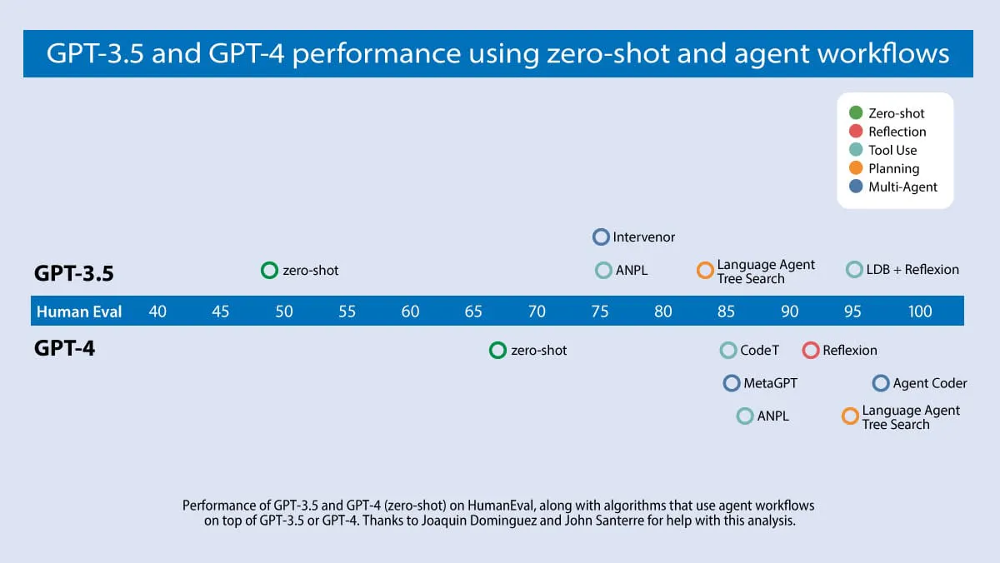

# Agents

## Why Agents?

[Why agents are the next frontier of generative AI, July 2024](https://www.mckinsey.com/capabilities/mckinsey-digital/our-insights/why-agents-are-the-next-frontier-of-generative-ai)

!!! tip
    "If one agent can't work well, then why is multi-agent useful?"

    * Grouping tools/responsibilities can give better results. An agent is more likely to succeed on a focused task than if it has to select from dozens of tools.
    * Separate prompts can give better results. Each prompt can have its own instructions and few-shot examples. Each agent could even be powered by a separate fine-tuned LLM!
    * Helpful conceptual model to develop. You can evaluate and improve each agent individually without breaking the larger application.
    
    Multi-agent designs allow you to divide complicated problems into tractable units of work that can be targeted by specialized agents and LLM programs.

    https://blog.langchain.dev/langgraph-multi-agent-workflows/

!!! quote "Using Agents can significantly improve performance"
   
    <figure markdown>
    
    </figure>

    GPT-3.5 (zero shot) was 48.1% correct. GPT-4 (zero shot) does better at 67.0%. However, the improvement from GPT-3.5 to GPT-4 is dwarfed by incorporating an iterative agent workflow. Indeed, wrapped in an agent loop, GPT-3.5 achieves up to 95.1%.
     https://www.deeplearning.ai/the-batch/how-agents-can-improve-llm-performance

    An agentic workflow in which the LLM is prompted to focus on one thing at a time can give better performance.
    https://www.deeplearning.ai/the-batch/agentic-design-patterns-part-5-multi-agent-collaboration/

!!! quote "Agentic AI Design Patterns"
    1. **[Reflection](https://www.deeplearning.ai/the-batch/agentic-design-patterns-part-2-reflection?ref=dl-staging-website.ghost.io)**: The LLM examines its own work to come up with ways to improve it. 
    2. **[Tool Use](https://www.deeplearning.ai/the-batch/agentic-design-patterns-part-3-tool-use)**: The LLM is given tools such as web search, code execution, or any other function to help it gather information, take action, or process data.
    3. **[Planning](https://www.deeplearning.ai/the-batch/agentic-design-patterns-part-4-planning/?ref=dl-staging-website.ghost.io)**: The LLM comes up with, and executes, a multistep plan to achieve a goal (for example, writing an outline for an essay, then doing online research, then writing a draft, and so on).
    4. **[Multi-agent collaboration](https://www.deeplearning.ai/the-batch/agentic-design-patterns-part-5-multi-agent-collaboration/?ref=dl-staging-website.ghost.io)**: More than one AI agent work together, splitting up tasks and discussing and debating ideas, to come up with better solutions than a single agent would.

    https://www.deeplearning.ai/the-batch/how-agents-can-improve-llm-performance

!!! quote "Reflection using a multi-agent framework" 
    Further, we can implement Reflection using a multi-agent framework. I've found it convenient to create two different agents, one prompted to generate good outputs and the other prompted to give constructive criticism of the first agent's output. The resulting discussion between the two agents leads to improved responses.

    https://www.deeplearning.ai/the-batch/agentic-design-patterns-part-2-reflection/

    Like the design pattern of Planning, I find the output quality of multi-agent collaboration hard to predict, especially when allowing agents to interact freely and providing them with multiple tools. The more mature patterns of Reflection and Tool Use are more reliable.
    
    https://www.deeplearning.ai/the-batch/agentic-design-patterns-part-5-multi-agent-collaboration/

## Agents in Production

1. Pitfalls and Best Practices — 5 lessons from LLMs in Production, Raza Habib, LLMs in Prod Con 2 https://www.youtube.com/watch?v=TRAUNcPj8KU 
2. Generative AI Agents in Production: Best Practices and Lessons Learned, Patrick Marlow https://www.youtube.com/watch?v=3y17VO3C8jo and whitepaper https://www.kaggle.com/whitepaper-agents
3. Fine-Tuning LLMs: Best Practices and When to Go Small, Mark Kim-Huang, MLOps Meetup https://www.youtube.com/watch?v=1WSUfWojoe0 
4. Everything you ever wanted to know about LLMOps Maturity Models, Alex Strick van Linschoten
Nov 26, 2024 https://www.zenml.io/blog/everything-you-ever-wanted-to-know-about-llmops-maturity-models
5. A comprehensive collection of over 300 real-world generative AI implementations that showcases how organizations are successfully deploying LLMs in production https://www.zenml.io/blog/demystifying-llmops-a-practical-database-of-real-world-generative-ai-implementations

## References

 1. The Shift from Models to Compound AI Systems, https://bair.berkeley.edu/blog/2024/02/18/compound-ai-systems/, Feb 18, 2024
 2. https://www.deeplearning.ai/the-batch/how-agents-can-improve-llm-performance
    1. https://www.deeplearning.ai/the-batch/agentic-design-patterns-part-2-reflection
    2. https://www.deeplearning.ai/the-batch/agentic-design-patterns-part-3-tool-use
    3. https://www.deeplearning.ai/the-batch/agentic-design-patterns-part-4-planning
    4. https://www.deeplearning.ai/the-batch/agentic-design-patterns-part-5-multi-agent-collaboration
 3. https://www.linkedin.com/pulse/potential-impact-future-ai-agents-agentic-series-part-44-techwards-84h3f
 4. https://www.resilientcyber.io/p/agentic-ais-intersection-with-cybersecurity
 5. https://blog.langchain.dev/langgraph-multi-agent-workflows/
 6. Mixture-of-Agents Enhances Large Language Model Capabilities, June 2024, https://arxiv.org/abs/2406.04692
 7. Data Interpreter: An LLM Agent For Data Science, Mar 2024, https://arxiv.org/abs/2402.18679
 8.  AgentCoder: Multi-Agent Code Generation with Effective Testing and Self-optimisation, May 2024, https://arxiv.org/html/2312.13010v3 
 9.  The COMPLETE TRUTH About AI Agents (2024) https://www.youtube.com/watch?v=HGS5LfyxLUU
    
