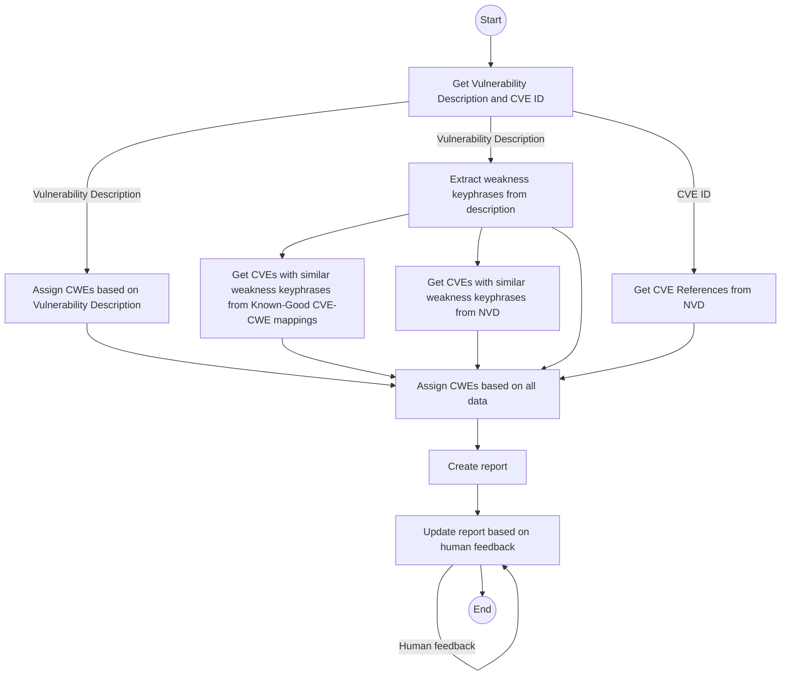

# Building Multi Agent Systems

!!! Overview
    Here we will discuss how to build a multi agent system using LangChain and LangGraph.

    We will illustrate the architecture of the system using a Mermaid diagram (generated via a GPT).

    We will then convert the diagram to LangChain and LangGraph code (using a GPT)

!!! tip
    LangGraph Studio could also be used https://github.com/LangChain-ai/langgraph-studio


# Multi Agent Systems
There are several frameworks for building Multi Agent Systems (MAS), and many more being developed.

[CrewAI](https://www.crewai.com/) (built on LangChain), and [AutoGen](https://microsoft.github.io/autogen/) (by Microsoft), are two popular frameworks.

* these are best suited to more complex multi agent use cases - where autonomy and conversation is required. 
    * Chatty can be expensive in time and money as its more LLM calls.
* they can also be useful for rapid prototyping and development of Multi Agent Systems - getting a working system quickly, that can then be optimized and customized with a lower level framework.

For simpler use cases, where we want to prescribe/control how agents interact with each other, we can use LangChain and LangGraph.

* LangChain does have [LCEL (LangChain Expression Language)](https://python.langchain.com/v0.1/docs/expression_language/) but [LangGraph on LangChain may be a better option](https://www.youtube.com/watch?v=_yFfc5YB5Xc).  
* Another option again is to write (and maintain) your own plumbing to get a simpler Multi Agent System. And it seems like lots of people are rolling their own.

My requirements here are:

1. Minimal Time-To-Value and Time-To-Learning from the initial solution
2. Representation and support by tools
   1. including Observability tooling e.g. [LangFuse](https://langfuse.com/), [LangSmith](https://www.langchain.com/langsmith) 
3. Representation and support for production Deployment on Cloud platforms (AWS, GCP)

So I'll use LangGraph on LangChain. YMMV!


## Architecture




Diagram Code
````
graph TD
    Start((Start)) --> A[Get Vulnerability Description and CVE ID]
    A --> |Vulnerability Description| B[Assign CWEs based on Vulnerability Description]
    A --> |Vulnerability Description| C[Extract weakness keyphrases from description]
    A --> |CVE ID| D[Get CVE References from NVD]
    C --> I[Get CVEs with similar weakness keyphrases \nfrom Known-Good CVE-CWE mappings]
    C --> E[Get CVEs with similar weakness keyphrases \nfrom NVD]
    B --> R[Assign CWEs based on all data]
    C --> R
    D --> R
    E --> R
    I --> R
    R --> F[Create report]
    F --> G[Update report based on human feedback]
    G -->|Human feedback| G
    G --> End((End))
````


## Architecture to Code

````
I want to create a LangGraph multi agent system based on this diagram

````
Claude 3.5 Sonnet


## Multi Agent System Skeleton Code

````
# Initialize our language model
llm = ChatOpenAI(model="gpt-3.5-turbo")

# Define our agents
def create_agent(name: str, description: str, tools: Sequence[Tool] = []):
    prompt = ChatPromptTemplate.from_messages([
        ("system", f"You are {name}. {description}"),
        ("human", "{input}"),
        ("human", "Relevant information: {agent_scratchpad}")
    ])
    agent = create_react_agent(llm, tools, prompt)
    return AgentExecutor(agent=agent, tools=tools)

# Define our agent nodes
get_vuln_description = create_agent("Vulnerability Description Extractor", "Extract the vulnerability description and CVE ID from the input.")
assign_initial_cwes = create_agent("Initial CWE Assigner", "Assign initial CWEs based on the vulnerability description.")
extract_keyphrases = create_agent("Keyphrase Extractor", "Extract weakness keyphrases from the description.")
get_similar_cves_known_good = create_agent("Known-Good CVE Retriever", "Get CVEs with similar weakness keyphrases from Known-Good mappings.")
get_similar_cves_nvd = create_agent("NVD CVE Retriever", "Get CVEs with similar weakness keyphrases from NVD.")
get_cve_references = create_agent("CVE Reference Retriever", "Get CVE References from NVD.")
assign_final_cwes = create_agent("Final CWE Assigner", "Assign final CWEs based on all collected data.")
create_report = create_agent("Report Creator", "Create a comprehensive report based on all the collected and analyzed data.")
update_report = create_agent("Report Updater", "Update the report based on human feedback.")

# Create our graph
workflow = StateGraph(AgentState)

# Add our nodes to the graph
workflow.add_node("get_vuln_description", get_vuln_description)
workflow.add_node("assign_initial_cwes", assign_initial_cwes)
workflow.add_node("extract_keyphrases", extract_keyphrases)
workflow.add_node("get_similar_cves_known_good", get_similar_cves_known_good)
workflow.add_node("get_similar_cves_nvd", get_similar_cves_nvd)
workflow.add_node("get_cve_references", get_cve_references)
workflow.add_node("assign_final_cwes", assign_final_cwes)
workflow.add_node("create_report", create_report)
workflow.add_node("update_report", update_report)

# Define our edges
workflow.add_edge("get_vuln_description", "assign_initial_cwes")
workflow.add_edge("get_vuln_description", "extract_keyphrases")
workflow.add_edge("get_vuln_description", "get_similar_cves_known_good")
workflow.add_edge("extract_keyphrases", "get_similar_cves_nvd")
workflow.add_edge("extract_keyphrases", "get_cve_references")
workflow.add_edge("assign_initial_cwes", "assign_final_cwes")
workflow.add_edge("extract_keyphrases", "assign_final_cwes")
workflow.add_edge("get_similar_cves_known_good", "assign_final_cwes")
workflow.add_edge("get_similar_cves_nvd", "assign_final_cwes")
workflow.add_edge("get_cve_references", "assign_final_cwes")
workflow.add_edge("assign_final_cwes", "create_report")
workflow.add_edge("create_report", "update_report")
workflow.add_edge("update_report", END)

# Compile the graph
app = workflow.compile()

# Run the graph
inputs = {
    "input": "A buffer overflow vulnerability in XYZ software allows remote attackers to execute arbitrary code.",
    "cve_id": "CVE-2023-12345"
}
for output in app.stream(inputs):
    print(output)
````

