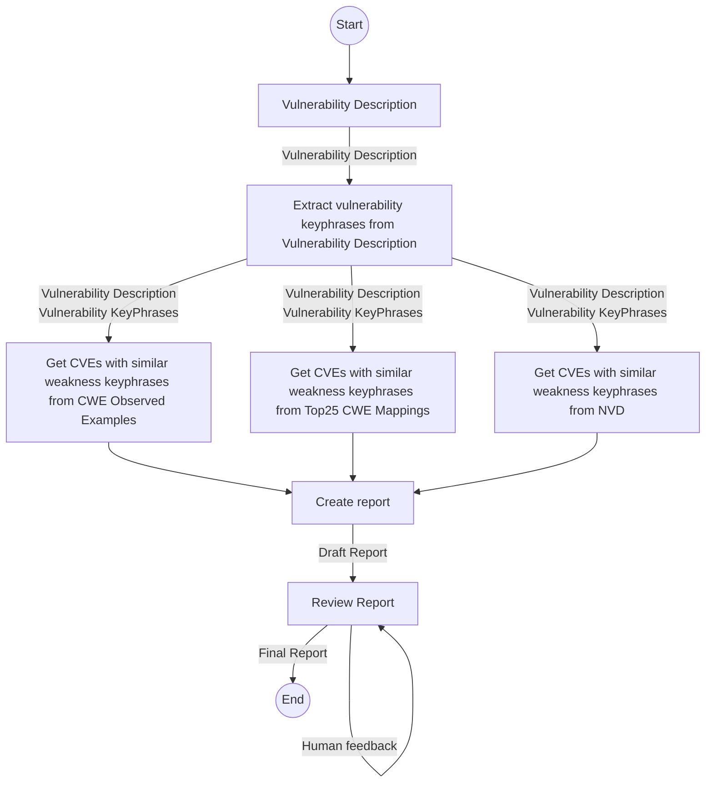

# Building Multi Agent Systems

!!! Overview
    Here we will discuss how to build a multi agent system using LangChain and LangGraph.

    We will illustrate the architecture of the system using a Mermaid diagram (generated via a GPT).

    We will then convert the diagram to LangChain and LangGraph code (using a GPT)

!!! tip
    LangGraph Studio could also be used https://github.com/LangChain-ai/langgraph-studio


# Multi Agent Systems
There are several frameworks for building Multi Agent Systems (MAS), and many more being developed.

[CrewAI](https://www.crewai.com/) (built on LangChain), and [AutoGen](https://microsoft.github.io/autogen/) (by Microsoft), are two popular frameworks.

* these are best suited to more complex multi agent use cases - where autonomy and conversation is required. 
    * Chatty can be expensive in time and money as its more LLM calls.
* they can also be useful for rapid prototyping and development of Multi Agent Systems - getting a working system quickly, that can then be optimized and customized with a lower level framework.

For simpler use cases, where we want to prescribe/control how agents interact with each other, we can use LangChain and LangGraph.

* LangChain does have [LCEL (LangChain Expression Language)](https://python.langchain.com/v0.1/docs/expression_language/) but [LangGraph on LangChain may be a better option](https://www.youtube.com/watch?v=_yFfc5YB5Xc).  
* Another option again is to write (and maintain) your own plumbing to get a simpler Multi Agent System. And it seems like lots of people are rolling their own.

My requirements here are:

1. Minimal Time-To-Value and Time-To-Learning from the initial solution
2. Representation and support by tools
   1. including Observability tooling e.g. [LangFuse](https://langfuse.com/), [LangSmith](https://www.langchain.com/langsmith) 
3. Representation and support for production Deployment on Cloud platforms (AWS, GCP)

So I'll use LangGraph on LangChain. YMMV!


## Architecture




Diagram Code
````
graph TD
    Start((Start)) --> A[Vulnerability Description]
    A --> |Vulnerability Description| C[Extract vulnerability keyphrases from Vulnerability Description]
    C --> |Vulnerability Description\nVulnerability KeyPhrases| D[Get CVEs with similar weakness keyphrases \nfrom CWE Observed Examples]
    C --> |Vulnerability Description\nVulnerability KeyPhrases| E[Get CVEs with similar weakness keyphrases \nfrom Top25 CWE Mappings]
    C --> |Vulnerability Description\nVulnerability KeyPhrases| I[Get CVEs with similar weakness keyphrases \nfrom NVD]
    D --> R[Create report]
    E --> R[Create report]
    I --> R[Create report]
    R --> |Draft Report|G[Review Report]
    G -->|Human feedback| G
    G --> |Final Report|End((End))
````


## Architecture to Code

````
I want to create a LangGraph multi agent system based on this diagram

````

````
I want to create a CrewAI multi agent system based on this diagram

````
Claude 3.5 Sonnet


## Multi Agent System Skeleton Code

````
#from typing import TypedDict, Annotated, Sequence
from langchain_core.messages import BaseMessage
from langgraph.graph import StateGraph, Graph
from langchain_core.runnables import RunnableBinding
from langchain.pydantic_v1 import BaseModel, Field
from langchain_core.prompts import ChatPromptTemplate
from langchain_openai import ChatOpenAI
import asyncio

# Define the state
class AgentState(TypedDict):
    messages: Annotated[Sequence[BaseMessage], "The messages in the conversation"]
    vulnerability_description: Annotated[str, "The original vulnerability description"]
    vulnerability_keyphrases: Annotated[list, "Extracted keyphrases from the vulnerability description"]
    cwe_observed_cves: Annotated[list, "CVEs from CWE Observed Examples"]
    top25_cwe_cves: Annotated[list, "CVEs from Top25 CWE Mappings"]
    nvd_cves: Annotated[list, "CVEs from NVD"]
    draft_report: Annotated[str, "The draft report"]
    final_report: Annotated[str, "The final report"]

# Initialize the language model
llm = ChatOpenAI(temperature=0)

# Define the agents

def extract_keyphrases(state):
    prompt = ChatPromptTemplate.from_template(
        "Extract key phrases related to the vulnerability from the following description: {vulnerability_description}"
    )
    chain = prompt | llm
    response = chain.invoke({"vulnerability_description": state["vulnerability_description"]})
    keyphrases = response.content.split(", ")
    return {"vulnerability_keyphrases": keyphrases}

async def get_cwe_observed_cves(state):
    # Simulating an asynchronous API call
    await asyncio.sleep(1)
    # In a real scenario, you would query a CVE database here
    return {"cwe_observed_cves": ["CVE-2021-1234", "CVE-2022-5678"]}

async def get_top25_cwe_cves(state):
    await asyncio.sleep(1)
    return {"top25_cwe_cves": ["CVE-2020-9876", "CVE-2023-4321"]}

async def get_nvd_cves(state):
    await asyncio.sleep(1)
    return {"nvd_cves": ["CVE-2019-8765", "CVE-2024-1111"]}

def create_report(state):
    prompt = ChatPromptTemplate.from_template(
        "Create a comprehensive report based on the following information:\n"
        "Vulnerability Description: {vulnerability_description}\n"
        "Key Phrases: {vulnerability_keyphrases}\n"
        "CVEs from CWE Observed Examples: {cwe_observed_cves}\n"
        "CVEs from Top25 CWE Mappings: {top25_cwe_cves}\n"
        "CVEs from NVD: {nvd_cves}\n"
        "Provide a detailed analysis and recommendations."
    )
    chain = prompt | llm
    response = chain.invoke(state)
    return {"draft_report": response.content}

def review_report(state):
    prompt = ChatPromptTemplate.from_template(
        "Review and improve the following report:\n{draft_report}\n"
        "Provide any necessary corrections or additions."
    )
    chain = prompt | llm
    response = chain.invoke(state)
    return {"final_report": response.content}

# Define the graph
workflow = StateGraph(AgentState)

# Add nodes
workflow.add_node("extract_keyphrases", extract_keyphrases)
workflow.add_node("get_cwe_observed_cves", get_cwe_observed_cves)
workflow.add_node("get_top25_cwe_cves", get_top25_cwe_cves)
workflow.add_node("get_nvd_cves", get_nvd_cves)
workflow.add_node("create_report", create_report)
workflow.add_node("review_report", review_report)

# Add edges
workflow.add_edge("extract_keyphrases", "get_cwe_observed_cves")
workflow.add_edge("extract_keyphrases", "get_top25_cwe_cves")
workflow.add_edge("extract_keyphrases", "get_nvd_cves")
workflow.add_edge("get_cwe_observed_cves", "create_report")
workflow.add_edge("get_top25_cwe_cves", "create_report")
workflow.add_edge("get_nvd_cves", "create_report")
workflow.add_edge("create_report", "review_report")

# Set entry point
workflow.set_entry_point("extract_keyphrases")

# Compile the graph
app = workflow.compile()

# Run the graph
config = {"vulnerability_description": "A buffer overflow vulnerability in the XYZ software allows remote attackers to execute arbitrary code."}
result = app.invoke(config)

print(result["final_report"])
````

