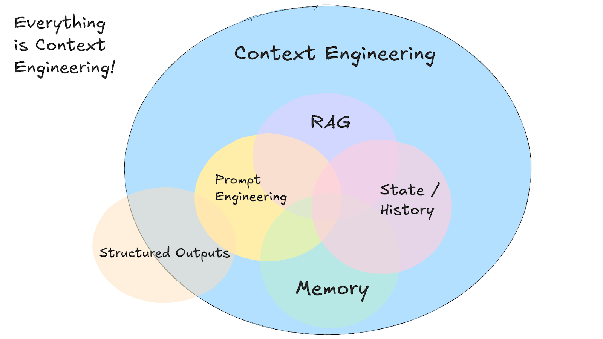

# Overview

!!! abstract 

    This section looks at Context Engineering, and gives Prioritized Context Engineering Steps for Agentic AI.

    !!! quote
        
        "Context engineering is the delicate art and science of filling the context window with just the right information for the next step." Andrej Karpathy,
        https://www.youtube.com/watch?v=LCEmiRjPEtQ

    <figure markdown>
    
    Source: https://github.com/humanlayer/12-factor-agents/blob/main/content/factor-03-own-your-context-window.md
    </figure>

## Intent Engineering over Context Engineering over Prompt Engineering

### Context Engineering

!!! quote

    +1 for "context engineering" over "prompt engineering".

    People associate prompts with short task descriptions you'd give an LLM in your day-to-day use. When in every industrial-strength LLM app, context engineering is the delicate art and science of filling the context window with just the right information for the next step. Science because doing this right involves task descriptions and explanations, few shot examples, RAG, related (possibly multimodal) data, tools, state and history, compacting... Too little or of the wrong form and the LLM doesn't have the right context for optimal performance. Too much or too irrelevant and the LLM costs might go up and performance might come down. Doing this well is highly non-trivial. And art because of the guiding intuition around LLM psychology of people spirits.

    On top of context engineering itself, an LLM app has to:

    - break up problems just right into control flows
    - pack the context windows just right
    - dispatch calls to LLMs of the right kind and capability
    - handle generation-verification UIUX flows
    - a lot more - guardrails, security, evals, parallelism, prefetching, ...

    **So context engineering is just one small piece of an emerging thick layer of non-trivial software that coordinates individual LLM calls (and a lot more) into full LLM apps.** The term "ChatGPT wrapper" is tired and really, really wrong.

    https://x.com/karpathy/status/1937902205765607626 @karpathy Jun 25

### Intent Engineering

!!! quote

    I really like it! But it’s still one level too deep. 

    I think the actual skill is more like **Intent engineering. Articulating what you want extremely clearly.**

    As critical as it is, the context is still just support. 

    The more important part is the clear thinking.

    https://x.com/DanielMiessler/status/1937937649005957260 @DanielMiessler Jun 25

!!! tip

    See also https://muness.com/posts/intent-engineering/.

    [Breakthrough Method for Agile AI-Driven Development (BMAD](../software/swe_redux.md) is an example framework where intent is expressed and checked.
  
## Guides from Anthropic and OpenAI 

!!! tip "Guides from Anthropic and OpenAI"

    [Anthropic's Guide](https://www.anthropic.com/engineering/effective-context-engineering-for-ai-agents):

      * Introduces the concept of "**context rot**," where model performance degrades as the context window fills.
      * Stresses the importance of providing the smallest possible set of high-signal tokens.
      * Recommends dynamic, "just-in-time" context retrieval.
      * For long-horizon tasks, it suggests compaction, structured note-taking, and multi-agent architectures.
      * They beta released a [Memory Tool](https://docs.claude.com/en/docs/agents-and-tools/tool-use/memory-tool) "to store and retrieve information across conversations through a memory file directory"

      [OpenAI Cookbook (on Session Memory)](https://cookbook.openai.com/examples/agents_sdk/session_memory):

      * Provides a concrete implementation of short-term memory management through "session memory."
      * Details specific techniques like "**context trimming**" (keeping the last N turns) and "context summarization."
      * Offers practical parameters for implementation, such as context_limit and keep_last_n_turns.

## Essential Knowledge

!!! tip "The best references covering the Problem and Solution space" 

    - Reunig, D. (2025, June 22). [*How long contexts fail (and how to fix them).*](https://www.dbreunig.com/2025/06/22/how-contexts-fail-and-how-to-fix-them.html)  
      Analyzes failure modes of excessively long context windows.  
        **Failure modes:**  
        - **Context poisoning**: When a hallucination makes it into the context  
        - **Context distraction**: When the context overwhelms the training  
        - **Context confusion**: When superfluous context influences the response  
        - **Context clash**: When parts of the context disagree  

    - Reunig, D. (2025, June 26). [*How to fix your context.*](https://www.dbreunig.com/2025/06/26/how-to-fix-your-context.html)  
      Follow-up article offering tactics to avoid context failure: RAG, tool loadout, context pruning, summarization, and offloading.

    - Martin, R. L. (2025, June 23). [*Context engineering.*](https://rlancemartin.github.io/2025/06/23/context_engineering/)  
      Overview of practical strategies for structuring and optimizing context for LLMs.  
      **Key practices: write, select, compress, isolate**

    - IndyDevDan. (2025, July). [*Elite context engineering with Claude Code*](https://www.youtube.com/watch?v=Kf5-HWJPTIE)  
      Demonstrates advanced context engineering techniques using Claude Code.
      **Core mantra:** **R&D = Reduce + Delegate.**  
      Reduce what the primary agent sees; delegate everything else to sub-agents or background primaries, with crisp contracts and logs  

    
    
## Prioritized Context Engineering Steps for Agentic AI

### 1) Minimize the Primary Context (treat it like a cache)

* Keep only: **goal**, **immediate instructions**, **tiny retrieved slice**, **output schema**.
* Keep ephemeral scratchpads for step-by-step reasoning; purge after use.
* Offload history, rules, and big docs to external memory or files.
*  🔑 **Impact:** Faster, cheaper, less distracted agent; fewer long-context failure modes.

---

### 2) Write Context Intentionally (don’t just append everything)

* Clear **system message** for goals, rules, constraints, evaluation criteria.
* Define **output schemas** (JSON/table) and acceptance checks.
* Put canonical facts/API contracts in stable references, not the live window.
* Log key decisions so context can be rebuilt if needed.
*  🔑 **Impact:** Prevents bloated prompts; establishes reliable “ground truth”.

---

### 3) Select Context Dynamically (quality > quantity)

* Retrieve only what’s relevant **now** via embeddings/filters.
* Cap retrieval: few high-signal snippets; drop duplicates/stale text.
* Prefer structured facts (tables/JSON) over long prose.
*  🔑 **Impact:** Model focuses on the right information; fewer hallucinations.

---

### 4) Use Context Priming (instead of big always-on memory files)

* Create reusable **prime commands** per task (Purpose → Read/Fetch → Steps → Report).
* Keep a **tiny universal core** (guardrails + IO schema) always loaded.
* Prime on demand for bugfix, feature, research, etc.
*  🔑 **Impact:** Minimal startup tokens with task-specific readiness.

---

### 5) Kill Always-On Baggage (tools/MCP autoloading)

* Don’t preload tool packs/MCP servers by default; load **lazily** per task.
* Unload after use; explicitly justify any autoload.
* Audit startup context and remove dead weight.
*  🔑 **Impact:** Frees large chunks of window; cuts token waste and latency.

---

### 6) Delegate Heavy Work to **Sub-Agents** (properly)

* One sub-agent = **one job** with a tight **system prompt**.
* Let sub-agents consume **their** windows; return **distilled reports** + artifacts.
* Standard report contract: `{summary, key_facts, risks, artifacts[]}`.
*  🔑 **Impact:** Keeps the primary window small while scaling capability.

---

### 7) Delegate Long/Expensive Tasks to **Background Primary Agents**

* Kick off separate agents for crawls, planning, batch edits, evals.
* They write **report files + artifacts**; foreground ingests concise summaries.
* Use this to “get out of the loop” while work continues.
*  🔑 **Impact:** Parallelizes work; maintains a lean, responsive main loop.

!!! tip

    [Claude Code CLI God Mode](../software/claude_code.md#claude-code-cli-god-mode) is an example of this, delegating to a different Primary model (that is the best tool for the job.)

---

### 8) Compress Context (mostly outside the window)

* Rolling conversation summaries; hierarchical notes (facts → decisions → actions).
* Store raw data externally; insert only **pointers + summaries**.
* Heuristic trimming rules (dedupe, last-N, relevance thresholds).
*  🔑 **Impact:** Extends effective history without clogging the window.

---

### 9) Isolate Contexts (sandboxing & pipelines)

* Keep runtime state objects and scratchpads **per agent**.
* Avoid leaking sub-agent history into the primary prompt.
* Build multi-agent pipelines with explicit handoffs.
*  🔑 **Impact:** Reduces poisoning, distraction, and cross-task conflicts.

---

### 10) Log **Context Bundles** for replay/handoff

* Save `{run_id, primes, reads, tool_calls, key_findings, decisions, outputs, next_steps}`.
* Use bundles to reprime new agents after window blow-ups or for continuity.
* Keep bundles concise—no verbatim dumps of huge content.
*  🔑 **Impact:** Reproducibility and seamless continuation across sessions.

---

### 11) Defend Against Context Failure Modes

* **Poisoning:** verify tool outputs; tag trust levels; gate propagation.
* **Confusion:** filter irrelevant turns; dedupe aggressively.
* **Conflict:** detect/resolve contradictions before composing answers.
*  🔑 **Impact:** Higher reliability and fewer cascading errors.

---

### 12) Standardize Schemas & Measure What Matters

* Standard prompt skeletons, report JSON, artifact layout, retrieval policies.
* Track `startup_tokens`, `peak_tokens`, `#agents_spawned`, `attempts_to_success`, `retrieval_hits`.
* Set SLOs (e.g., startup ≤10% window, attempts ≤3) and alert on drift.
*  🔑 **Impact:** Consistency at scale; makes optimization and debugging straightforward.

---

## Context Engineering 101 cheat sheet

<figure markdown>

Context Engineering 101 cheat sheet by Lena Hall https://x.com/lenadroid/status/1943685060785524824
</figure>

## References

### Academic Papers

1. Zhang, W., Gupta, R., Müller, F., et al. (2025, July). *A Survey of Context Engineering for Large Language Models*. *arXiv preprint*.

   * **Comprehensive academic survey reviewing context engineering techniques, challenges, and future research directions.**
     [https://arxiv.org/pdf/2507.13334](https://arxiv.org/pdf/2507.13334)

2. Haseeb, M., et al. (2025, August). *Context Engineering for Multi-Agent LLM Code Assistants Using Elicit, NotebookLM, ChatGPT, and Claude Code*. *arXiv preprint*.

   * **Proposes a multi-agent workflow combining intent translation, semantic retrieval, document synthesis, and Claude Code to improve code generation and validation in large codebases.**
     [https://arxiv.org/html/2508.08322v1](https://arxiv.org/html/2508.08322v1)

3. Hua, Q., Ye, L., Fu, D., Xiao, Y., Cai, X., Wu, Y., Lin, J., Wang, J., & Liu, P. (2025, October). *Context Engineering 2.0: The Context of Context Engineering*. *arXiv preprint*.

   * **Foundational position paper that situates context engineering historically, defines it as entropy reduction between human intentions and machine-readable representations, and introduces a four-era framework with design considerations for context collection, management, and usage.**
     [https://arxiv.org/abs/2510.26493](https://arxiv.org/abs/2510.26493)

---

### Blogs & Articles

4. Martin, R. L. (2025, June). *Context Engineering*.

   * **Blog post introducing principles of context engineering for AI systems, including prompt design, retrieval, and orchestration strategies.**
     [https://rlancemartin.github.io/2025/06/23/context_engineering/](https://rlancemartin.github.io/2025/06/23/context_engineering/)

5. Schmid, P. (2025, June). *Context Engineering: Optimizing Prompts and Retrieval for LLMs*.

   * **Detailed exploration of context engineering patterns and their practical application in LLM development.**
     [https://www.philschmid.de/context-engineering](https://www.philschmid.de/context-engineering)

6. LlamaIndex (2025, June). *Context Engineering – What it is, and techniques to consider*.

   * **Official blog post from LlamaIndex outlining core techniques in context engineering for enterprise AI assistants.**
     [https://www.llamaindex.ai/blog/context-engineering-what-it-is-and-techniques-to-consider](https://www.llamaindex.ai/blog/context-engineering-what-it-is-and-techniques-to-consider)

7. Datacamp (2025, June). *Context Engineering: The Next Frontier of AI Development*.

   * **Educational article explaining how context engineering enhances AI reliability, accuracy, and enterprise integration.**
     [https://www.datacamp.com/blog/context-engineering](https://www.datacamp.com/blog/context-engineering)

8. Landgraf, T. (2025, August). *Context Engineering for Claude Code: Mastering Deep Technical Knowledge*.

   * **Medium article introducing advanced context engineering workflows for Claude Code, including knowledge-file creation, project architecture awareness, and technical validation.**
     [https://medium.com/%40tl_99311/context-engineering-for-claude-code-mastering-deep-technical-knowledge-bae14f158289](https://medium.com/%40tl_99311/context-engineering-for-claude-code-mastering-deep-technical-knowledge-bae14f158289)

9. Breunig, D. (2025, June). *How to Fix Your Context*.

   * **Practical guide to diagnosing long-context failures and applying tactics like RAG, tool loadouts, quarantine, pruning, summarization, and offloading to stabilize agent behavior.**
     [https://www.dbreunig.com/2025/06/26/how-to-fix-your-context.html](https://www.dbreunig.com/2025/06/26/how-to-fix-your-context.html)

10. LangChain. (n.d.). *Context engineering in agents*.

    * **Official LangChain documentation page explaining context engineering as the core of reliable agents, with middleware patterns for managing model, tool, and life-cycle context.**
      [https://docs.langchain.com/oss/python/langchain/context-engineering](https://docs.langchain.com/oss/python/langchain/context-engineering)

11. LangChain. (2025, July). *Context Engineering*.

    * **LangChain blog post (“Context Engineering for Agents”) organizing context engineering strategies into write, select, compress, and isolate patterns, with concrete examples from real agents.**
      [https://blog.langchain.com/context-engineering-for-agents/](https://blog.langchain.com/context-engineering-for-agents/)

12. Osmani, A. (2024, July). *Context Engineering: Bringing Engineering Discipline to Prompts*.

    * **Substack essay framing context engineering as bringing software-engineering discipline and information architecture to prompt and context design for production AI systems.**
      [https://addyo.substack.com/p/context-engineering-bringing-engineering](https://addyo.substack.com/p/context-engineering-bringing-engineering)

---

### Open Source Repositories & Tools

13. Kimai, D. (2025, July). *Context-Engineering (GitHub Repository)*.

    * **Open-source repository providing frameworks and examples for implementing context engineering strategies in real-world projects.**
      [https://github.com/davidkimai/Context-Engineering](https://github.com/davidkimai/Context-Engineering)

14. *Context Engineering Template* (2025, August). *Context-Engineering-Intro (GitHub Repository)*.

    * **Template repository by coleam00 for setting up Claude Code-based context engineering projects, including examples, global rules, and workflows.**
      [https://github.com/coleam00/context-engineering-intro](https://github.com/coleam00/context-engineering-intro)

---

### Media & Visualizations

15. Youtube (2025, September). *Elite Context Engineering with Claude Code* — IndyDevDan [Video].

    * **Advanced context engineering techniques using Claude Code, as presented by IndyDevDan.**
      [https://www.youtube.com/watch?v=Kf5-HWJPTIE](https://www.youtube.com/watch?v=Kf5-HWJPTIE) ([YouTube][1])

16. Youtube (2025, September). *Context Engineering for Agents — Lance Martin, LangChain* [Video].

    * **Discussion on context engineering specifically for agent frameworks, by Lance Martin from LangChain.**
      [https://www.youtube.com/watch?v=_IlTcWciEC4](https://www.youtube.com/watch?v=_IlTcWciEC4) ([YouTube][2])

17. Droid, L. (2025, July). *Context Engineering Visualization*.

    * **Illustrative summary of context engineering techniques, shared via social media.**
      [https://x.com/lenadroid/status/1943685060785524824/photo/1](https://x.com/lenadroid/status/1943685060785524824/photo/1)

18. Youtube (2025, September). *Advanced Context Engineering for Agents — Dexter Horthy* [Video].

    * **Walks through why naive back-and-forth prompting fails, how spec-first development keeps teams aligned, and why “everything is context engineering.” From compaction strategies to subagents and planning workflows, he shows how intentional context management turns AI coding from prototypes into production.**
      [https://www.youtube.com/watch?v=IS_y40zY-hc](https://www.youtube.com/watch?v=IS_y40zY-hc) ([YouTube][3])

---

## Takeaways
  
!!! success "Key Takeaways"

    * **Treat the Context Window Like a CPU Cache, Not a Hard Drive:** The core principle is to keep the primary agent's context minimal and focused—containing only the immediate goal, instructions, and a small slice of relevant data. Offload history, large documents, and non-essential tools to external memory to improve speed, reduce cost, and avoid distraction.
    * **Reduce and Delegate, Don't Accumulate:** Instead of bloating a single agent's context, delegate heavy or specialized tasks to sub-agents or background agents. These agents work in their own isolated contexts and return only concise, distilled reports, enabling complex work without overwhelming the primary agent.
    * **Context Must Be Actively Managed, Not Passively Appended:** Implement dynamic strategies like just-in-time retrieval (RAG), summarization, and context isolation to ensure the model always has high-quality, relevant information. Actively defend against common failure modes like poisoning and confusion by verifying inputs and filtering irrelevant data.