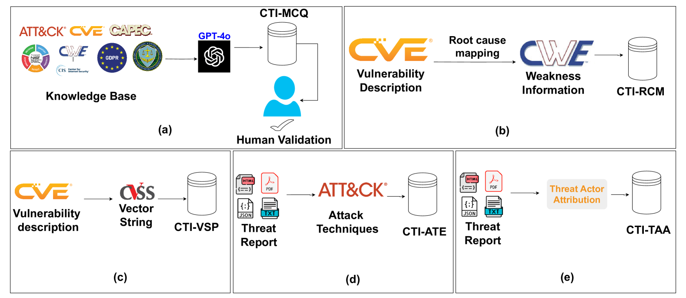

# Overview

!!! abstract "Overview"

    CyberSecurity Models are those that are optimized and configured specifically for the CyberSecurity domain via knowledge.

## Benchmark

[CTIBench: A Benchmark for Evaluating LLMs in Cyber Threat Intelligence](https://arxiv.org/html/2406.07599v3) is a suite of benchmark tasks and datasets to evaluate LLMs in Cyber Threat Intelligence (CTI). 

<figure markdown>

</figure>

It consists of:

- (a) CTI-MCQ, a knowledge evaluation dataset comprising multiple-choice questions aimed at testing LLMs’ understanding of crucial CTI concepts, including standards, threat identification, detection strategies, mitigation techniques, and best practices
- (b) CTI-RCM, which involves mapping Common Vulnerabilities and Exposures (CVE) descriptions to Common Weakness Enumeration (CWE) categories
- (c) CTI-VSP, which requires calculating Common Vulnerability Scoring System (CVSS) scores 
- (d) CTI-ATE, which focuses on extracting MITRE ATT&CK techniques from threat descriptions 
- (e) CTI-TAA, where LLMs are tasked with analyzing publicly available threat reports and attributing them to specific threat actors or malware families

### Benchmark Usage

[CTIBench: A Benchmark for Evaluating LLMs in Cyber Threat Intelligence](https://arxiv.org/html/2406.07599v3) is being used by some vendors for their CTI models e.g.

1. Google https://security.googleblog.com/2025/04/google-launches-sec-gemini-v1-new.html 
2. Cisco https://huggingface.co/fdtn-ai/Foundation-Sec-8B
3. Trend Micro https://huggingface.co/trend-cybertron

### CTI-RCM
The Cyber Threat Intelligence Root Cause Mapping (CTI-RCM) benchmark evaluates an LLM's ability to understand the nuances of vulnerability descriptions, identify vulnerabilities underlying root causes, and accurately classify them according to the CWE taxonomy.

CTI-RCM includes 1000 CVE --> CWE Mappings using the CVE Description only (not CVE Reference link content). 

- The 1000 is a random sample of vulnerabilities reported in the year 2024: https://github.com/xashru/cti-bench/blob/main/data/cti-rcm.tsv 
- It also includes 1000 CVES from 2021 https://github.com/xashru/cti-bench/blob/main/data/cti-rcm-2021.tsv

### CTI-RCM Exploratory Data Analysis

An Exploratory Data Analysis of the dataset is available in https://github.com/CyberSecAI/cti_bench_rcm.

#### Limitations

1. The dataset is not "known-good" i.e. how do we know the CVE-CWE mappings are correct?
    1. For comparison, the MITRE CWE Top25 2023 identified [a significant number of CWEs that were incorrect](https://www.youtube.com/watch?v=AtBZIAikdL0&list=PLBAUUhONOrO_aB01lOv6XNRTHD4ueFVTp&t=1142s) 
2. The dataset contains a limited number of CWEs per https://github.com/CyberSecAI/cti_bench_rcm
    1. For comparison, the MITRE CWE Top25 2023 contains ~400 unique CWEs
3. The dataset contains a limited number of CVEs per https://github.com/CyberSecAI/cti_bench_rcm
    1. For comparison, the MITRE CWE Top25 2022, 2023 include ~~7K CVE-CWE mappings each
4.  The dataset contains 1 CWE per CVE 
    1. For comparison, the MITRE CWE Top25 2022, 2023 datasets contain many CWEs with more than 1 CWE per CVE
5. The dataset is highly imbalanced per https://github.com/CyberSecAI/cti_bench_rcm
    1. Some CWEs appear a lot more than others per https://github.com/CyberSecAI/cti_bench_rcm
 6. The dataset contains the CVE Description only i.e. not the CVE Reference Information in the CVE links
    1. This generally contains more information than the CVE Description alone.
    2. A benchmark dataset should use the full CVE info available in the CVE including the Reference Content.
    3. For comparison, the MITRE CWE Top25 2022, 2023 mappings relied on the Reference content in many cases because the CVE Description was not sufficient.
6. The evaluation is a binary equals per https://github.com/xashru/cti-bench/blob/main/evaluation/evaluation.ipynb i.e. correct if the CWE assigned by the model equals the CWE in the benchmark dataset. 
    1. Based on my work with the MITRE CWE-RCMWG, a model may assign CWEs that are (correctly) more specific (childOf) than the CWE in the CVE. Does this make it "wrong" or "more right"?
    2. An evaluation metric should support this e.g. use distance between benchmark and assigned CWEs, where exact match is distance 0, parent/child is distance 1, grandparent/grandchild or cousin is distance 2.
    3. An evaluation metric should support the case where there is more that one CWE for a CVE.
