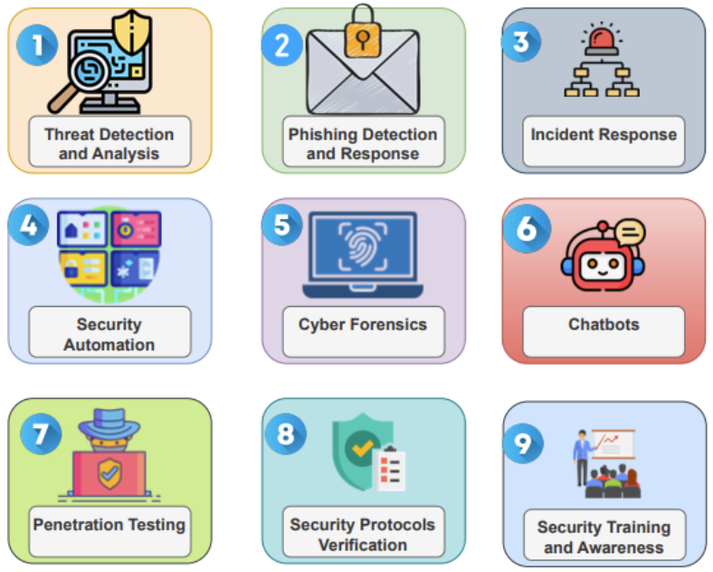

# LLMs for CyberSecurity

!!! tip
      LLMs (the subset of GenAI that focus on processing and generating text/language) can be used effectively for many parts of CyberSecurity:

      - anywhere natural language is used from standards, documents, messages, reports, log files 
      - across different modes: text, audio, video.

<figure markdown>

<figcaption>Image from Generative AI and Large Language Models for Cyber Security: All Insights You Need https://arxiv.org/pdf/2405.12750 </figcaption>
</figure>

The [Research](../research/research.md) section lists reports and research papers that describe the application of LLMs for CyberSecurity.

## Comparing LLMs
There are several sites that allow comparisons of LLMs characteristics list cost, speed, etc... e.g.

1. https://artificialanalysis.ai/
      1. Independent analysis of AI models and API providers. Understand the AI landscape to choose the best model and provider for your use-case
2. https://llmpricecheck.com/
      1. Compare and calculate the latest prices for LLM (Large Language Models) APIs from leading providers such as OpenAI GPT-4, Anthropic Claude, Google Gemini, Mate Llama 3, and more. Use our streamlined LLM Price Check tool to start optimizing your AI budget efficiently today!
3. [Compare models used via OpenRouter](https://openrouter.ai/rankings?view=day)
   