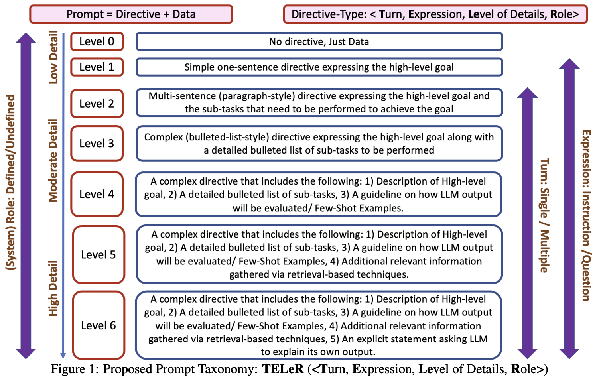
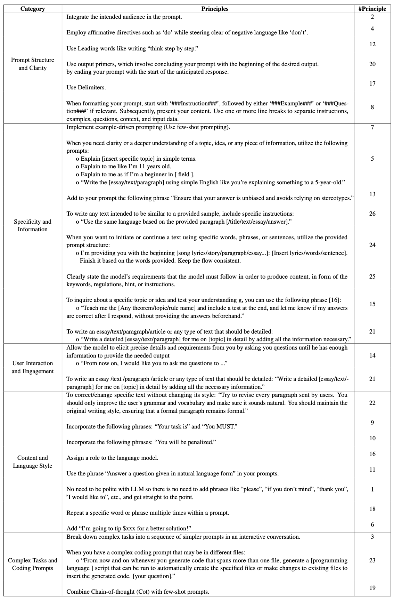
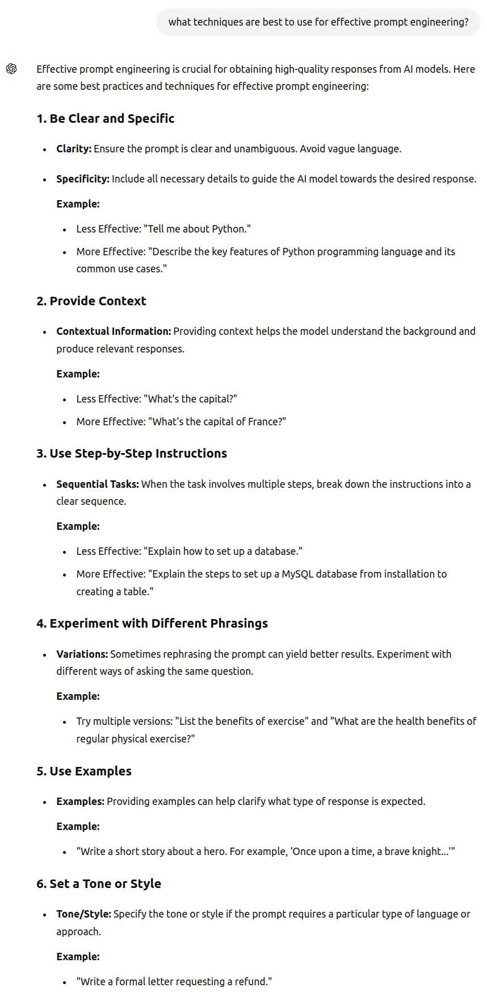
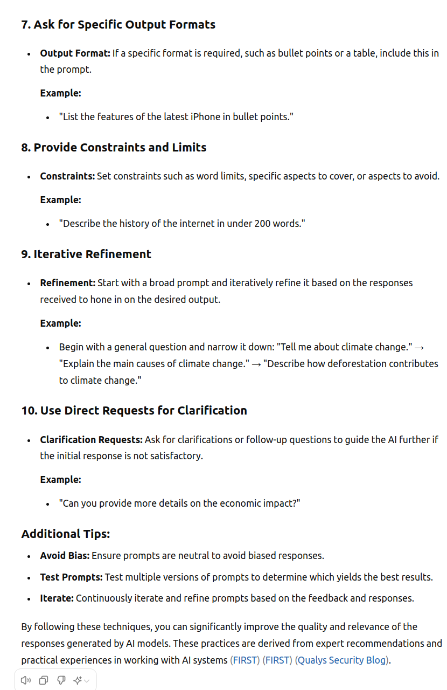
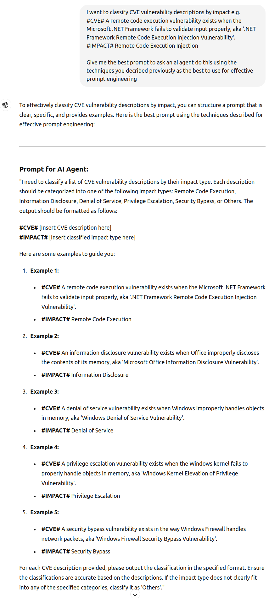
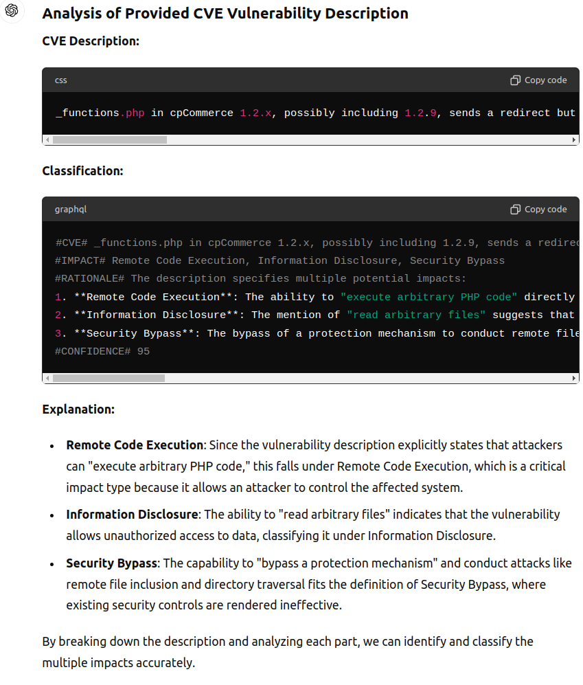
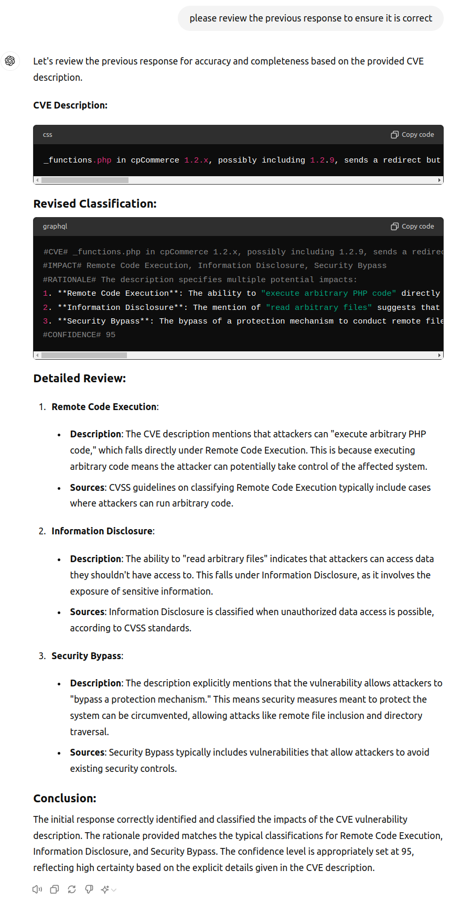

# Prompt Engineering

!!! abstract "Overview"

    A large part of working LLMs is knowing how to prompt them to get the information you want.

    ChatGPTo will be used here but the techniques apply in general to any LLM.


## Prompt Guides
There are many books, guides, and articles on Prompt Engineering. Some of the better ones are listed here:

1. [Prompt Engineering Guide](https://www.promptingguide.ai/) 
1. [OpenAI Prompt Engineering Guide](https://platform.openai.com/docs/guides/prompt-engineering) 
2. [Best practices for prompt Engineering with the OpenAI API](https://help.openai.com/en/articles/6654000-best-practices-for-prompt-engineering-with-the-openai-api)
3. [Google Gemini Prompting guide 101 - A quick-start handbook for effective prompts, April 2024 edition](https://services.google.com/fh/files/misc/gemini-for-google-workspace-prompting-guide-101.pdf)
4. [How I Won Singapore’s GPT-4 Prompt Engineering Competition](https://towardsdatascience.com/how-i-won-singapores-gpt-4-prompt-engineering-competition-34c195a93d41), Dec 2023
5. [Prompt Engineering for Generative AI Book](https://www.oreilly.com/library/view/prompt-engineering-for/9781098153427/), May 2024
6. [Google Prompt design strategies](https://ai.google.dev/gemini-api/docs/prompting-strategies) 
7. [Anthropic Prompt Engineering overview](https://docs.anthropic.com/en/docs/build-with-claude/prompt-engineering/overview) 
8. [Best Prompt Techniques for Best LLM Responses](https://medium.com/the-modern-scientist/best-prompt-techniques-for-best-llm-responses-24d2ff4f6bca), Feb 2024


## Prompt Taxonomy
### Prompt Taxonomy Turn, Expression, Level of Details, Role

<figure markdown>

</figure>
The above proposed Prompt Taxonomy is TELeR: Turn, Expression, Level of Details, Role from  [TELeR: A General Taxonomy of LLM Prompts for Benchmarking Complex Tasks](https://arxiv.org/pdf/2305.11430)

### Prompt Taxonomy 26 Guiding Principles
<figure markdown>
 
</figure>
The above "26 guiding principles designed to streamline the process of querying and prompting large language models" is from [Principled Instructions Are All You Need for Questioning LLaMA-1/2, GPT-3.5/4](https://arxiv.org/pdf/2312.16171)


## Prompt Tactics

Some tactics I find particularly useful:

1. Ask the LLM to generate the prompt.
      1. Do this in 2 parts (task decomposition)
         1. Ask the LLM what techniques are best to use for effective prompt engineering
         2. Ask the LLM to create a prompt using these techniques for the objective and example you specify
3. Ask the LLM to provide a confidence score for their answer. 
      1. People can be fooled by the fluency of LLMs aka hallucinations 
      2. LLMs know how confident they are in their answer.
      3. So asking an LLM to rate their confidence in the answer can reduce blind trust.
4. Ask the LLM (or a different LLM) to review the answer and provide improvements.


### Ask the LLM to generate the prompt

#### Ask the LLM what techniques are best to use for effective prompt engineering?


<figure markdown>


</figure>


#### Ask the LLM to create a prompt using these techniques for the objective and example you specify

<figure markdown>

</figure>


````
_functions.php in cpCommerce 1.2.x, possibly including 1.2.9, sends a redirect but does not exit when it is called directly, which allows remote attackers to bypass a protection mechanism to conduct remote file inclusion and directory traversal attacks, execute arbitrary PHP code, or read arbitrary files via the GLOBALS[prefix] parameter, a different vector than CVE-2003-1500.


#CVE# _functions.php in cpCommerce 1.2.x, possibly including 1.2.9, sends a redirect but does not exit when it is called directly, which allows remote attackers to bypass a protection mechanism to conduct remote file inclusion and directory traversal attacks, execute arbitrary PHP code, or read arbitrary files via the GLOBALS[prefix] parameter, a different vector than CVE-2003-1500.
#IMPACT# Remote Code Execution, Information Disclosure, Security Bypass
#RATIONALE# The description specifies multiple potential impacts:
1. **Remote Code Execution**: The ability to "execute arbitrary PHP code" directly implies a high severity impact where an attacker can run malicious code on the affected system.
2. **Information Disclosure**: The mention of "read arbitrary files" suggests that attackers can access sensitive information stored in files.
3. **Security Bypass**: The bypass of a protection mechanism to conduct remote file inclusion and directory traversal attacks implies that security controls are being circumvented.
#CONFIDENCE# 95
````


<figure markdown>

</figure>

### Ask the LLM to review the answer and provide improvements.
<figure markdown>

</figure>

### LLM Tools to Improve Prompts

In addition to using LLMs to generate prompts (aka Meta Prompts), and review prompts in an adhoc manner via the chat interface, there are various tools that use LLMs to improve prompts:

1. [Fabric Prompt to Improve Prompts](./Fabric.md#fabric-prompt-to-improve-prompts)
2. [Anthropic Console supports testing and improving prompts](https://www.anthropic.com/news/evaluate-prompts) (for Anthropic - but likely the resulting prompt would be portable to other LLMs)
    1. Claude can generate prompts, create test variables, and show you the outputs of prompts side by side.
    2. https://x.com/AnthropicAI/status/1810747792807342395
3. [Google Prompt Gallery](https://aistudio.google.com/app/gallery) 

  
!!! success "Takeaways" 

    1. Getting the right prompt to get what you want out of an LLM can sometimes feel like art or interrogation. There are several options covered here:
        1. Prompt Templates
        1. Prompt Frameworks
        2. Ask an LLM to generate a prompt
        3. LLM-based tools for prompt refinement
