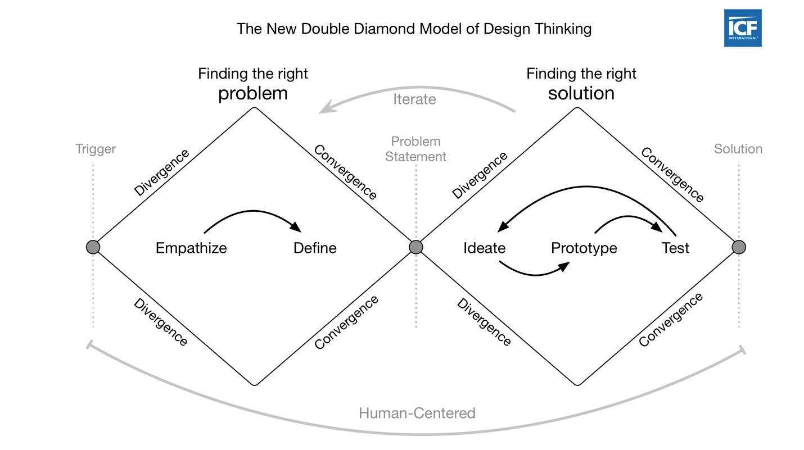
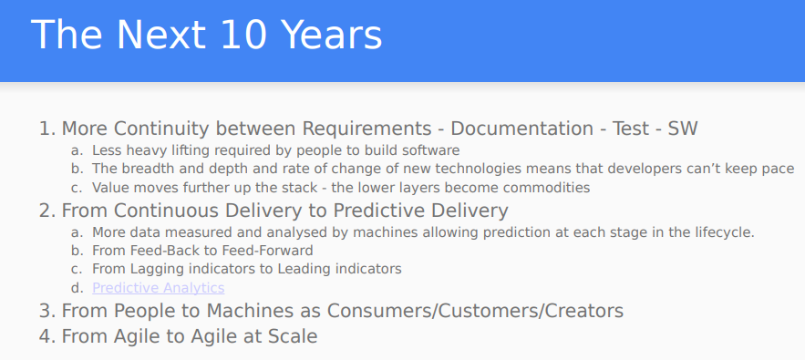
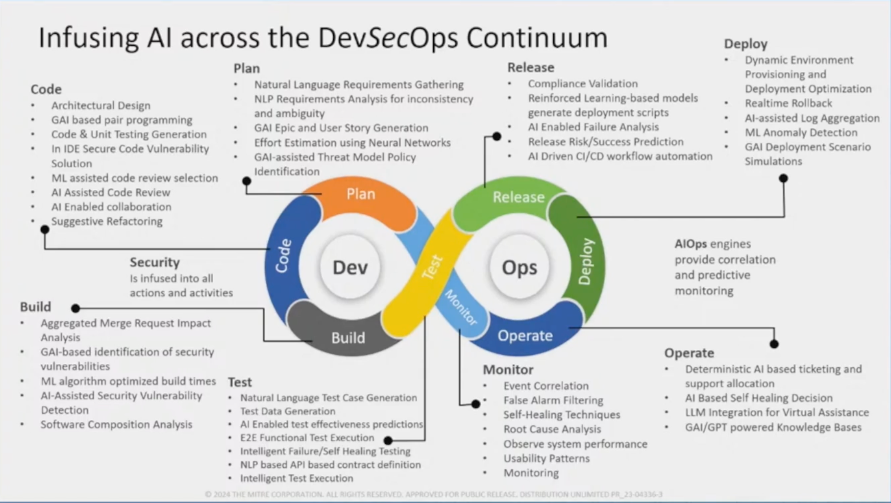

# How AI is Changing Software Engineering

!!! abstract "Overview"

    This section gives an overview of Software Engineering and how it has evolved with AI and Generative AI.

    It looks at the early days of Software Engineering and the transition from WaterFall to Agile - and the emphasis on communication over code and documentation. 

    Then it looks at how AI gave us Software 2.0 where "AI is **eating** software", and how Generative AI gave us Software 1.0 **Redux** where "AI is **feeding** software" (and Vibe Coding).
    
    [Andrej Karpathy](https://en.wikipedia.org/wiki/Andrej_Karpathy) quotes are used throughout as a consistent commentary from someone who has been formative in this space.

        

## Evolution of Software Engineering as Communication over Code

 

Effective software development depends fundamentally on clear communication between all stakeholders—from business experts to developers to end users. The evolution from rigid, document-heavy approaches to collaborative, feedback-driven methodologies illustrates how the industry has learned to prioritize human communication over process documentation.

### The Waterfall Challenge

The [Waterfall model](https://en.wikipedia.org/wiki/Waterfall_model) dominated software development for decades through its linear, sequential approach. However, this methodology created significant communication barriers. Requirements, design documents, and other pre-coding artifacts quickly became outdated as projects progressed. The code itself became the only reliable source of truth, but most stakeholders couldn't understand it.

This disconnect between documentation and reality often led teams to solve the wrong problems. The fundamental issue was the lack of continuous feedback loops between those who understood the business needs and those building the software.

### The Agile Response

During the 1990s, [lightweight development methodologies emerged](https://en.wikipedia.org/wiki/Agile_software_development) in response to these heavyweight, document-centric approaches. [Agile software development](https://en.wikipedia.org/wiki/Agile_software_development) became the most influential of these approaches, emphasizing iterative development, continuous feedback, and direct collaboration between business stakeholders and development teams.

Rather than relying on comprehensive documentation, Agile methodologies prioritize working software and frequent communication. This shift recognized that software development is fundamentally a collaborative, creative process that benefits from ongoing dialogue rather than upfront specification.

### The Language of Collaboration

<figure markdown>

</figure>

!!! tip

    See the Design Council’s [Systemic Design Framework](https://medium.com/design-council/developing-our-new-systemic-design-framework-e0f74fe118f7) for an evolution of the Double Diamond that  recognises the importance of the ‘invisible activities’ that sit around the design process: orientation and value setting, continuing the journey, collaboration and connection, and leadership and storytelling.

Software engineering thought leaders have consistently emphasized how critical shared understanding becomes in successful projects. 

- [Alistair Cockburn's research](https://agilemodeling.com/essays/communication.htm) demonstrated that face-to-face communication, particularly when enhanced by shared modeling tools like whiteboards, represents the most effective form of team communication. His work on [communication effectiveness](https://alistaircockburn.com/) showed that physical proximity and multiple communication modalities dramatically improve information transfer and reduce misunderstandings.

- Eric Evans, in his foundational work on [Domain-Driven Design](https://www.domainlanguage.com/), introduced the concept of ["ubiquitous language"](https://martinfowler.com/bliki/UbiquitousLanguage.html)—a shared vocabulary that bridges the gap between business experts and technical teams. This common language emerges from ongoing collaboration and becomes embedded in both conversations and code, ensuring that business terminology permeates throughout the software system.

- [Dan North](https://dannorth.net/) extended these ideas when developing [Behavior-Driven Development (BDD)](https://dannorth.net/introducing-bdd/), creating frameworks that use natural language constructs to describe software behavior in terms that all stakeholders can understand. BDD treats the specification of desired behavior as a ubiquitous language for the entire project team, helping prevent communication breakdowns between developers and business stakeholders.

These approaches share a common insight: **successful software development requires more than technical expertise—it demands ongoing communication, shared vocabulary, and collaborative understanding of both the problem domain and the solution being built.**

## Software 2.0

The emergence of artificial intelligence is fundamentally changing how we think about software development. 

In 2017, Andrej Karpathy introduced the concept of "Software 2.0" to describe this transformation, where traditional human-written code gives way to AI-generated solutions.

!!! quote

    Software (1.0) is eating the world, and now AI (Software 2.0) is eating software.

    The “classical stack” of Software 1.0 is what we’re all familiar with — it is written in languages such as Python, C++, etc. It consists of explicit instructions to the computer written by a programmer. By writing each line of code, the programmer identifies a specific point in program space with some desirable behavior.

    In contrast, Software 2.0 is written in much more abstract, human unfriendly language, such as the weights of a neural network. No human is involved in writing this code because there are a lot of weights (typical networks might have millions), and coding directly in weights is kind of hard

    In Software 1.0, human-engineered source code (e.g. some .cpp files) is compiled into a binary that does useful work. 
    
    In Software 2.0 most often the source code comprises 
    
    1. the dataset that defines the desirable behavior and 
    2. the neural net architecture that gives the rough skeleton of the code, but with many details (the weights) to be filled in.

    It is likely that any setting where the program is not obvious but one can repeatedly evaluate the performance of it (e.g. — did you classify some images correctly? do you win games of Go?) will be subject to this transition, because the optimization can find much better code than what a human can write.

    Andrej Karpathy, Nov 11, 2017 https://karpathy.medium.com/software-2-0-a64152b37c35

!!! note

    "Software (1.0) is eating the world" is a reference to "Why Software Is Eating the World", Marc Andreessen", 2011.
  
    https://a16z.com/why-software-is-eating-the-world/ where a16z is "**A**ndreessenHorowit**z**."

### Software 2.0 Example: Tesla Autopilot transition from C++ code to AI

Tesla's Autopilot system demonstrates this transition in practice. As Karpathy explained:

!!! quote 

    Neural network can eat through the [programming] stack… When I joined Tesla, there was a ton of C++ code, and now there's much, much less C++ code in the code that runs in the car. 

    Neural network initially was just doing a detection on the image level, then it went for multiple images, it gives you prediction, then multiple images over time give you a prediction, and you're discarding C++ code. And eventually you're just giving steering commands.

    … I do suspect that the end-to-end systems for Tesla in, say, 10 years, it is just a neural net. I mean, the videos stream into a neural net and commands come out.

    https://www.linkedin.com/pulse/andrej-karpathy-8-big-ideas-mikael-alemu-gorsky-eckuf/

This evolution illustrates how AI systems can progressively replace traditional programmatic logic, moving toward end-to-end neural networks that process inputs and generate outputs directly.

### Data as the New Source Code

In this Software 2.0 world, datasets become the primary artifact of development. 

[Hugging Face](https://huggingface.co/) has emerged as "Software 2.0's GitHub," hosting over [400K+ datasets](https://huggingface.co/datasets) alongside [1.7M+ models,](https://huggingface.co/models) where repositories contain datasets and commits represent additions and edits of labels rather than code changes.

This shift fundamentally changes how we think about version control, collaboration, and the artifacts that define our systems. The focus moves from managing code repositories to curating and versioning the data that trains our AI systems. 

As Karpathy noted:

!!! quote 

    Github is a very successful home for Software 1.0 code. Is there space for a Software 2.0 Github? In this case repositories are datasets and commits are made up of additions and edits of the labels.

    https://karpathy.medium.com/software-2-0-a64152b37c35

## Software 1.0 Redux

!!! note

     "Software 1.0 **Redux**" refers to how fundamental software engineering principles remain unchanged, but the development process itself has been transformed by Generative AI and LLMs. All traditional artifacts become even more relevant as AI-generated code depends on high-quality specifications.

!!! quote 

    “The hottest new programming language is English.”  
    
    —[Andrej Karpathy on X/Twitter, 2023](https://x.com/karpathy/status/1617979122625712128) 

Not all problems are suited to the Software 2.0 paradigm of neural networks replacing traditional code. 

For such problems, Large Language Models (LLMs) are transforming how we write traditional software, creating what we might call "Software 1.0 **Redux**", where AI feeds and enhances traditional software, rather than eating it ala Software 2.0.

- While AI handles low-level implementation details, human developers are elevated to higher levels of abstraction, using natural language to specify intent and behavior. 
- The skill shifts from syntax mastery to effective requirements management, architecture, and system design, and clean coding principles. 

### Thoughts on the Future from the Past

In the past, I captured some thoughts publicly on how I thought the future of software would play out.

These predictions have materialized through today's Generative AI tools, though at the time the Generative AI that we take for granted today did not exist.

#### More Continuity between Requirements – Documentation – Test – SW
Six years ago (March 2019), as part of a presentation on presentation on [DevSecOps - Thoughts from the Trenches](../assets/docs/DevSecOps_v0201.pdf), I concluded with my view of the next 10 years:

<figure markdown>

</figure>

For "More Continuity between Requirements – Documentation – Test – SW", these points were already playing out at that time:

- Less heavy lifting required by people to build software
- The breadth and depth and rate of change of new technologies means that developers can't keep pace
- Value moves further up the stack – the lower layers become commodities

!!! tip

    The "More Continuity between Requirements – Documentation – Test – SW" is now playing out as "Software 1.0 Redux" where the non-code artifacts (requirements, architecture and design documentation, tests, user documentation) become the contracts from which code is generated by LLMs—and the code becomes more of a byproduct. These contracts are maintained and versioned alongside the code.

    Natural language prompts have become first-class citizens in development workflows, allowing developers to specify intent at higher levels of abstraction while AI handles implementation details. Prompt engineering is an important skill currently, though the need for prompt engineering diminishes with more capable models (e.g. Reasoning, Research).

#### Diagrams as Code

Five years ago (May 2020), as part of a "[Thoughts For The Future](https://crashedmind.github.io/PlantUMLHitchhikersGuide/about/future.html?highlight=machine#machine-processing-of-text-files)" chapter for [The Hitchhiker's Guide to PlantUML!](https://crashedmind.github.io/PlantUMLHitchhikersGuide/) (linked from [plantuml.com](https://www.plantuml.com)), I wrote:

!!! quote

    1.3. Machine Processing Of Text Files

    Having a diagram source as a text file is powerful because it allows for machine processing e.g.

    1. If standard building blocks are used, it allows automated analysis and recognition of the diagram text source, and recommendations to the user e.g. if an arrow text includes "TLS" to indicate the link is secured, then an external program can provide recommendations on TLS protocol version, cipher-suites etc…

    2. As companies move towards standard architecture icon sets (AWS, MS/Azure, Google,…), it is possible to process an existing architecture diagram image with optical recognition (and machine learning) and create the text (plantuml) equivalent.

 
!!! quote

    Having diagrams as code that can live beside the system code, that the stakeholders are equally comfortable editing and viewing, reduces the gap i.e. “Where system diagrams meet system reality”

    https://crashedmind.github.io/PlantUMLHitchhikersGuide/about/AboutPlantUML.html#diagrams-as-code

I felt strong enough about this that I wrote a guide on PlantUML, a diagram-as-code tool.

!!! experiment
    
    One of my first experiments with an LLM (text-only) was to ask it to do a security review of a diagram-as-code architecture.

    And when multi-modal LLMs became available, with a diagram-as-image architecture.
    

### Validation Through Current AI Tools

These predictions have materialized through today's generative AI tools:

- e.g. [Claude's Artifacts feature](https://support.anthropic.com/en/articles/9487310-what-are-artifacts-and-how-do-i-use-them) exemplifies the upstream artifacts concept, allowing users to generate substantial, standalone content like code snippets, documents, or website designs that appear in a dedicated window for iterative refinement. Meanwhile, [Claude Code](https://www.anthropic.com/claude-code) takes this further by operating directly in the terminal, understanding entire codebases and helping developers code faster by executing routine tasks, explaining complex code, and handling git workflows through natural language commands.
- The "diagrams as code" vision has also been realized—modern AI can now generate Mermaid diagrams, SVG graphics, and complete architecture visualizations from natural language descriptions, then provide contextual analysis including security recommendations and threat modeling based on those diagrams. It can also generate the code given an image.
- I've used [LLMs to create architecture diagrams, and then generate code from those diagrams](../agents/Build_agents.md#architecture).

But [AWS DevGenius](https://github.com/aws-samples/sample-devgenius-aws-solution-builder/tree/main) is a more recent complete example application that exemplifies this.
#### Example DevGenius - AWS Solution Generator 

[AWS DevGenius](https://github.com/aws-samples/sample-devgenius-aws-solution-builder/tree/main) (April 2025) is an example of this. 

!!! quote

    DevGenius is an AI-powered application that transforms project ideas into complete, ready-to-deploy AWS solutions. It leverages Amazon Bedrock and Claude AI models to provide architecture diagrams, cost estimates, infrastructure as code, and comprehensive technical documentation.

    **Conversational Solution Architecture Building**: DevGenius enables customers to design solution architectures in a conversational manner. Users can create architecture diagrams (in draw.io format) and refine them interactively. Once the design is finalized, they can generate end-to-end code automation using CDK or CloudFormation templates, and deploy it in their AWS account with a single click. Additionally, customers can receive cost estimates for running the architecture in production, along with detailed documentation for the solution.

    **Build Solution Architecture from Whiteboard Drawings**: For customers who already have their architecture in image form (e.g., whiteboard drawings), DevGenius allows them to upload the image. Once uploaded, DevGenius analyzes the architecture and provides a detailed explanation. Customer can then refine the design conversationally and, once finalized, generate end-to-end code automation using CDK or CloudFormation. Cost estimates and comprehensive documentation are also available.
### From Code-Centric to Contract-Centric Development

This transformation reflects a broader trend toward what [a16z calls](https://a16z.com/nine-emerging-developer-patterns-for-the-ai-era/) "upstream artifacts" becoming the primary deliverables:

> In agent-driven workflows, code becomes a byproduct—like a compiled artifact—while high-level inputs become the core deliverable. Code becomes the byproduct of those inputs, more like a compiled artifact than a manually authored source.

#### The New Development Hierarchy

| Aspect               | Traditional (Software 1.0)           | AI-Enhanced (Software 1.0 Redux)            |
|----------------------|---------------------------------------|----------------------------------------------|
| **Primary Artifact** | Code                                  | Requirements, contracts, specifications       |
| **Developer Role**   | Implementation focused                | Architecture and validation focused          |
| **Skill Emphasis**   | Syntax, algorithms, debugging         | Requirements engineering, system design      |
| **Version Control**  | Code changes                          | Contract changes + generated artifacts       |

#### Critical Upstream Artifacts

The most valuable artifacts in AI-driven development become the specifications that guide code generation:

| Artifact Category         | Examples                                             | AI-Centric Value                             |
|---------------------------|------------------------------------------------------|----------------------------------------------|
| **Requirements**          | User stories, acceptance criteria, functional specs  | Clear evaluation targets for AI validation   |
| **Architecture & Design** | ADRs, system diagrams, API contracts                | Unambiguous constraints for code generation  |
| **Data & Schemas**        | JSON schemas, database models, API specifications    | Structured templates for consistent output   |
| **Security & Compliance** | Threat models, security policies, audit requirements | Automated guardrails and validation rules    |

### Everything-as-Code: The Infrastructure Precedent

This shift toward specification-driven development builds on existing "everything-as-code" movements:

- **Infrastructure as Code** (Terraform, CloudFormation)
- **Policy as Code** (Open Policy Agent)
- **Diagrams as Code** (Mermaid, PlantUML)
- **Configuration as Code** (Kubernetes manifests)

These approaches already demonstrated the value of maintaining human-readable specifications that generate operational artifacts. AI extends this pattern to application code itself.

### Blurred Boundaries: Developer Roles Evolve

The lines between traditional software engineering roles are blurring:

**Developer + Requirements Analyst:** Developers must now excel at translating business needs into precise specifications that AI can implement reliably.

**Human + Machine Collaboration:** Success requires understanding both what AI can do well (pattern matching, code generation) and what humans do better (creative problem-solving, architectural judgment).

This evolution suggests developers will spend less time on implementation minutiae and more time on:

- **System design** and architectural decision-making
- **Requirements engineering** and specification writing  
- **Quality validation** of AI-generated outputs
- **Integration orchestration** across AI and human-created components

### Coding for AI Agents vs. Humans

[Coding for AI Agents vs. Humans, May 2025, Martin Treiber](https://www.ikangai.com/coding-for-ai-agents-vs-coding-for-human-developers/)  

!!! quote

    As AI coding assistants and autonomous agents (often powered by large language models) become more involved in software development, best practices in coding must account for a new “audience.” Traditionally, code is written by and for human developers, emphasizing readability and maintainability for people. In contrast, code intended to be generated or maintained by AI agents may prioritize different qualities to align with an AI’s interpretive capabilities. 

    | ASPECT                    | CODE OPTIMIZED FOR HUMAN DEVS                                                                                                                                                                   | CODE OPTIMIZED FOR AI AGENTS                                                                                                                                                                                                 |
    |---------------------------|-------------------------------------------------------------------------------------------------------------------------------------------------------------------------------------------------|------------------------------------------------------------------------------------------------------------------------------------------------------------------------------------------------------------------------------|
    | **Design & Patterns**     | Uses established design patterns and abstractions for maintainability; architecture planned with human intuition in mind. *E.g.* heavily employs DRY and common patterns to avoid duplication.      | Prefers straightforward implementations unless instructed otherwise; may duplicate logic or use simpler patterns by default. Requires explicit guidance to enforce complex patterns or project-specific architectures.        |
    | **Readability & Naming**  | Emphasizes self-explanatory code: clear but concise names, standard formatting, and comments only where needed. Relies on code being self-documenting and consistent by convention.             | Emphasizes explicit clarity: very descriptive names (the AI doesn’t mind length), extremely consistent naming and styling. Heavy inline documentation and docstrings are included to provide context (since AI can update). |
    | **Performance Trade-offs**| Prioritizes readability and maintainability; avoids premature optimizations. Optimizes hotspots after profiling, using complex techniques only with justification (and documenting them for colleagues). | Prioritizes correctness and completeness on first pass; optimizations are applied via iteration or prompts. Tends toward robust, error-checked code even if slightly slower. Can leverage known optimizations or libraries.   |

    Ultimately, good code is good code – many best practices overlap whether the consumer is human or AI. Clean architecture, readable style, and efficient execution benefit both. The key differences lie in emphasis: AI agents “read” code differently than humans, so code meant for them leans into consistency, explicit context, and simplicity of structure.

### From Professional Development to Rapid Prototyping via Vibe Coding

While professional software engineering requires rigorous practices, AI has also enabled what [Andrej Karpathy terms "vibe coding"](https://en.wikipedia.org/wiki/Vibe_coding)— a more experimental approach where developers "see things, say things, run things, and copy-paste things, and it mostly works."

Though Karpathy notes this isn't traditional software engineering and has limitations, vibe coding serves an important role in enabling rapid prototyping and proof-of-concepts for both experienced developers and newcomers to programming.

!!! quote
    
    “Don’t worry about that specification paperwork. We’d better hurry up and start coding, because we’re going to have a whole lot of debugging to do.”

    Barry Boehm, 1984, verifying and Validating software Requirements and design Specifications

## AI Across the Development Lifecycle

Tracy Bannon's excellent talk [Applying AI to the SDLC: New Ideas and Gotchas! - Leveraging AI to Improve Software Engineering](https://www.infoq.com/presentations/ai-sdlc/) includes a model for where AI can be used with DevSecOps.

<figure markdown>

</figure>

It demonstrates how AI can enhance every phase of software development:

| Phase             | AI Applications                                       | Current Tools                                  |
|-------------------|-------------------------------------------------------|-----------------------------------------------|
| **Plan & Design** | Generate design alternatives, review architectural decisions | Claude Artifacts, GitHub Copilot Chat        |
| **Code**          | Auto-complete, generate from natural language specs   | GitHub Copilot, Claude Code, Cursor          |
| **Test & QA**     | Auto-generate test cases, intelligent fuzzing        | GitHub Copilot, automated testing tools      |
| **Deploy & Ops**  | Predictive scaling, infrastructure optimization       | AI-powered DevOps platforms                  |
| **Monitor**       | Automated root-cause analysis, performance insights   | AI monitoring and observability tools        |

This comprehensive integration shows AI's potential to transform every aspect of the software development lifecycle.

## Takeaways
  
!!! success "Key Takeaways"

    1. **Accelerated Innovation**: AI compresses idea-to-prototype cycles from weeks to minutes, fundamentally changing development velocity.
    
    2. **Inverted Priorities**: Upstream artifacts (requirements, architecture, contracts) become primary deliverables, while code becomes a generated byproduct.
    
    3. **Evolved Skill Sets**: Success now requires mastering requirements engineering, system architecture, and human-AI collaboration alongside traditional coding skills.
    
    4. **New Paradigms**: We're witnessing both Software 2.0 (AI eating software) and Software 1.0 Redux (AI feeding traditional development), each suited to different problem domains.

