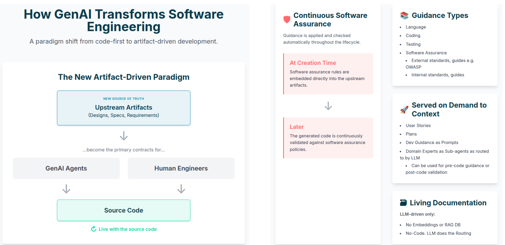
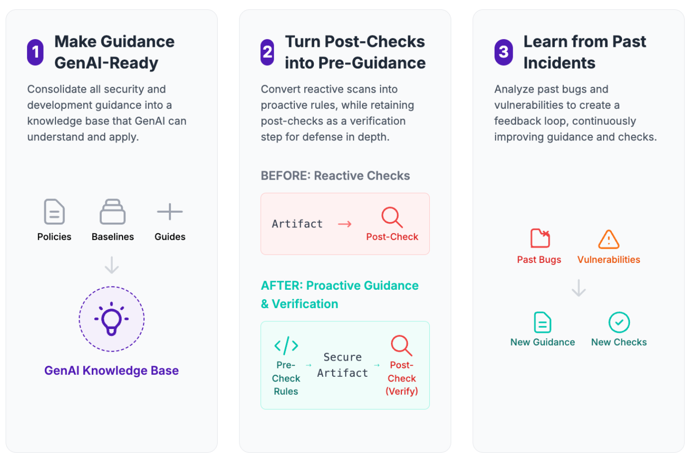

# Policy-as-Code Served Pre and Post Coding

!!! abstract "Overview"

    This chapter explains how to turn large, static security documents into *working* policy-as-code that GenAI Security Agents can apply during design, coding, and review.
    Instead of asking engineers to memorize external and internal standards and guidance, we:

    - Break large documents into small, testable **rule cards**  
    - Compile those rule cards into reusable **knowledge packs**  
    - Expose the packs through **security agents** and **interactive skills**  
    - Wire them into **software engineering workflows** so guidance appears at the right time and place  

    The end goal is simple: security guidance lives as close as possible to the code, served automatically at the time of coding as pre-coding guidance and post-coding checks—achieving Continuous Software Assurance.

    🧑🏻‍💻 Source code: https://github.com/CyberSecAI/genai-sec-agents
---

## Goals

<figure markdown>

</figure>

The Policy-as-Code engine for GenAI Security Agents is designed to:

* **Operationalise standards**
  Turn external frameworks and internal policies into concrete, testable rules.

* **Embed security into workflows**
  Make security checks first-class citizens in planning, design, coding, and review.

* **Support both pre-code and post-code use**
  Give guidance before the first line of code, and validation once code exists.
  In general, give guidance pre and post any artifact creation.

* **Provide traceability**
  Make it clear which requirement, from which document, led to each recommendation.

* **Enable incremental adoption**
  Start with pre-built knowledge packs, then extend with your own documentation over time.

---

## Core Concept: From Documents to Rule Cards

The core idea is simple:

> Take large security documents and convert them into small, testable **rule cards** that can be applied by [Claude Code](claude_code.md) agents and skills.

### Source Documents

<figure markdown>

</figure>

Typical sources include:

* OWASP and ASVS guidance as used in this example
* Internal security policies and standards
* Regulator rules and industry frameworks
* Architecture decision records and security guidelines

These are treated as **source of truth**, not something the LLM invents.

### Atomic Rule Cards

From those documents we create **atomic rule cards**:

* Each card represents a **single, precise requirement**
  (“API must use OAuth2 with short-lived access tokens”, not “use strong auth”)

* Each card has:

    * A clear **condition** (when it applies)
    * A **requirement** (what must be true)
    * **Rationale / references** (why it matters, where it came from)
    * **Example checks** or questions the agent should ask

!!! tip

    Think of rule cards as “linters for architecture and security design” - small, focused rules that are easy to test and revise.

### Compiled Knowledge Packs

Rule cards are grouped and compiled into **knowledge packs**:

* Packs align with **domains** (authentication, secrets, logging, etc.)
* Each pack can be:

    * Loaded by a **specialist security agent**
    * Queried via **interactive skills** or **semantic search** or **grep**
    * Used in combinations for broader reviews

This compilation step normalises the content into a **machine-friendly format** that agents can load efficiently.

### Agents and Skills

<figure markdown>

</figure>

The `.claude/` folder in a project then becomes the delivery vehicle:

* **Security agents**
  Deep specialists for cross-cutting reviews (e.g. "comprehensive security review", "authentication specialist").

* **Interactive skills**
  Specialized context modifiers that can be triggered via slash commands or automatically by Claude (e.g. `/authentication-security`, `/secrets-check`, `/logging-review`).

!!! note

    The same underlying rule cards and packs power all of these entry points - you don't have to duplicate logic across agents and skills.

#### When to Use Skills or Agents

!!! note "Skills vs Agents"

    **Skills** are best for:

    - **Automatic context injection** - Claude detects when they're needed via pure LLM reasoning
    - **Interactive workflows** - Progressive disclosure loads only what's needed when matched
    - **Token efficiency** - Small discovery cost (name + description), larger only when activated
    - **Learning and exploration** - Rich examples and guidance for understanding capabilities
    - **Multi-skill composition** - Multiple skills can auto-activate together for complex requests

    **Agents** are best for:

    - **Explicit parallel execution** - Multiple sub-agents run simultaneously via Agent SDK
    - **Programmatic invocation** - CI/CD pipelines, pre-commit hooks, automated validation
    - **Deterministic workflows** - User controls exactly which agents run and when
    - **Background execution** - Long-running tasks with monitoring and output retrieval
    - **Orchestration patterns** - Main agent delegates to specialist sub-agents

    **Critical distinction:** 
    - Skills are **context modifiers** that inject specialized instructions and can constrain allowed tools/model selection. Agents are **task executors** that run in separate contexts for parallel analysis. 

    **Complementary, not competing:** Use skills for automatic context management in interactive workflows. Use agents for explicit parallel execution in programmatic workflows. Both share the same rule knowledge base via symlinks.

---

## Access Patterns: Six Ways LLMs Use Security Knowledge

The Policy-as-Code engine exposes **six complementary access patterns**. Each pattern balances:

* How predictable the invocation is
* How much context it needs
* How “deep” the analysis should be
* How it affects the primary Claude Code CLI context

### Summary of Patterns

| Pattern             | Activation                                     | Token Cost | Context Window Impact                | Use Case                                          |
| ------------------- | ---------------------------------------------- | ---------- | ------------------------------------ | ------------------------------------------------- |
| **Slash Commands**  | Deterministic (user-explicit)                  | Variable   | Invokes skills or direct commands    | Explicit developer-invoked guidance               |
| **Skills**          | LLM-triggered (based on description) or via slash command | 1.5k-15k per invocation | Context modifier with progressive disclosure | Specialized instructions and tool/model constraints |
| **Agents**          | Explicit (Task tool)                           | 15k+       | Separate context (not main window)   | Parallel analysis, deep validation                |
| **Semantic Search** | Explicit (tool)                                | Variable   | On-demand reading into main context  | Standards research, best practices lookup. No vector or RAG DB needed. |
| **Grep**            | Explicit (tool)                                | Minimal    | On-demand reading into main context  | Direct pattern search in rules/corpus             |
| **CLAUDE.md**       | Automatic (every turn)                         | 1-5k per turn (~15k per 5-turn conversation) | Always present in main context | Workflow orchestration, security enforcement      |

Note: numbers are given as representative examples. YMMV!

!!! note "Skills vs Slash Commands"

    **Skills** and **Slash Commands** work together, not as alternatives:

    - **Skills** are prompt-based context modifiers that inject specialized instructions and can constrain allowed tools and model selection
    - **Slash Commands** are invocation methods that can trigger skills deterministically (user types `/skill-name`)
    - **Skills** can ALSO be triggered automatically via pure LLM reasoning when Claude reads skill descriptions and decides they're relevant
    - A skill can be invoked both ways: explicitly via slash command OR automatically when the LLM detects the need

!!! warning "Skills Auto-Activation is Probabilistic and Naive"

    **Automatic skill activation is hit-and-miss and heavily depends on skill description quality:**

    **Naive Discovery Mechanism:**

    - Skill matching uses substring and semantic matching on the `description` field in SKILL.md frontmatter
    - The matching algorithm is **not sophisticated** - no embedding models, no matching scores, no ranking
    - If your description is vague or lacks keywords matching the user's request, **the skill won't activate at all**
    - Skills can fail to activate even when they seem clearly relevant

    **No Debug Capability:**

    - There is **no matching score** or confidence metric available
    - There is **no debug mode** to see why a skill didn't activate
    - The only way to troubleshoot is trial-and-error refinement of descriptions

    **Critical Success Factors:**
    
    - **Include specific keywords** that users are likely to mention (e.g., "JWT", "OAuth2", "password hashing")
    - **List explicit use cases** in the description ("Use this skill when reviewing login code, authentication flows, or credential handling")
    - **Add trigger phrases** that map to common developer requests
    - **Test extensively** with realistic user prompts to validate activation rates
    - **Quality of CLAUDE.md matters** - clear instructions can guide Claude to prefer certain skills in specific contexts

    **Recommendation:** For security-critical workflows, **do NOT rely solely on automatic skill activation**. Use explicit slash commands or deterministic agent invocation for mandatory security checks. Consider skills as helpful guidance that MAY activate, not guaranteed enforcement.

### When to Use Which Pattern

!!! info "Claude's Autonomy in Pattern Selection"

    **Claude Code can autonomously choose which access patterns to use** based on task requirements and instructions in the `CLAUDE.md` file:

    - The patterns described below are **guidance for system designers**, not rigid constraints on Claude's behavior
    - Claude may decide to use Skills, Agents, Semantic Search, or Grep based on what's most appropriate for the current task
    - `CLAUDE.md` instructions can guide Claude to prefer certain patterns in specific contexts (e.g., "always use the security agent for authentication code")
    - Developers can invoke patterns explicitly via slash commands, OR Claude can choose them autonomously based on LLM reasoning
    - This flexibility allows Claude to adapt its approach based on context, task complexity, and available information

* **Slash Commands**
  Use when you want *deterministic*, user-controlled skill invocation:

    * A developer explicitly calls `/secrets-security` while working on config to invoke a specific skill.
    * An architect explicitly asks `/api-authentication-review` to trigger authentication review skills on an ADR.

* **Skills**
  Use when you want to inject *specialized context and constraints* into Claude's behavior:

    * Define skills that Claude can automatically detect and invoke based on pure LLM reasoning.
    * Constrain which tools Claude can use during specific security reviews.
    * Modify Claude's model selection or execution permissions for specialized tasks.
    * Skills can be triggered either explicitly via slash commands OR automatically when Claude determines they're relevant.

* **Agents**
  Use when you need **broad, cross-cutting security analysis**:

    * “Review this PR against our security standards.”
    * “Assess this architecture document for threats and missing controls.”

* **Semantic Search**
  Use when the question is primarily **research**:

    * “What are our password policies?”
    * “How do we handle multi-tenant isolation?”

* **Grep**
  Use when you need **exact phrase matching**:

    * “Show all rules that mention ‘JWT’.”
    * “Find references to `SAMESITE` cookies.”

* **CLAUDE.md**
  Use to **orchestrate when security runs at all**:

    * Automatically invoke a security agent when certain file types or keywords appear.
    * Ensure security checks become part of the default coding workflow, not an afterthought.

---

## Layered Architecture

The Policy-as-Code engine follows a simple layered architecture:

1. **Source Documents**

      * Raw security content: standards, policies, guidelines.
      * Semantic search and Grep search these
  
2. **Atomic Rule Cards**

      * Normalised, testable rules with conditions and references.
  
3. **Compiled Rule Sets (Knowledge Packs)**

      * Grouped JSON bundles for efficient loading.
      
4. **Agents & Skills**

      * Human-facing and Claude-code-facing entry points defined in `.claude/`.

This separation is important:

* Security experts can **iterate on rule cards** without touching agent wiring.
* Developers only see the **agents and skills**, not the internal representation.
* You can run **validation** on rule cards and packs independently from model behaviour.

!!! note

    This layout is intentionally compatible with both current Claude Code workflows and other agent frameworks. The rule packs are just data - any agent that can load them can use them.

---

## Two Modes of Adoption

The repository supports two complementary adoption paths.

### 1. Use Pre-Built Security Knowledge

For teams who want **fast value with minimal setup**:

* Copy the provided `.claude/` folder into your project.
* You immediately get:

    * A curated set of **security skills**
    * A suite of **security agents**
    * Pre-populated rule packs aligned to common standards (e.g. OWASP / ASVS families)

Typical uses:

* **Pre-code**
  Use skills while drafting designs, ADRs, and user stories to catch issues early.

* **Post-code**
  Use agents to review pull requests, configuration files, Dockerfiles, etc.

### 2. Build Your Own Knowledge Packs

For organisations with **strong internal standards** or regulatory needs:

* Modify the provided tooling to:

    * Ingest your internal security policies and standards
    * Shard them into rule cards
    * Compile them into custom knowledge packs
    * Wire those packs into new or existing agents and skills

* Requirements (high level):

    * A Python environment
    * The ability to run the build scripts locally or in CI

!!! tip

    Start by extending the existing packs - add a **small number of internal rules** for your most critical risks (e.g. data residency, customer data handling) before attempting a full policy migration.

---

## How It Fits the Software Engineering 1.0 Redux Flow

This engine is designed to plug into the phases already described in the [Software Engineering 1.0 Redux](swe_redux.md) and [Software Engineering Security](swe_redux_security.md) sections.

### Pre-Code: Planning and Security Review

* **Planning**

    * Use skills to ensure PRDs and architecture docs include required security content.
    * Architect and Security roles can call targeted skills for authentication, secrets, logging, and data protection.

* **Security Review**

    * Run a comprehensive security agent over:

        * Product brief
        * Architecture document
        * Security stories
      
    * Generate:

        * Security assessment
        * [Threat model](threat_model.md)
        * Security test cases
        * Security stories to feed into the backlog

### Core Development: Implementation and Code Review

* **During implementation**

    * Developers call skills in-context in their IDE:

        * “Is this JWT handling secure?”
        * “Check this API route for common auth issues.”
    * Agents can be invoked periodically for deeper checks on key modules.

* **Code review**

    * Use a security agent as a specialized reviewer:

      * Run over diffs, not just whole files.
      * Map findings back to the rule cards that were violated.
      * Output concrete, testable recommendations (often directly convertible into security stories and test cases).

!!! note

    This keeps the **security source of truth** in one place (rule cards and packs), while letting different roles access it in ways that match their workflows.

---

## Personas and How They Use It

The same knowledge packs are surfaced differently for different roles:

* **Architect**

    * Uses skills to check architecture documents against security requirements.
    * Invokes a security agent for full design reviews.

* **Product Owner / PM**

    * Ensures security requirements are explicitly captured in PRDs and stories.
    * Uses outputs (security stories, test cases) to plan and track work.

* **Security Engineer / Analyst**

    * Curates rule cards and packs.
    * Owns the security validation of the agents.
    * Reviews high-risk findings and refines the rules.

* **Developer**

    * Uses skills inline in the IDE for quick checks.
    * Treats the security agent as a specialised reviewer alongside human reviewers.

!!! note

    This aligns with the broader guide’s stance: **LLMs augment, not replace, the existing roles**. The Policy-as-Code engine simply gives each role a more usable interface to the organization’s security brain.

---

## Example Workflow: From Policy to Actionable Checks

A concrete end-to-end flow might look like this:

1. **Ingest standards**

      * Security team selects a subset of OWASP / ASVS and internal standards as initial scope.

2. **Create rule cards**

      * Rule cards are authored and reviewed for clarity, conditions, and references.

3. **Build knowledge packs**

      * Packs are compiled by domain (auth, secrets, etc.) and validated.

4. **Wire into agents and skills**

      * Security agents load the full set of relevant packs.
      * Skills are exposed for common queries (“check my auth”, “review my logging”).

5. **Connect to engineering workflows**

    * `.claude/` is added to the repo.
    * CLAUDE.md is updated so that:

        * Certain files trigger automatic security checks.
        * Developers have easy access to security skills.

6. **Iterate based on findings**

      * False positives and gaps feed back into rule card revisions.
      * New standards or guidance become new or updated cards.

!!! tip "Success"

    Once this loop is running, your security standards stop being static irrelevant documents and become a **living, executable policy-as-code system** that evolves along with your software.

---

## Takeaways

!!! success "Takeaways"

    - Large, static security documents are converted into **atomic rule cards** and **knowledge packs**.
    - The same packs power **skills**, **agents**, search, and workflow automation via `CLAUDE.md`.
    - Teams can start quickly with **pre-built security content** and then extend with internal policies.
    - The engine fits naturally into the **Software Engineering 1.0 Redux** lifecycle: planning, design, implementation, and review.
    - Security becomes **embedded and executable**, not a separate after-the-fact checklist.

---

## Glossary

**Rule Cards**
: Small, testable units representing a single, precise security requirement. Each card contains a condition (when it applies), a requirement (what must be true), rationale/references (why it matters), and example checks. Think of them as "linters for architecture and security design."

**Knowledge Packs**
: Compiled collections of rule cards grouped by security domain (authentication, secrets, logging, etc.). Packs are normalized into machine-friendly JSON format that can be efficiently loaded by agents and skills.

**Context Injection**
: The process by which skills and CLAUDE.md automatically insert specialized instructions and security rules into Claude's conversation context. Skills use progressive disclosure to load minimal metadata initially, then full content when semantically matched.

**Progressive Disclosure**
: A token-efficiency strategy where skills load information incrementally: (1) discovery phase loads only name + description, (2) activation phase loads full skill instructions when matched, (3) on-demand phase loads detailed rules (JSON) only if needed.

**Context Modifiers**
: Skills that inject specialized instructions and can constrain Claude's behavior by modifying allowed tools, model selection, and execution permissions. Distinguished from agents which are task executors in separate contexts.

**LLM Reasoning**
: The mechanism by which Claude autonomously decides when to activate skills. Based purely on language understanding of skill descriptions and user requests—not algorithmic pattern matching, embeddings, or ML-based intent detection.

**Agent SDK**
: Claude Code's framework for explicit parallel execution of multiple sub-agents. Agents run in separate contexts (not the main conversation window) and enable programmatic invocation for CI/CD pipelines and automated validation.

---

## References

1. [GenAI Security Agents Repository](https://github.com/CyberSecAI/genai-sec-agents) - Source code for policy-as-code engine with rule cards and knowledge packs (2025)
2. [Claude Skills Deep Dive](https://leehanchung.github.io/blogs/2025/10/26/claude-skills-deep-dive/) - Technical analysis of skills architecture and activation mechanisms (October 26, 2025)
3. [Claude Code Internals Analysis](https://agiflow.io/blog/claude-code-internals-reverse-engineering-prompt-augmentation/) - Reverse engineering of context injection and prompt augmentation (2025)
4. [Agent Skills for the Real World](https://www.anthropic.com/engineering/equipping-agents-for-the-real-world-with-agent-skills) - Anthropic's official documentation on agent skills (2024)
5. [Technical Deep Dive into Context Injection](https://medium.com/data-science-collective/claude-skills-a-technical-deep-dive-into-context-injection-architecture-ee6bf30cf514) - Detailed architecture analysis (2025)
