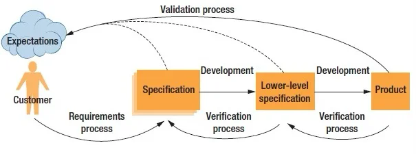
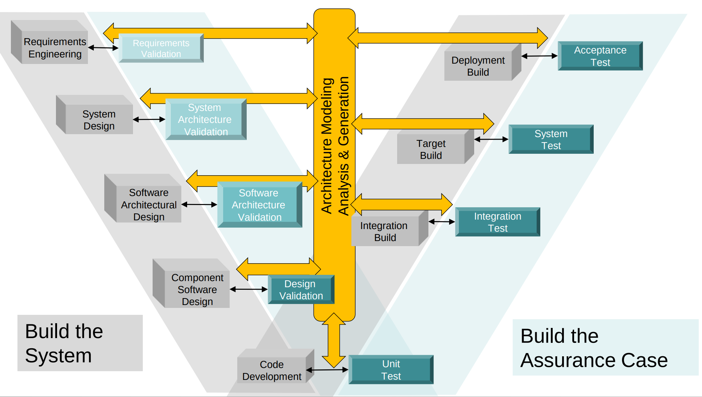

# Software Assurance

!!! abstract "Overview"

    This section provides an overview of Software Assurance today and what it could look like in the future.

    Shift-left testing is necessary but not sufficient.

## Software Assurance

!!! quote

    Software assurance (SwA) is a critical process in software development that ensures the reliability, safety, and security of software products.

    There are several types of software assurance initiatives, including:

    - **Certification and accreditation**: These programs establish standards and guidelines for software development, and verify that software products meet these standards. Certification and accreditation can help to ensure that software products are reliable, secure, and compliant with regulations and industry standards.[6]
    - **Training and education**: These initiatives provide software developers with the knowledge and skills they need to create high-quality, secure software. Training and education can include courses on software testing, secure coding practices, and industry standards and best practices.[7]
    - **Code analysis and testing**: These initiatives use tools and techniques to analyze software code and identify defects or vulnerabilities. Code analysis and testing can include static analysis, dynamic analysis, and fuzz testing, among other techniques.[8]
    - **Threat modeling and risk assessment**: These initiatives assess the potential risks and threats to a software system, and identify strategies for mitigating these risks. Threat modeling and risk assessment can help to ensure that software systems are designed to be resilient to attacks and other threats.[21]

    Software assurance is executed through a series of activities that aim to ensure the reliability, safety, and security of software products. These activities include requirements analysis, design reviews, code inspections, testing, and formal verification.

    https://en.wikipedia.org/wiki/Software_assurance

## Validation vs. verification

!!! quote

    **The basic objectives in verification and validation (V&V) of software requirements and design specifications are to identify and resolve software problems and high-risk issues early in the software life-cycle.**

    **Verification** - to establish the truth of the correspondence between a software product and its specification. 
    
    - "Are you building it right?" 

    **Validation** - to establish the fitness or worth of a software product for its operational mission.

    - "Are you building the right thing?"
    

    It is clear that the **key artifact that distinguishes verification activities from validation activities is the software requirements baseline**

    - verification activities begin in the Product Design phase and conclude with the acceptance
    Test. They do not lead to changes in the requirements baseline; only to changes in the
    refinements descending from it.

    - On the other hand, validation identifies problems which must be resolved by a change of the
    requirements specification. Thus, there are validation activities which occur throughout the software life-cycle, including the development phase. 
        - For example, a simulation of the product design may establish not only that the design cannot meet the baseline performance requirements (verification), but also that the performance requirements are too stringent for any cost-effective product designs, and therefore need to be changed (validation).

    Basic V&V criteria for software requirements and design specifications: 
    
    - completeness
    - consistency
    - feasibility
    - testability

    Guidelines For Verifying And Validating Software Requirements And Design Specifications, Barry W. Boehm

<figure markdown>

A continuous validation and veri­fication process. Validation ensures the requirements correctly capture the users’ and stakeholders’ expectations and should be performed whenever a translation of requirements from one domain to another occurs. https://www.infoq.com/articles/ieee-verification-and-validation-for-software-systems/
</figure>

<figure markdown>

"Incremental Architecture-centric Validation & Verification Improves Qualification Confidence"
Continuous Verification & Validation of Critical Software via DevSecOps, https://apps.dtic.mil/sti/pdfs/AD1187382.pdf
</figure>

A continuous validation and veri­fication process. Validation ensures the requirements correctly capture the users’ and stakeholders’ expectations and should be performed whenever a translation of requirements from one domain to another occurs.

## DevOps
Four Fundamental Principles
1. Collaboration: between all stakeholders
2. Infrastructure as code (IaC): assets are versioned, scripted,
and shared
3. Automation: deployment, testing, provisioning, any manual or
human-error-prone process
4. Monitoring: any metric in development or operation that can
inform priorities, direction, and policy

## Laws of Software Architecture

The code review is designed to answer, “Does this code successfully implement its specification?” The architecture validation is designed to answer, “Will the computer system to be built from this architecture satisfy its business goals?”2

[Fundamentals of Software Architecture](https://www.oreilly.com/library/view/fundamentals-of-software/9781492043447/), Mark Richards & Neal Ford, defines some fundamental Laws of Software Architecture.

### First Law of Software Architecture

**"Everything in software architecture is a trade-off."**

- Corollary 1:  If an architect thinks they have discovered something that isn’t a trade-off, more likely they just haven’t identifiˆed the trade-off yet.

### Second Law of Software Architecture

**"Why is more important than how."**

trast with validation."
https://en.wikipedia.org/wiki/V-model#Validation_vs._verification

https://www.parasoft.com/blog/verification-vs-validation-in-embedded-software/

## From Shift-Left Testing to Earlier Lag Indicators

!!! quote

    Shift-left testing is an approach to software testing and system testing in which testing is performed earlier in the lifecycle (i.e. moved left on the project timeline). It is the first half of the maxim "test early and often."

    [Shift-left testing - Wikipedia](https://en.wikipedia.org/wiki/Shift-left_testing)

**Shift-left testing is inherently a lagging activity** by definition—it measures past outcomes earlier in the SDLC rather than preventing issues from occurring.

A lagging indicator is a metric that measures past performance or outcomes, reflecting what has already happened. In other words, it reveals the symptoms rather than addressing root causes.

Shift-left security testing is a DevSecOps practice that integrates security testing early in the Software Development Life Cycle (SDLC). While this approach is necessary, it is neither sufficient nor efficient for remediating cybersecurity risk.

## Leading Levers for Security

Leading indicators are measures that change before outcomes occur. They function as proactive measures that focus on the activities and processes that influence outcomes, rather than simply measuring results after the fact.

A leading lever, when adjusted, influences the system and causes lagging indicators to change as a result, providing feedback to the operator.

The critical question is: what levers do we need to use to address the symptoms?

1. What are the root causes?
2. Where are the Pareto distributions? (What follows the 80/20 rule?)
3. What are the top three remediation priorities that will deliver the biggest reduction in organizational risk?

**Reference:** [Security Risk Management Discussion](https://youtu.be/oMZN810xfck?t=897)
## Shift Left Before Coding

## Shift Negative

## DevSecOps Reimagined

### Find Your Levers

Remediation ROI 

Shift Left Security Testing is a DevSecOps practice that integrates security testing and processes early in the Software Development Life Cycle (SDLC). 

## CyberSecurity Industry Reimagined

