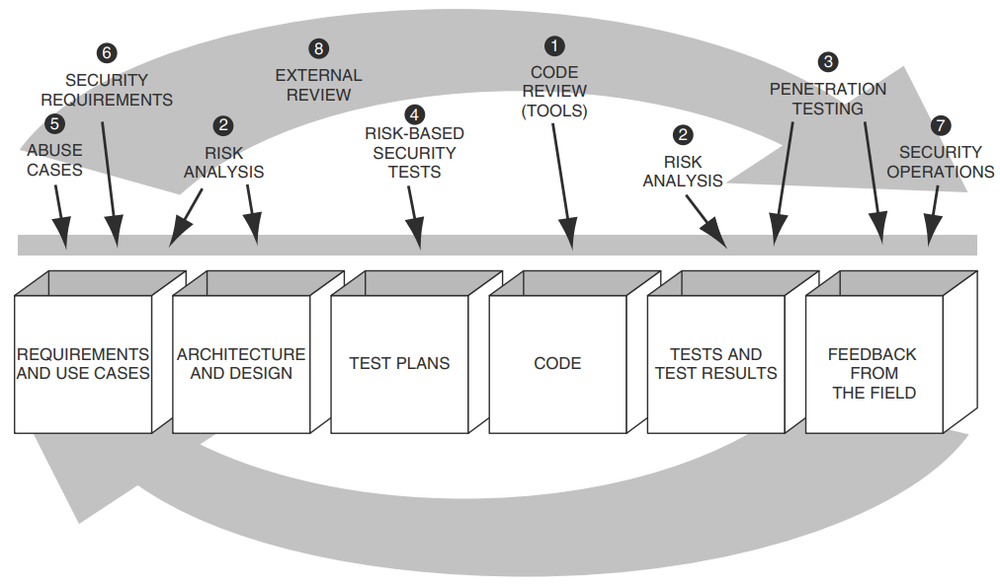

# Software Engineering 1.0 Redux

!!! overview

    This section is hands on end2end turning the thoughts on Software Engineering 1.0 Redux from the previous pages into reality.

    | **Phase** | **Input** | **Chat History** | **Output** |
    |-----------|-----------|----------|------------|
    |     **Exploratory**     |   -        |      -    |     [Pre-existing documentation](https://github.com/CWE-ChatBot/CWE-ChatBot/blob/main/README.md#additional-documentation)       |
    |      **Planning**    |  [Pre-existing documentation](https://github.com/CWE-ChatBot/CWE-ChatBot/blob/main/README.md#additional-documentation)         | [Chat history](https://github.com/CWE-ChatBot/CWE-ChatBot/blob/main/docs/chats/bmad_planning_chat.md)          | [Product Brief, PRD, UX requirements, Architecture document.](https://github.com/CWE-ChatBot/CWE-ChatBot/blob/main/README.md#project-documentation)           |
    |      **Security Review**     |  [Product Brief, PRD, UX requirements, Architecture document.](https://github.com/CWE-ChatBot/CWE-ChatBot/blob/main/README.md#project-documentation)          |   [Chat history](https://github.com/CWE-ChatBot/CWE-ChatBot/blob/main/docs/chats/bmad_security_agent_chat.md)       |  - [Security review documents](https://github.com/CWE-ChatBot/CWE-ChatBot/tree/main/docs/security/bmad_fullagent_security)  - [Changes to the architecture document  by the architect based on the security agent's findings](https://github.com/CWE-ChatBot/CWE-ChatBot/commit/ad8b50438cc669f3f16afee755756af5300db464)         |
    |      **Document Preparation** for development consumption     | - [PRD](https://github.com/CWE-ChatBot/CWE-ChatBot/blob/main/README.md#project-documentation)   - [Security Story Report from Security Analyst](https://github.com/CWE-ChatBot/CWE-ChatBot/blob/main/docs/security/bmad_fullagent_security/security_story_report.md)    |  - [Chat history](https://github.com/CWE-ChatBot/CWE-ChatBot/blob/main/docs/chats/bmad_user_stories.md)   - [Chat history](https://github.com/CWE-ChatBot/CWE-ChatBot/blob/main/docs/chats/bmad_security_stories.md)      |   - [User Stories](https://github.com/CWE-ChatBot/CWE-ChatBot/tree/main/docs/stories) - [Security Stories](https://github.com/CWE-ChatBot/CWE-ChatBot/tree/main/docs/stories) ("S-" prefix)                |    
    |      **Core Development Cycle**    |           |          |            |
    
    *Summary table of the SW Engineering 1.0 Redux phases*

## Software Security Touchpoints

<figure markdown>

Image from [Secure Programming with Static Analysis by Brian Chess, Jacob West](https://www.amazon.com/Secure-Programming-Static-Analysis-Brian/dp/0321424778)
</figure>

## Phase: Existing Exploratory Documentation

In the exploratory part of the project at the start I had some [existing documentation](https://github.com/CWE-ChatBot/CWE-ChatBot/blob/main/README.md#additional-documentation):

1. A Cost Analysis was created by using 
      1. ChatGPT and Gemini **Reasoning** models to create an analysis
      2. Getting them to cross-review each other's output and amending their own output as a result
      3. Then taking the amended ChatGPT version as it was more succinct which is what I was looking for.
      4. The cost analysis was a back-of-napkin effort to understand likely operational costs early to see if these were a show-stopper or not.
2. Research Documents using ChatGPT and Gemini **Research** models and Anthropic
3. ADRs using an existing competed example I liked, and redoing it for the architecture decisions I had made using ChatGPT and Gemini **Reasoning** models and Anthropic.
4. Some Functional Requirements and use cases and user stories (in a Doc format) from MITRE CWE team.

## Phase: [BMAD The Planning Workflow](https://github.com/bmadcode/BMAD-METHOD/blob/main/docs/core-architecture.md#51-the-planning-workflow) 

Having reviewed and played with some of the [SWE agents](swe_agents_report.md), the BMAD-Method was closest to my views on Software 1.0 Redux, so this is used here.

There's 2 [BMad Workflows](https://github.com/bmadcode/BMAD-METHOD/blob/main/docs/core-architecture.md#51-the-planning-workflow):

- [The Planning Workflow](https://github.com/bmadcode/BMAD-METHOD/blob/main/docs/core-architecture.md#51-the-planning-workflow) 
- [The Core Development Cycle](https://github.com/bmadcode/BMAD-METHOD/blob/main/docs/core-architecture.md#52-the-core-development-cycle)

See the updated BMAD flows detailing the Security activities I added:

- [The Planning Workflow](https://github.com/CyberSecAI/BMAD-METHOD/blob/feature/add-new-agent-vulnerability-tech/docs/core-architecture.md#51-the-planning-workflow) 
- [The Core Development Cycle](https://github.com/CyberSecAI/BMAD-METHOD/blob/feature/add-new-agent-vulnerability-tech/docs/core-architecture.md#52-the-core-development-cycle)

### BMAD The Planning Workflow

BMAD method breaks down the requirements and other upstream artifacts into epics and stories, enabling Claude Code to generate structured code and docs with little human intervention ([Level 4 Autonomy](./code/code_assistant_agents.md#autonomy-levels-for-ai-coding-tools)).

   
!!! quote "Key Planning Phases"

    - Optional Analysis: Analyst conducts market research and competitive analysis
    - Project Brief: Foundation document created by Analyst or user
    - PRD Creation: PM transforms brief into comprehensive product requirements
    - Architecture Design: Architect creates technical foundation based on PRD
    - Validation & Alignment: PO ensures all documents are consistent and complete
    - Refinement: Updates to epics, stories, and documents as needed
    - Environment Transition: Critical switch from web UI to IDE for development workflow
    - Document Preparation: PO shards large documents for development consumption

Here we build the [Upstream Software Engineering Artifacts](./software_artifacts.md).

Specifically these are the [artifacts](https://github.com/CWE-ChatBot/CWE-ChatBot/blob/main/README.md#project-documentation) that are built with the workflow below.

### Setup

The [BMAD-METHOD](./swe_agents_report.md) is used.

Specifically, the [Fastest Start: Web UI Full Stack Team at your disposal](https://github.com/bmadcode/BMAD-METHOD?tab=readme-ov-file#fastest-start-web-ui-full-stack-team-at-your-disposal-2-minutes) part where you create a Gemini GEM with a [BMAD-provided text file](https://github.com/bmadcode/BMAD-METHOD/blob/main/dist/teams/team-fullstack.txt).

- All these documents are created via a browser interface (Gemini GEM) so the process is IDE-independent!
- Gemini's long-context window allows it to keep the various documents produced in context so it can make consistent changes across them all.

!!! tip

    The created files are available via 
    
    - the Google Gem Canvas 
    - the prompt response when you request a specific document

!!! Observation

    I was impressed how well this setup worked! 

    - following a logical workflow and prompting for choices or input at each stage (and not getting lost)
    - allowing me to request Gemini Gem to output a document at any time (so I could review and version control it before changes)
    - allowing me to refine the content or ask questions across all the documents as required e.g. if I suggested a change that impacted multiple documents then this was detected by Gemini and the updates made. This ensured consistency across the artefacts.
  
Some choices / decisions were delibertate postponed e.g. data exchange formats and schemas per [Principle #3 - Assume variability; preserve options](https://framework.scaledagile.com/assume-variability-preserve-options/). This results in a PARTIAL Status at this point.

### Interaction with BMAD Gemini Gem

!!! success

    See the **[full chat history of creating a Product Brief, PRD, UX requirements, Architecture document.](https://github.com/CWE-ChatBot/CWE-ChatBot/blob/main/docs/chats/bmad_planning_chat.md)** 

!!! tip

    I worked the pre-existing document content into the [The Planning Workflow](https://github.com/bmadcode/BMAD-METHOD/blob/main/docs/core-architecture.md#51-the-planning-workflow) by providing the content to the BMAD Persona at the relevant time via the prompt.

## Phase: Security Review

BMAD-Method did not have a dedicated Security persona or security documents (but does include some basic security checks)

Other [Threat Modeling](./threat_model.md) solutions could be used to create these security documents

- See example [security artifacts](https://github.com/CWE-ChatBot/CWE-ChatBot/tree/main/docs/security) 

!!! tip

    The different [Threat Modeling](./threat_model.md) solutions had different features I liked, so I decided to build a BMAD Method Security Agent with all the features I wanted.

    The BMAD Method Security Agent fits in the BMAD Planning Workflow

    - It reviews the existing documents, creates security documents including threat models, security test cases, and security updates to the architecture document.
    - Unlike the other solutions, this Security Agent can also be used during the code implementation phase.

### Adding a BMAD Method Security Agent

I added a Security Agent to BMAD per [commits](https://github.com/CyberSecAI/BMAD-METHOD/commits/feature/add-new-agent-security) from Crashedmind. The commit descriptions give the details.

You can browse through the files e.g.:

- [Security Agent](https://github.com/CyberSecAI/BMAD-METHOD/blob/feature/add-new-agent-security/bmad-core/agents/security.md)
- [Security Tasks](https://github.com/CyberSecAI/BMAD-METHOD/tree/feature/add-new-agent-security/bmad-core/tasks)

!!! tip

    The [Security Agent](https://github.com/CyberSecAI/BMAD-METHOD/blob/feature/add-new-agent-security/bmad-core/agents/security.md) creates these [Security review documents](https://github.com/CWE-ChatBot/CWE-ChatBot/tree/main/docs/security/bmad_fullagent_security)

    | Document | Description |
    |----------|-------------|
    | [security_assessment.md](https://github.com/CWE-ChatBot/CWE-ChatBot/tree/main/docs/security/bmad_fullagent_security/security_assessment.md) | Initial security assessment and analysis |
    | [threat_model.md](https://github.com/CWE-ChatBot/CWE-ChatBot/tree/main/docs/security/bmad_fullagent_security/threat_model.md) | Complete STRIDE threat model |
    | [dread.md](https://github.com/CWE-ChatBot/CWE-ChatBot/tree/main/docs/security/bmad_fullagent_security/dread.md) | Quantitative DREAD risk assessment |
    | [security_story_report.md](https://github.com/CWE-ChatBot/CWE-ChatBot/tree/main/docs/security/bmad_fullagent_security/security_story_report.md) | Actionable security user stories |
    | [https://github.com/CWE-ChatBot/CWE-ChatBot/tree/main/docs/security/bmad_fullagent_security/security_test_cases.md](security_test_cases.md) | Security test cases and validation scenarios |
    | [security_architecture_checklist.md](https://github.com/CWE-ChatBot/CWE-ChatBot/tree/main/docs/security/bmad_fullagent_security/security_architecture_checklist.md) | Architecture checklist validation |
    | [compliance_audit.md](https://github.com/CWE-ChatBot/CWE-ChatBot/tree/main/docs/security/bmad_fullagent_security/compliance_audit.md) | GDPR compliance audit |

### Building the Bundles

The [builder](https://github.com/CyberSecAI/BMAD-METHOD/tree/feature/add-new-agent-security/tools/builders) gathers all the relevant files for all the agents into single files in  https://github.com/CyberSecAI/BMAD-METHOD/tree/feature/add-new-agent-security/dist/teams

- e.g. [team-fullstack.txt](https://github.com/CyberSecAI/BMAD-METHOD/blob/feature/add-new-agent-security/dist/teams/team-fullstack.txt) contains all the agents including security, and all the other files they need.

### Create a Gemini Gem with the FullStack team
- https://gemini.google.com/
- Explore Gems
- New Gems
- CopyNPaste [team-fullstack.txt](https://github.com/CyberSecAI/BMAD-METHOD/blob/feature/add-new-agent-security/dist/teams/team-fullstack.txt) into instructions
- Save

### Using the BMAD Method Security Agent via the Gemini Gem with FullStack team

1. Collate the project brief, prd, architecture etc... md files into one file (e.g. using gitingest)
2. At the prompt say "here's my existing documentation" and copyNpaste the collated md file into the prompt
3. Click the Submit Arrow
4. The workflow kicks off

!!! success

    See the 
    
    - **[full chat history using the Security Agent](https://github.com/CWE-ChatBot/CWE-ChatBot/blob/main/docs/chats/bmad_security_agent_chat.md)**.
    - **[full chat history creating and using the Security Agent (Video)](https://www.youtube.com/watch?v=UdXLFQbogIU)**
    - output [security artifacts](https://github.com/CWE-ChatBot/CWE-ChatBot/tree/main/docs/security/bmad_fullagent_security). 
    - [changes](https://github.com/CWE-ChatBot/CWE-ChatBot/commit/ad8b50438cc669f3f16afee755756af5300db464) to the architecture document by the architect based on the security agent's findings
    
         - "| July 23, 2025 | 2.0 | Integrated security agent's findings (WAF, AI Guardrails, DoS Protection, Enhanced Logging). | Winston (Architect) |"

## Document Preparation for development

!!! quote "Key Planning Phases"

    When to move to the IDE: Once you have your PRD, Architecture, optional UX and Briefs - its time to switch over to the IDE to shard your docs, and start implementing the actual code! 
Coming soon..

## Phase: Core Development Cycle

Coming soon..

## Other Claude Code Workflows

There are other Claude Code workflows, some example are given here.

##### UI Designer 
https://www.youtube.com/watch?v=TyGx277x9hQ

##### Retrospectives 

https://www.youtube.com/watch?v=ai_sSQH1Pn4&t=478s

##### Multitasking

https://www.geeky-gadgets.com/how-to-use-git-worktrees-with-claude-code-for-seamless-multitasking/

There are UI tools built on GIT worktrees to support this.

### Other non-Claude Code Workflows

#### Accessibility
https://github.com/scragz/kornelius/blob/main/prompts/audit/a11y.prompt

## References

1. https://harper.blog/2025/02/16/my-llm-codegen-workflow-atm/
2. https://www.geeky-gadgets.com/how-to-use-git-worktrees-with-claude-code-for-seamless-multitasking/
3. https://github.com/ryoppippi/ccusage
4. https://github.com/eyaltoledano/claude-task-master/blob/main/docs/tutorial.md
5. https://www.reddit.com/r/vibecoding/comments/1lu37up/vibecoding_is_straight_chaos_without_instructions/ 
6. https://www.reddit.com/r/vibecoding/comments/1l5o93n/lets_talk_about_security/
