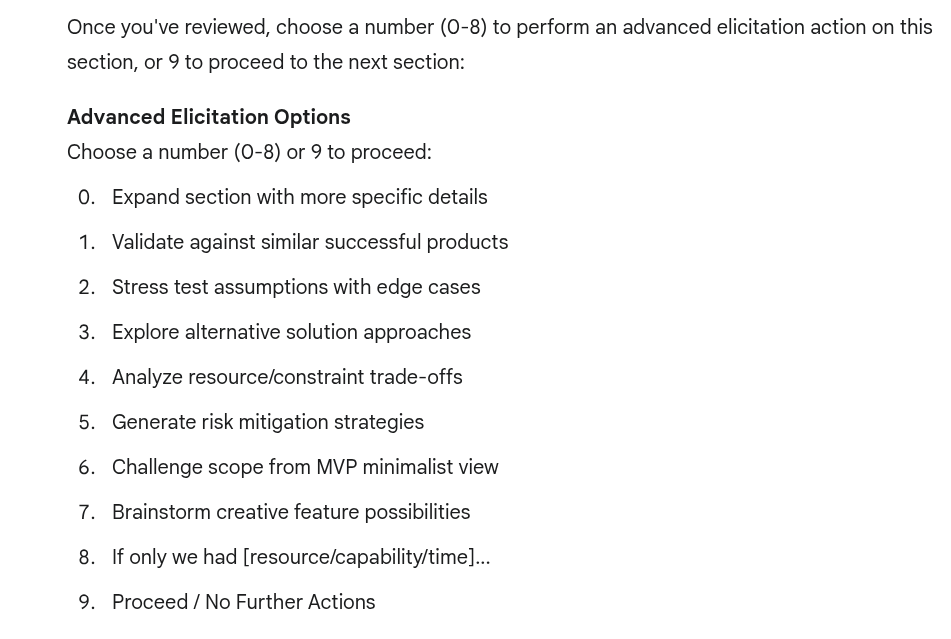
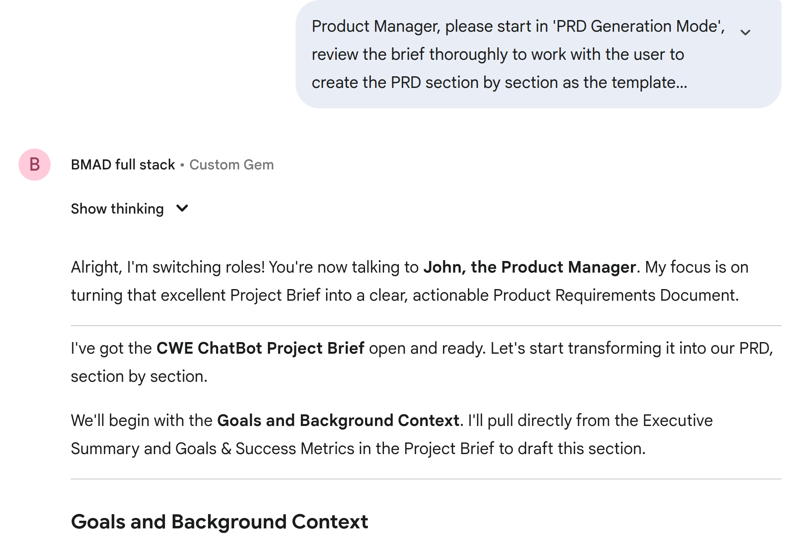
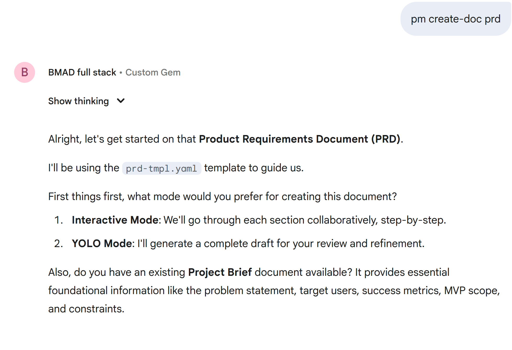
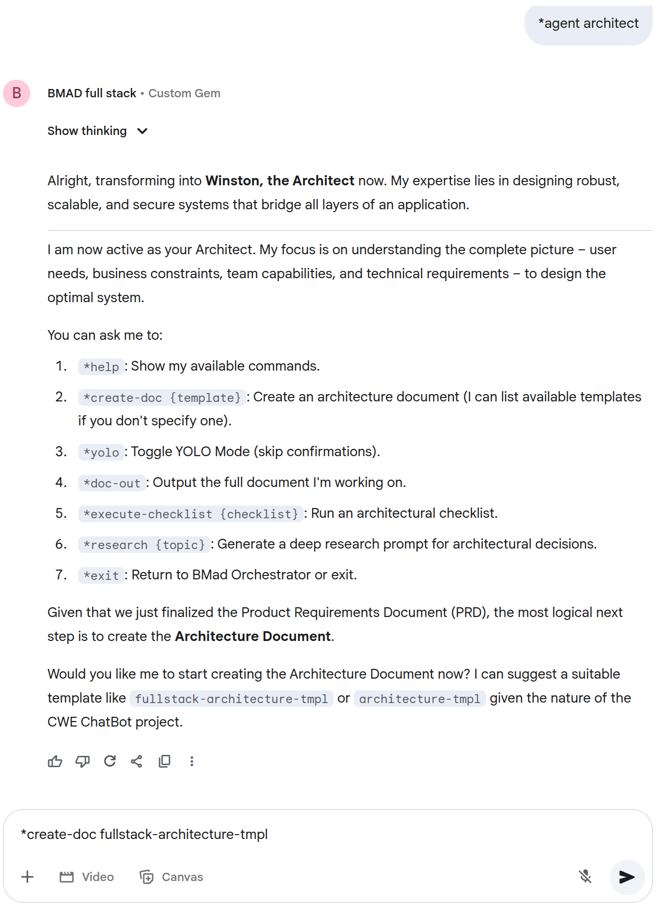
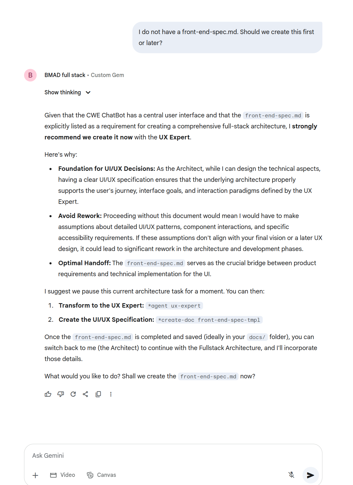
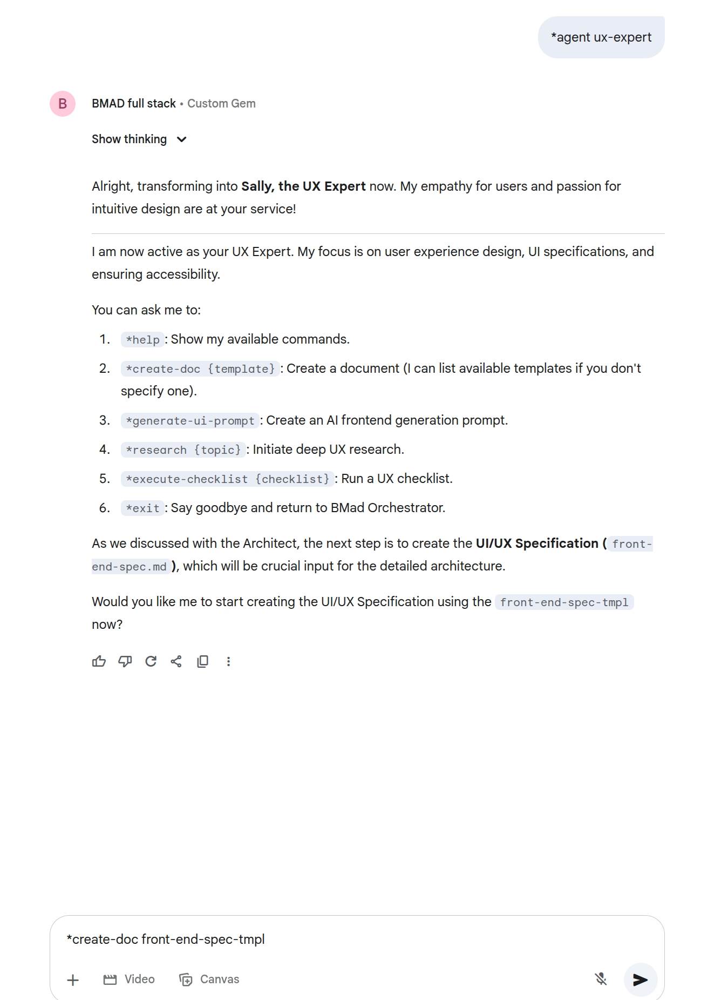
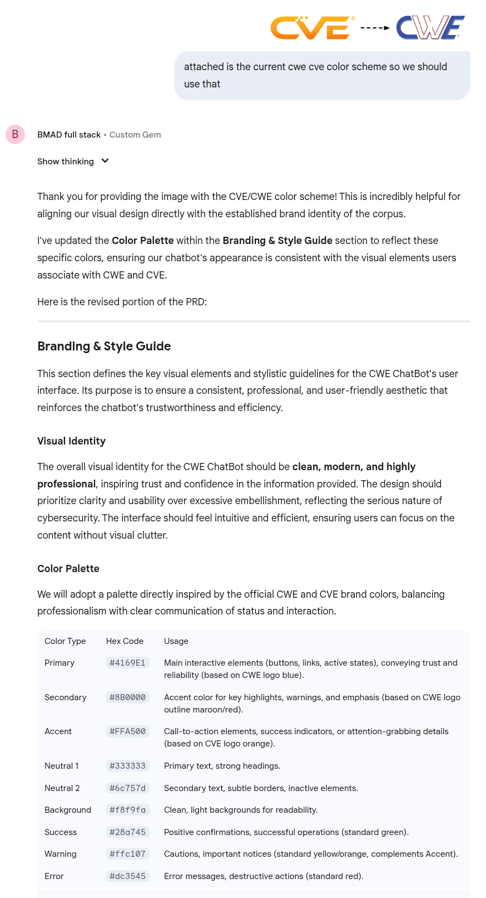
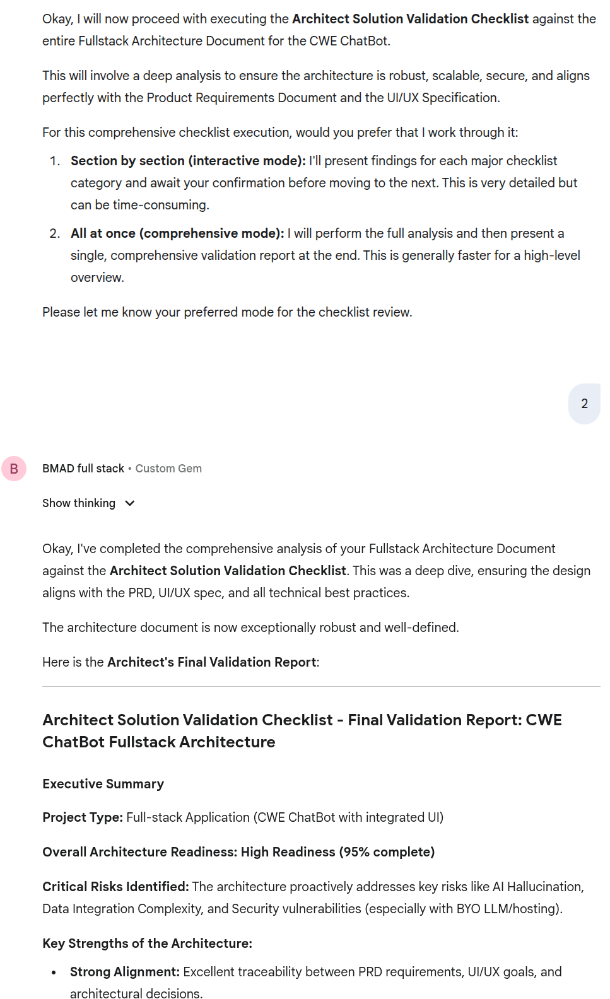
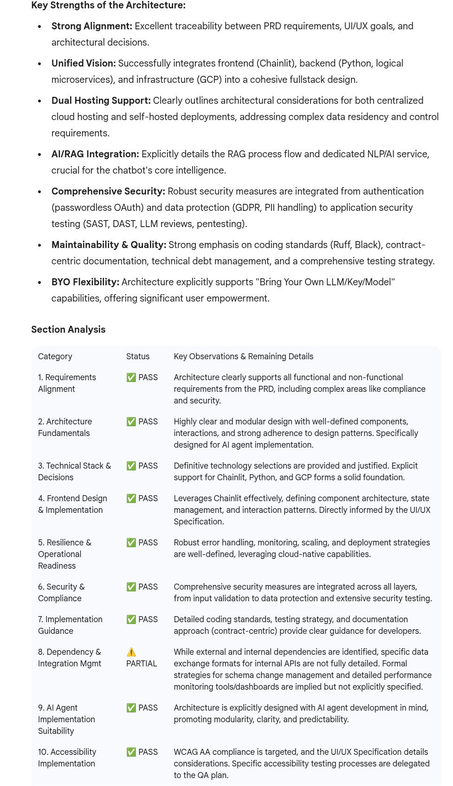
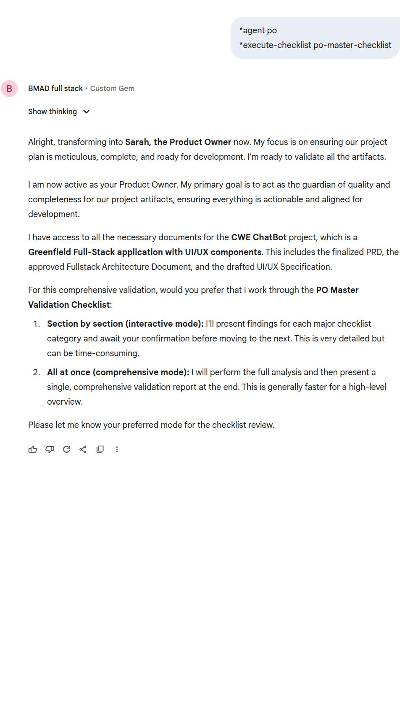

# Software Engineering Reimagined

!!! overview

    In the early stages of GenAI implementation, organizations tend to "shoehorn" GenAI's advanced capabilities into existing workflows and processes. 
    
    - They essentially use powerful new tools to perform the same tasks slightly more efficiently, without fundamentally reimagining what's possible.

    However, the true transformative potential of generative AI emerges when we recognize that it won't simply augment our current operational models—it will radically reshape them. 

    - The "way of doing things" inevitably undergoes profound change as the technology matures and its implications become more apparent.

    For effective GenAI strategy, organizations must simultaneously:

    - Address immediate needs by applying AI to current processes
    - Anticipate and design for entirely new operational paradigms that will emerge
    
    This dual focus ensures solutions remain relevant not just for today's challenges, but for the transformed landscape that GenAI will ultimately create.

    This section is hands on walk through of Software Engineering for a Greenfield application using GenAI.

## Introduction

Having reviewed and played with some of the [SWE agents](swe_agents_report.md), the BMAD-Method was closest to my views on Software 1.0 Redux, so this is used here.

There's 2 [BMad Workflows](https://github.com/bmadcode/BMAD-METHOD/blob/main/docs/core-architecture.md#51-the-planning-workflow):

- [The Planning Workflow](https://github.com/bmadcode/BMAD-METHOD/blob/main/docs/core-architecture.md#51-the-planning-workflow) 
   
    !!! quote "Key Planning Phases"

        - Optional Analysis: Analyst conducts market research and competitive analysis
        - Project Brief: Foundation document created by Analyst or user
        - PRD Creation: PM transforms brief into comprehensive product requirements
        - Architecture Design: Architect creates technical foundation based on PRD
        - Validation & Alignment: PO ensures all documents are consistent and complete
        - Refinement: Updates to epics, stories, and documents as needed
        - Environment Transition: Critical switch from web UI to IDE for development workflow
        - Document Preparation: PO shards large documents for development consumption
        
- [The Core Development Cycle](https://github.com/bmadcode/BMAD-METHOD/blob/main/docs/core-architecture.md#52-the-core-development-cycle)

    !!! quote "Key Planning Phases"

        When to move to the IDE: Once you have your PRD, Architecture, optional UX and Briefs - its time to switch over to the IDE to shard your docs, and start implementing the actual code! 

## Existing Exploratory Documentation

In the exploratory part of the project at the start I had some [existing documentation](https://github.com/CWE-ChatBot/CWE-ChatBot/blob/main/README.md#additional-documentation):

1. A Cost Analysis was created by using 
      1. ChatGPT and Gemini **Reasoning** models to create an analysis
      2. Getting them to cross-review each other's output and amending their own output as a result
      3. Then taking the amended ChatGPT version as it was more succinct which is what I was looking for.
      4. The cost analysis was a back-of-napkin effort to understand likely operational costs early to see if these were a show-stopper or not.
2. Research Documents using ChatGPT and Gemini **Research** models and Anthropic
3. ADRs using an existing competed example I liked, and redoing it for the architecture decisions I had made using ChatGPT and Gemini **Reasoning** models and Anthropic.
4. Some Functional Requirements and use cases and user stories (in a Doc format) from MITRE CWE team.

!!! tip

    I worked the existing document content into the [The Planning Workflow](https://github.com/bmadcode/BMAD-METHOD/blob/main/docs/core-architecture.md#51-the-planning-workflow) by providing the content to the BMAD Persona at the relevant time via the prompt.

## [The Planning Workflow](https://github.com/bmadcode/BMAD-METHOD/blob/main/docs/core-architecture.md#51-the-planning-workflow) 

Here we build the [Upstream Software Engineering Artifacts](./software_artifacts.md).

Specifically the artifacts [here](https://github.com/CWE-ChatBot/CWE-ChatBot/blob/main/README.md#project-documentation):

1. Executive summary and problem statement defining the project vision and user personas
2. Detailed functional and non-functional requirements with user stories
3. User interface and user experience design specifications
4. Complete technical architecture and system design
5. Final product owner review and approval

### Setup

The [BMAD-METHOD](./swe_agents_report.md) is used.

Specifically, the [Fastest Start: Web UI Full Stack Team at your disposal](https://github.com/bmadcode/BMAD-METHOD?tab=readme-ov-file#fastest-start-web-ui-full-stack-team-at-your-disposal-2-minutes) where you create a Gemini GEM with a [BMAD-provided text file](https://github.com/bmadcode/BMAD-METHOD/blob/main/dist/teams/team-fullstack.txt).

- All these documents are created via a browser interface (Gemini GEM) - the process is IDE independent!
- Gemini's long-context window allows it to keep the various documents produced in context so it can make consistent changes across them all.
- 

!!! Success

    I was impressed how well this setup worked 
        - following a logical workflow and prompting for choices or input at each stage (and not getting lost)
        - allowing me to refine the content or ask questions across all the documents as required e.g. if I suggested a change that impacted multiple documents then this was detected by Gemini and the updates made. This ensured consistency across the artefacts.

<figure markdown>

Prompt 
</figure>

<figure markdown>

</figure>
<figure markdown>

</figure>

<figure markdown>

</figure>
<figure markdown>

</figure>
<figure markdown>

</figure>
<figure markdown>

</figure>
<figure markdown>

</figure>
<figure markdown>

</figure>
<figure markdown>

</figure>
<figure markdown>

</figure>

## Restrospectives