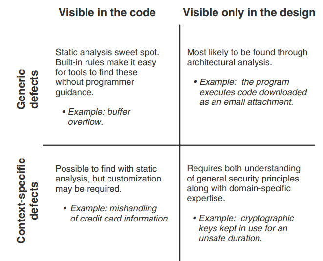

# Software Engineering 1.0 Redux Security

!!! overview

    This section covers the Core Review Security touchpoint.

    We touched on this point earlier in [NotebookLM Secure Code](../../NotebookLM/NotebookLM_Secure_Code/).

## Software Security Touchpoints

<figure markdown>

Image from [Secure Programming with Static Analysis by Brian Chess, Jacob West](https://www.amazon.com/Secure-Programming-Static-Analysis-Brian/dp/0321424778)
</figure>

## Finding Defects in Source Code

<figure markdown>

Image from [Secure Programming with Static Analysis by Brian Chess, Jacob West](https://www.amazon.com/Secure-Programming-Static-Analysis-Brian/dp/0321424778)

The best way to find a particular defect depends on whether it is generic or context specific, and whether 
it is visible in the code or only in the design.
</figure>

**LLMs can compliment the Static analysis sweetspot (Generic defects - Visible in the code)**

- "SAST tools often rely on predefined patterns and rules, which can result in high false-positive rates and an inability to detect novel or context-dependent vulnerabilities" per [ref](https://arxiv.org/html/2409.15735v2).
- Additional context can be given to LLMs to improve their performance e.g. vulnerability reports on similar code
 [LSAST: Enhancing Cybersecurity through LLM-supported Static Application Security Testing](https://arxiv.org/html/2409.15735v2)

## How to use LLMs and SAST Tools Together

LLMs can be used with Code Analysis Tools in different ways:

1. Create a formatted report of findings: 
      1. this is more an editorial activity - not code analysis
2. Utilising LLMs for False Positive Mitigation (FPM) on SAST Warnings: 
      1. Traditional SAST tools often generate a high volume of false positive alerts, which can be time-consuming and resource-intensive for developers to manually review. 
      2. LLMs can be integrated to automate this false positive mitigation process
3. Direct Integration of SAST Results with LLMs:
      1. SAST tools provide initial insights into known vulnerabilities based on predefined rules and patterns. Their findings, including details like CWE IDs and line numbers, can be formatted and directly incorporated into the prompts provided to LLMs alongside the target code. 
      2. This approach, referred to as "[RAW LSAST](https://arxiv.org/html/2409.15735v2)," has been shown to significantly enhance the LLM’s ability to detect vulnerabilities that static scanners alone might miss, thereby improving overall detection accuracy 
4. Independently look for issues 
      1. e.g. using an analysis of [CPGs](https://en.wikipedia.org/wiki/Code_property_graph).
5. Actively exercise the code by creating or guiding test cases.
   

!!! quote

    While traditional tools like Bandit are valuable, our results show that LLMs provide a complementary advantage by analyzing fragmented and non-compilable code and detecting complex vulnerability patterns that existing tools may miss. Additionally, the ability of LLMs to generate security tests adds a useful layer of verification, potentially enhancing the accuracy of vulnerability assessments.

    [Leveraging Large Language Models for Command Injection Vulnerability Analysis in Python: An Empirical Study on Popular Open-Source Projects](https://arxiv.org/html/2505.15088v1)

!!! quote

    Our findings indicate that SAST tools exhibit low vulnerability detection ratios while maintaining a low marked function ratio, akin to a low false positive rate. In contrast, LLMs demonstrate high vulnerability detection ratios but are accompanied by elevated marked function ratios (akin to high false positive rates). Through ensemble approaches, we demonstrate that combining SAST tools and LLMs mitigates their respective limitations, resulting in improved overall vulnerability detection performance.

    [Comparison of Static Application Security Testing Tools and Large Language Models for Repo-level Vulnerability Detection](https://arxiv.org/abs/2407.16235)  

!!! quote

    Analysis reveals that the optimal approaches differ across programming languages.
    The best choice will depend on the user’s acceptance of the trade-off between detection ratios and marked function ratios.
    
    [Comparison of Static Application Security Testing Tools and Large Language Models for Repo-level Vulnerability Detection](https://arxiv.org/html/2407.16235v1) 

!!! quote

    The reasoning-oriented models consistently produced fewer false positives, suggesting that their internal steps for “validating” potential vulnerabilities lead to more precise outcomes.
    
    [CASTLE: Benchmarking Dataset for Static Code Analyzers and LLMs towards CWE Detection](https://arxiv.org/html/2503.09433v1)

### Code Context

A challenge with using LLMs is to get the precise and complete code context to the LLM as described in [Utilizing Precise and Complete Code Context to Guide LLM in Automatic False Positive Mitigation](https://arxiv.org/html/2411.03079v1). They developed a tool to extract this code context.

!!! quote

    - First, we propose a line-level precise code slicer eCPG-Slicer. It constructs an extended Code Property Graph (eCPG) and then extracts line-level code context related to the warning within the given files.
    - Second, we propose a linear complexity algorithm, FARF, which is used to identify source files that have dependencies related to a warning, enabling the slicer to extract the complete code context.
    - Third, we integrate our eCPG-Slicer and FARF algorithm into our LLM4FPM framework. LLM4FPM can efficiently drive LLMs to give judgements for a given warning generated by SAST tools.

!!! note

    The source code for these does not appear to be publicly available But Joern is an open source solution used [for such purposes](https://arxiv.org/html/2404.14719v1).

    !!! quote
        A code property graph of a program is a graph representation of the program obtained by merging its abstract syntax trees (AST), control-flow graphs (CFG) and program dependence graphs (PDG) at statement and predicate nodes. 
        https://en.wikipedia.org/wiki/Code_property_graph

    !!! quote
        Joern is a platform for analyzing source code, bytecode, and binary executables. It generates code property graphs (CPGs), a graph representation of code for cross-language code analysis. Code property graphs are stored in a custom graph database.
        https://github.com/joernio/joern 

!!! quote

    1. **Precise Code Context**. The extracted code snippet should focus on control flows and data flows relevant to the warning, capturing the precise code context while omitting unnecessary parts that might distract the LLM and lead to incorrect or ambiguous conclusions.
    2. **Complete Code Context**. The analysis should account for key information often missing from bug reports, such as references to global variables or invoked functions located in other files. Without this, the extracted context remains incomplete.
    3. **Correct Conclusions**. After obtaining precise and complete code context, there is an opportunity to more effectively guide the LLM to make accurate judgments on bug reports from SAST tools.

    [Utilizing Precise and Complete Code Context to Guide LLM in Automatic False Positive Mitigation](https://arxiv.org/html/2411.03079v1)

## References

1. [Secure Programming with Static Analysis by Brian Chess, Jacob West](https://www.amazon.com/Secure-Programming-Static-Analysis-Brian/dp/0321424778)
2. [Software Security: Building Security In, by Gary McGraw](https://www.amazon.com/Software-Security-Building-Gary-McGraw/dp/0321356705)
3. [Towards Effective Complementary Security Analysis using Large Language Models](https://arxiv.org/html/2506.16899v1)
4. [Leveraging Large Language Models for Command Injection Vulnerability Analysis in Python: An Empirical Study on Popular Open-Source Projects](https://arxiv.org/html/2505.15088v1)
1. [LLM vs. SAST: A Technical Analysis on Detecting Coding Bugs of GPT4-Advanced Data Analysis](https://arxiv.org/html/2506.15212v1)
2. [Comparison of Static Application Security Testing Tools and Large Language Models for Repo-level Vulnerability Detection](https://arxiv.org/abs/2407.16235) 
3. [LSAST: Enhancing Cybersecurity through LLM-supported Static Application Security Testing](https://arxiv.org/html/2409.15735v2)
4. [CASTLE: Benchmarking Dataset for Static Code Analyzers and LLMs towards CWE Detection](https://arxiv.org/html/2503.09433v1)
5. [Source Code Vulnerability Detection: Combining Code Language Models and Code Property Graphs](https://arxiv.org/html/2404.14719v1)
6. [SecLint, a Python-based AI agent for detecting insecure code patterns using RAG](https://harishkolla.substack.com/p/seclint-an-agentic-code-vulnerability) 

